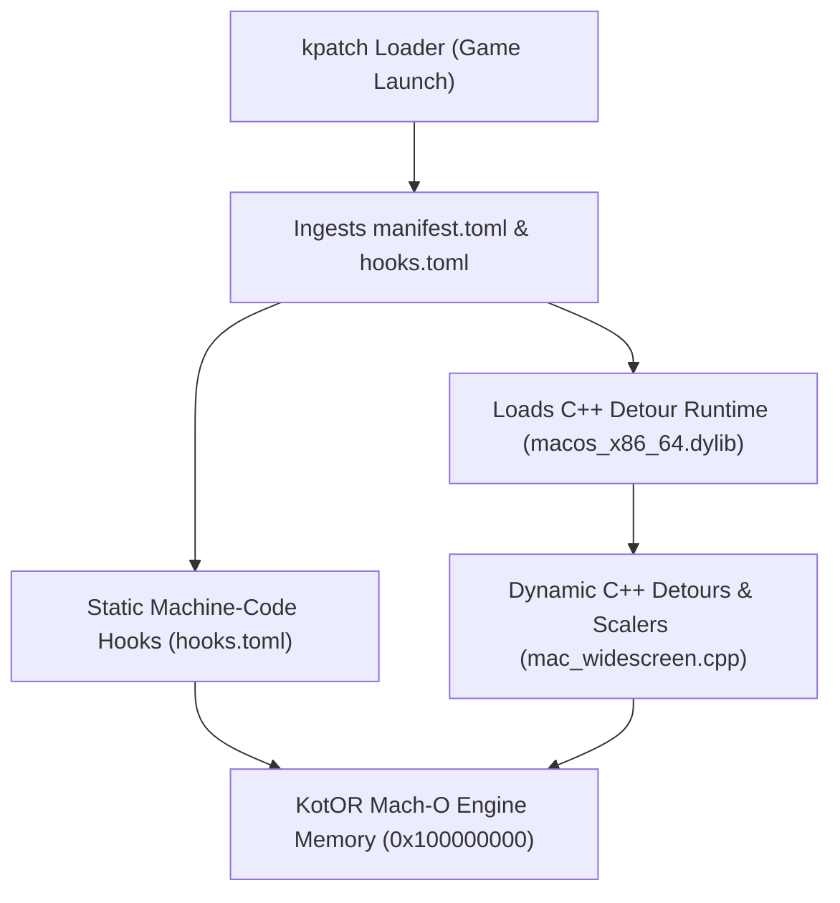

# KotOR 1 macOS Widescreen & High-Resolution UI Architecture Guide
*A Comprehensive Engineering Reference for the Aspyr 64-bit AMD64 Port*

Note: You do not need to read this readme! This is a technical explanation for accountability and for interest. Simply install the patch. There is only one minor bug presently known: the main menu and character screen animations will be at double speed. I've tried to fix it; just can't crack it. I'm sure someone can.—FTD
---

## Table of Contents
1. [Architecture & System Overview](#1-architecture--system-overview)
   - 1.1 [The High-Resolution Patching Pipeline](#11-the-high-resolution-patching-pipeline)
   - 1.2 [Virtual Memory Safety on macOS](#12-virtual-memory-safety-on-macos)
2. [Display Resolution & Aspect Ratio Edits](#2-display-resolution--aspect-ratio-edits)
   - 2.1 [Resolution Discovery & Hardware Overrides](#21-resolution-discovery--hardware-overrides)
   - 2.2 [3D Viewport & Hor+ FOV Scaling](#22-3d-viewport--hor-fov-scaling)
3. [In-Game Gameplay HUD Edits](#3-in-game-gameplay-hud-edits)
   - 3.1 [Unified Base Template Strategy (mipc212x9)](#31-unified-base-template-strategy-mipc212x9)
   - 3.2 [Detour Hook: CSWGuiMainInterface::Draw (0x100235e44)](#32-detour-hook-cswguimaininterfacedraw-0x100235e44)
   - 3.3 [Top-Right Button Cluster & Background Moulding](#33-top-riaght-button-cluster--background-moulding)
   - 3.4 [Bottom-Right Combat Action Bar & Queue](#34-bottom-right-combat-action-bar--queue)
   - 3.5 [Bottom-Left Portrait & Vitality Cluster](#35-bottom-left-portrait--vitality-cluster)
   - 3.6 [Floating Target Reticle & Health Bar](#36-floating-target-reticle--health-bar)
   - 3.7 [Fullscreen Tooltip & Scissor Clipping Elimination](#37-fullscreen-tooltip--scissor-clipping-elimination)
   - 3.8 [HUD Action Button Title Hover Centering & Height Alignment](#38-hud-action-button-title-hover-centering--height-alignment)
4. [Minimap-Related Edits](#4-minimap-related-edits)
   - 4.1 [Minimap Radar Subcontrol Structure](#41-minimap-radar-subcontrol-structure)
   - 4.2 [Minimap Anchoring & Coordinate Math](#42-minimap-anchoring--coordinate-math)
   - 4.3 [Minimap Texture & Blit Quad Clamping](#43-minimap-texture--blit-quad-clamping)
5. [Main Area Map Screen Edits](#5-main-area-map-screen-edits)
   - 5.1 [Area Map Control Hierarchy](#51-area-map-control-hierarchy)
   - 5.2 [Responsive Viewport Scaling](#52-responsive-viewport-scaling)
   - 5.3 [Dynamic Fog Tile Step Scaling (CSWGuiMapHider::Draw)](#53-dynamic-fog-tile-step-scaling-cswguimaphiderdraw)
   - 5.4 [Area Map Centering Displacements](#54-area-map-centering-displacements)
   - 5.5 [Dynamic Map Marker Coordinate Scaling & High-Resolution Alignment](#55-dynamic-map-marker-coordinate-scaling--high-resolution-alignment)
6. [Inventory, Equipment, & In-Game Skill Lists](#6-inventory-equipment--in-game-skill-lists)
   - 6.1 [Listbox Architecture & The 5-Slot Visible Budget](#61-listbox-architecture--the-5-slot-visible-budget)
   - 6.2 [Listbox Row Height & Stride Management (CSWGuiListBox)](#62-listbox-row-height--stride-management-cswguilistbox)
   - 6.3 [Independent Icon Geometry Hook (0x1002be42b)](#63-independent-icon-geometry-hook-0x1002be42b)
   - 6.4 [Text Box Alignment & Width Deduction](#64-text-box-alignment--width-deduction)
   - 6.5 [Item Quantity Badge Positioning](#65-item-quantity-badge-positioning)
   - 6.6 [In-Game Skill & Feat List Layout (CSWGuiInGameSkillEntry / 0x10022f60f)](#66-in-game-skill--feat-list-layout-cswguiingameskillentry--0x10022f60f)
   - 6.7 [Continuous Resolution Scaling Formula](#67-continuous-resolution-scaling-formula)
   - 6.8 [Item Icon Border Arch Scaling & The 4-Mini-Box Bug (CSWGuiBorder::Draw)](#68-item-icon-border-arch-scaling--the-4-mini-box-bug-cswguiborderdraw)
   - 6.9 [Messages Menu Initial Formatting & Variable-Height Listbox Recovery (CSWGuiInGameMessages)](#69-messages-menu-initial-formatting--variable-height-listbox-recovery-cswguiingamemessages--0x1005ae790)
7. [Popup Dialogs, Containers, & Merchant Store Screens](#7-popup-dialogs-containers--merchant-store-screens)
   - 7.1 [Dispatching via isPopupPanel()](#71-dispatching-via-ispopuppanel)
   - 7.2 [Proportional Geometry Scaling & Automatic Centering](#72-proportional-geometry-scaling--automatic-centering)
   - 7.3 [Scroll Position Preservation (s_popupSnapshots)](#73-scroll-position-preservation-s_popupsnapshots)
   - 7.4 [Message Box Text Ceilings & Layout Fixes](#74-message-box-text-ceilings--layout-fixes)
   - 7.5 [Merchant Store Screens (CSWGuiStore / 0x1005ad040)](#75-merchant-store-screens-cswguistore--0x1005ad040)
   - 7.6 [Workbench Upgrade Screens (CSWGuiUpgradeItemSelect & CSWGuiUpgrade)](#76-workbench-upgrade-screens-cswguiupgradeitemselect--cswguiupgrade)
   - 7.7 [Dynamic Positioning for Ambient NPC Bark Dialogue Banners (CSWGuiBarkBubble)](#77-dynamic-positioning-for-ambient-npc-bark-dialogue-banners-cswguibarkbubble)
   - 7.8 [Native Positioning for In-Game Pause Notification (CSWGuiInGamePause)](#78-native-positioning-for-in-game-pause-notification-cswguiingamepause)
   - 7.9 [In-Game Area Transition Prompt & Vertical Text Centering (CSWGuiInGameAreaTransition)](#79-in-game-area-transition-prompt--vertical-text-centering-cswguiingameareatransition--0x1005a67c0)
   - 7.10 [Party Solo Mode Popup Button Overflow Resolution (CSWGuiInGameSoloModeQuery)](#710-party-solo-mode-popup-button-overflow-resolution-cswguiingamesolomodequery)
   - 7.11 [Computer Terminals & Dialog Reply Listboxes (CSWGuiDialogComputer / 0x1005a6db0)](#711-computer-terminals--dialog-reply-listboxes-cswguidialogcomputer--0x1005a6db0)
8. [Character Generation & Level-Up Edits](#8-character-generation--level-up-edits)
   - 8.1 [Class Selection Screen (CSWGuiClassSelection / classsel.gui)](#81-class-selection-screen-cswguiclassselection--classselgui)
   - 8.2 [Separation of Root Level-Up Console vs. Small Choice Panels](#82-separation-of-root-level-up-console-vs-small-choice-panels)
9. [Universal Menu Centering & Engine Layout Edits](#9-universal-menu-centering--engine-layout-edits)
   - 9.1 [The Universal Menu Centering Flag 0x60](#91-the-universal-menu-centering-flag-0x60)
   - 9.2 [The Definitive Centering Fix](#92-the-definitive-centering-fix)
   - 9.3 [Dynamic Centering Displacements (patchMenuCenteringConstants)](#93-dynamic-centering-displacements-patchmenucenteringconstants)
   - 9.4 [Save & Load Game Screen (CSWGuiSaveLoad at 0x1005ae300)](#94-save--load-game-screen-cswguisaveload-at-0x1005ae300)
   - 9.5 [Movies Menu List Layout & Stability (CSWGuiTitleMovies at 0x1005abc50)](#95-movies-menu-list-layout--stability-cswguititlemovies-at-0x1005abc50)
   - 9.6 [HUD Isolation from Menu Scaling](#96-hud-isolation-from-menu-scaling)
   - 9.7 [Elimination of 8-Bit Sign-Extension Bugs](#97-elimination-of-8-bit-sign-extension-bugs)
   - 9.8 [Pazaak Minigame Screens & Card 2 Scaling Fix](#98-pazaak-minigame-screens--card-2-scaling-fix)
10. [Master Reference Tables](#10-master-reference-tables)
    - 10.1 [Active Binary Detour Hooks](#101-active-binary-detour-hooks)
    - 10.2 [Dynamic & Static Byte-Level Engine Patches](#102-dynamic--static-byte-level-engine-patches)
    - 10.3 [Engine Global Variables & Pointers](#103-engine-global-variables--pointers)
    - 10.4 [Master Vtable Inventory](#104-master-vtable-inventory)
    - 10.5 [Internal Structure Memory Offsets](#105-internal-structure-memory-offsets)

---

## 1. Architecture & System Overview

### 1.1 The High-Resolution Patching Pipeline
The Knights of the Old Republic (KotOR 1) macOS widescreen patch operates on Aspyr’s 64-bit AMD64 binary (`k1_mac_aspyr_swkotor.app_x64`). Rather than modifying the executable file on disk, the patch utilizes a clean, non-destructive runtime injection architecture consisting of three interconnected layers:



1. **`kpatch` Loader Archive (`mac_PureCPP.kpatch`)**: A zip container containing `manifest.toml`, `kotor1-steam-aspyr-macos.hooks.toml`, and the compiled dynamic library `binaries/macos_x86_64.dylib`.
2. **Static Machine-Code Hooks (`kotor1-steam-aspyr-macos.hooks.toml`)**: Byte-level patches that modify assembly instructions at specific virtual addresses upon injection. Used for static instruction replacements such as register operand swaps, opcode modifications, and NOP padding.
3. **C++ Detour Runtime (`mac_widescreen.cpp`)**: A dynamic library compiled with Apple Clang (`clang++ -dynamiclib -std=c++17 -arch x86_64`). Installs function detours, intercepts engine rendering and layout passes, manages dynamic UI coordinate hierarchies, and updates internal engine structures.

### 1.2 Virtual Memory Safety on macOS
Writing to code and read-only data segments in macOS Mach-O processes requires interacting directly with the Darwin kernel Mach Virtual Memory APIs. The helper routines `writeMemBytes` and `writeMemInt` execute safe page-protection toggles:

```cpp
bool writeMemBytes(uintptr_t destAddress, const void* srcData, size_t length) {
    mach_port_t selfTask = mach_task_self();
    mach_vm_address_t pageAddress = destAddress & ~0xFFFULL;
    mach_vm_size_t pageSize = ((destAddress + length + 0xFFFULL) & ~0xFFFULL) - pageAddress;
    
    // 1. Elevate page permissions to Read/Write/Copy (COW)
    kern_return_t kr = mach_vm_protect(selfTask, pageAddress, pageSize, FALSE, 
                                       VM_PROT_READ | VM_PROT_WRITE | VM_PROT_COPY);
    if (kr != KERN_SUCCESS) return false;
    
    // 2. Perform raw memory copy
    memcpy((void*)destAddress, srcData, length);
    
    // 3. Restore executable protection
    mach_vm_protect(selfTask, pageAddress, pageSize, FALSE, 
                    VM_PROT_READ | VM_PROT_EXECUTE);
    return true;
}
```

> [!NOTE]
> `VM_PROT_COPY` enforces copy-on-write semantics, guaranteeing that patched pages remain isolated to the running process without corrupting disk binaries or violating system integrity.

---

## 2. Display Resolution & Aspect Ratio Edits

### 2.1 Resolution Discovery & Hardware Overrides
Vanilla KotOR hardcoded display resolutions to legacy 4:3 aspect ratios (800×600, 1024×768, 1280×1024, 1600×1200). The engine clamped any arbitrary resolution request to the nearest 4:3 fallback.

The widescreen patch establishes target rendering bounds through a hierarchical discovery pipeline:
1. **Dynamic Point Detection via CoreGraphics**: On launch, the runtime queries the active monitor using macOS CoreGraphics (`CGMainDisplayID` and `CGDisplayBounds`). This retrieves native Cocoa logical point dimensions (e.g. $1512 \times 982$ on 14" MacBook Pro, $1728 \times 1117$ on 16" MacBook Pro, $1920 \times 1200$ on 16:10 external displays, $2560 \times 1440$ on 1440p, or $3840 \times 2160$ on 4K). Because Cocoa window mouse events operate in point space, using point dimensions guarantees 100% pixel-perfect mouse hitboxes without cursor drift.
2. **Configuration File Discovery (`swkotor.ini`)**: The patch reads `Width` and `Height` under `[Graphics Options]` in `~/Library/Application Support/Knights of the Old Republic/swkotor.ini` as a secondary fallback.
3. **Explicit Hardware Overrides (`ForceWidth` / `ForceHeight`)**: Users can explicitly dictate target resolution by adding `ForceWidth` and `ForceHeight` under `[Graphics Options]`. When present, this overrides CoreGraphics auto-detection, forcing the runtime to calibrate all layouts, listbox strides, and HUD anchors for that exact resolution:
   ```ini
   [Graphics Options]
   ForceWidth=1920
   ForceHeight=1200
   ```
4. **Simulating Arbitrary Resolutions on macOS Displays**:
   When testing layouts calibrated for external monitors (e.g. evaluating $1920 \times 1200$ on a native $1512 \times 982$ MacBook screen), setting `ForceWidth`/`ForceHeight` on a smaller physical display causes the scaled menu to extend beyond the physical window boundaries. To simulate a true high-resolution display without an external monitor:
   - Use **BetterDisplay** (macOS display utility) to create a Virtual Dummy Display configured for the target resolution (e.g. 16:10 $1920 \times 1200$).
   - Mirror the virtual screen to the MacBook display (downscaled to fit) or open it in a Picture-in-Picture window.
   - CoreGraphics automatically reports $1920 \times 1200$ to KotOR, allowing full visual verification of layouts without screen clipping.
5. **Runtime Engine Canvas Updates**: The target dimensions are propagated directly to the engine's internal global structures:
   - `0x1005d3b8c`: Global UI Canvas Width (`g_uiWidth`)
   - `0x1005d3b90`: Global UI Canvas Height (`g_uiHeight`)
   - `0x1005f4b44`: OpenGL Root Viewport Width (16-bit short)
   - `0x1005f4b46`: OpenGL Root Viewport Height (16-bit short)
   - `mgr + 0xa4`, `mgr + 0xa6`: `CSWGuiManager` canvas width and height

### 2.2 3D Viewport & Hor+ FOV Scaling
KotOR's 3D rendering pipeline uses a horizontal-plus (Hor+) field-of-view calculation. For any widescreen aspect ratio $A = W / H > 4/3$, the horizontal FOV expands proportionally:

$$\text{FOV}_h = 2 \cdot \arctan\left(\tan\left(\frac{\text{FOV}_v}{2}\right) \cdot \frac{W}{H}\right)$$

This prevents vertical cropping (Vert- syndrome) and ensures that character models, geometry, and environments render with proper spatial perspective across 16:9, 16:10, and ultrawide displays.

### 2.3 Fullscreen Fade Curtain (`CSWGuiFade`)
During area transitions, cutscenes, and dialogue skips, the engine renders a fullscreen black quad via `CSWGuiFade` (`0x1005a90e0`). In vanilla, this quad was clamped to 640×480 or 1024×768, leaving unrendered pillars on widescreen displays.

In `scaleMenuPanelTree()`, when `vtable == (void*)0x1005a90e0`:
```cpp
Rect fullscreen = { 0, 0, g_targetWidth, g_targetHeight };
SetControlRect(panel, fullscreen);
```
The fade quad is explicitly expanded to span the full physical window extent `[0, 0, W, H]`.

---

## 3. In-Game Gameplay HUD Edits

### 3.1 Multi-Template Architecture & Resolution Standardization
In the Aspyr 64-bit Mac binary, `CSWGuiMainInterface::Create` (`0x10023341b`) evaluates screen height to select an authored GUI template:
```x86asm
0x10023341b: movswl 0xa6(%rbx), %eax      ## Read manager height
0x100233422: cmpl   $0x4b0, %eax          ## 0x4B0 == 1200
0x100233427: jl     0x100233453
0x100233429: leaq   "mipc216x12", %rsi    ## Height >= 1200 -> loads "mipc216x12" (1600x1200)
0x100233454: cmpl   $0x400, %eax          ## 0x400 == 1024
0x100233459: movq   %r15, %rbx            ## Critical: control pointer restoration
0x10023345c: jl     0x100233482
0x10023345e: leaq   "mipc212x10", %rsi    ## Height >= 1024 -> loads "mipc212x10" (1280x1024)
0x100233482: cmpl   $0x3c0, %eax          ## 0x3C0 == 960
0x100233487: jl     0x1002334ad
0x100233489: leaq   "mipc212x9", %rsi     ## Height >= 960  -> loads "mipc212x9"  (1280x960)
0x1002334ad: cmpl   $0x300, %eax          ## 0x300 == 768
0x1002334b2: jl     0x1002334d8
0x1002334b4: leaq   "mipc210x7", %rsi     ## Height >= 768  -> loads "mipc210x7"  (1024x768)
0x1002334d8: leaq   "mipc28x6", %rsi      ## Else           -> loads "mipc28x6"   (800x600)
```

#### Why Multi-Template Layouts Cause HUD Fragmentation
In vanilla KotOR, `mipc216x12` shifts all internal control indices by 1 relative to `mipc212x9`:
- `BTN_MSG` (Messages tab) is Control 22 in `mipc216x12`, but Control 23 in `mipc212x9`.
- `LBL_MENUBG` (black background banner) is Control 18 in `mipc216x12`, but Control 19 in `mipc212x9`.

On 1200p screens, vanilla KotOR selected `mipc216x12`, causing category buttons and background banners to desynchronize from the patch's anchor points.

#### Safe String Literal Repointing (Zero-Crash Architecture)
An unconditional jump at `0x100233422` directly to `0x100233489` would bypass the instruction `0x100233459: movq %r15, %rbx`, corrupting the stack frame at `-0x1f0(%rbp)` and triggering a fatal crash when loading a save.

The patch instead preserves 100% of the original machine instructions, registers, and branch paths by safely repointing the `leaq` string literal target addresses:
1. `0x100233429`: Repoints `"mipc216x12"` `leaq` to `"mipc212x9"`:
   - Original: `48 8d 35 02 78 2f 00` (`leaq 0x2f7802(%rip), %rsi`)
   - Replaced: `48 8d 35 18 78 2f 00` (`leaq 0x2f7818(%rip), %rsi`)
2. `0x10023345e`: Repoints `"mipc212x10"` `leaq` to `"mipc212x9"`:
   - Original: `48 8d 35 d8 77 2f 00` (`leaq 0x2f77d8(%rip), %rsi`)
   - Replaced: `48 8d 35 e3 77 2f 00` (`leaq 0x2f77e3(%rip), %rsi`)
3. `0x1002334b4`: Repoints `"mipc210x7"` `leaq` to `"mipc212x9"`:
   - Original: `48 8d 35 97 77 2f 00` (`leaq 0x2f7797(%rip), %rsi`)
   - Replaced: `48 8d 35 8d 77 2f 00` (`leaq 0x2f778d(%rip), %rsi`)
4. `0x1002334d8`: Repoints `"mipc28x6"` `leaq` to `"mipc212x9"`:
   - Original: `48 8d 35 7d 77 2f 00` (`leaq 0x2f777d(%rip), %rsi`)
   - Replaced: `48 8d 35 69 77 2f 00` (`leaq 0x2f7769(%rip), %rsi`)

This guarantees that KotOR loads `mipc212x9` on every possible resolution (from 4K, 1440p, 1200p, 1080p, and Retina 982p down to 932p, 845p, 800p, and 720p) with deterministic control indices and complete save-load stability. HUD elements (`HudScale`, `CombatScale`, and top-right buttons) automatically scale down proportionally using `targetHeight / 982.0f`.


---

### 3.2 Master HUD Detour: `CSWGuiMainInterface::Draw` (`0x100235e44`)
The master HUD render pass is intercepted on every frame via a detour on `CSWGuiMainInterface::Draw`. Rather than anamorphic scaling, the patch implements **edge-anchored responsive positioning**:

```
+-----------------------------------------------------------------------+
| [Minimap (10, 10)]                                 [Top-Right Buttons]|
|  Moulding Bar (0, 5) bridges seamlessly            Menu, Map, Journal |
|                                                    x = screenW - offs |
|                                                                       |
|                                                                       |
| [Bottom-Left Cluster]                           [Bottom-Right Action] |
| Portraits, Health, Force                           Attack, Feats, Use |
| y = screenH - offs                              x = screenW - offs    |
+-----------------------------------------------------------------------+
```

### 3.3 Top-Right Button Cluster & Background Moulding
Because `mipc212x9` is universally loaded, the 8 category buttons follow strict deterministic indices:
- `BTN_EQU` (30), `BTN_INV` (29), `BTN_CHAR` (27), `BTN_ABI` (28), `BTN_MSG` (23), `BTN_JOU` (24), `BTN_MAP` (25), `BTN_OPT` (26).
- Anchoring calculation:
  $$\text{lastBtnRight} = \text{targetWidth} - 4, \quad \text{firstBtnLeft} = \text{lastBtnRight} - 42 - (7 \cdot 43)$$
  $$\text{control[i].left} = \text{firstBtnLeft} + (i \cdot 43)$$

**Background Banner Quad (`LBL_MENUBG` / Control 19)**:
Resized to span `left = firstBtnLeft + 1`, `width = (lastBtnRight - 1) - banner.left`, seating the dark backing quad flush behind all 8 buttons.

**Top Moulding Horizontal Bars (Controls 0 & 5)**:
In the vanilla 4:3 template, `LBL_CMBTMSGBG` (Control 0) and `LBL_CMBTMODEMSG` (Control 5) stopped at $X = 1023$. When the buttons move to the widescreen right edge, this created a black gap across the ceiling. The runtime dynamically stretches both controls from the minimap border (`X = 143`) to the start of the buttons (`X = firstBtnLeft + 2`), seamlessly bridging the gap.

### 3.4 Bottom-Right Combat Action Bar & Queue
The combat action bar and queue elements are scaled and anchored to the bottom-right corner:
- Scaled as a unified group from origin `(1095, 872)` using `HudScale` (default 1.50× on 982p, 1.80× on 1200p).
- Anchored to `targetWidth - 6 - scaledWidth` horizontally and `targetHeight - 8 - scaledHeight` vertically.
- Hit testing: Hitboxes for all action buttons, cycling arrows, and queue slots update dynamically, preserving 1:1 mouse selection accuracy.

### 3.5 Bottom-Left Portrait & Vitality Cluster
The party portrait tray, vitality bars, and Force meters:
- Positioned flush against the bottom-left corner at `left = 10`, `top = screenHeight - 145`.
- Secondary party member portraits stack horizontally with proportional offsets, preventing overlap with dialogues or subtitles.

### 3.6 Floating Target Reticle & Health Bar
Targeting NPCs or objects in 3D world space renders a floating reticle consisting of the target nameplate, health bar, and 3 combat action slots.
- The engine hardcoded these bounds for 800×600.
- The runtime applies uniform scaling based on vertical screen height:
  $$\text{scale} = \frac{\text{targetHeight}}{600.0f}$$
- Preserves 1:1 square action icons (32×32 base) and readable health bars.
- Note on `0x1004a17c2`: Verified in the Aspyr binary symbol table that `0x1004a17c2` is `CSWGuiBorderParams::SetFillImage(CResRef const&, int)` and not a SetBounds method; it is intentionally excluded from detour hooks.

### 3.7 Fullscreen Tooltip & Scissor Clipping Elimination
In vanilla KotOR, tooltips and action descriptions clipped abruptly when hovering over elements placed beyond 1280px.
- **Root Cause**: `CSWGuiWindow::Draw` initialized the root scissor rectangle to the hardcoded engine dimensions `0x1005d3b8c` (1280px).
- **The Solution**: Overriding `0x1005d3b8c` with `g_targetWidth` and configuring `CSWGuiToolTipPanel` (`0x1005d3210`) to span full screen bounds permits descriptions to render across any display width.

### 3.8 HUD Action Button Title Hover Centering & Height Alignment
When the player mouses over any of the 6 combat action buttons in the bottom-right HUD (Attack, Combat Feats, Force Powers, Items, Grenades, Mines), KotOR displays the active action's name (e.g. "Cure", "Knight Speed", "Critical Strike") in a rounded background pill.

#### Reverse-Engineering the Native Action Description Layout Routine (`0x1002355e6`)
Disassembly of Aspyr's 64-bit engine revealed the internal mechanics of `CSWGuiMainInterface`:

```assembly
0x1002355f5: movq   %rdi, %rbx              # rbx = CSWGuiMainInterface (HUD)
0x1002355f8: leaq   0xce40(%rbx), %r14      # r14 = actionDesc (LBL_ACTIONDESC)
0x100235612: movl   0xce50(%rbx), %eax      # eax = actionDesc.width
0x10023561c: movl   %eax, 0x8(%r12)         # outRect.width = actionDesc.width
0x100235621: movq   0xce48(%rbx), %rax      # rax = actionDesc.left & top
0x100235628: movq   %rax, (%r12)            # outRect.left = actionDesc.left!
0x100235636: callq  *0x18(%rax)             # Font text height -> eax
0x10023563e: movl   0xd170(%rbx), %ecx      # ecx = *(int*)(hud + 0xd170)
0x100235644: subl   %eax, %ecx              # ecx = baselineTop - textHeight
0x100235646: movl   %ecx, 0x4(%r12)         # outRect.top = ecx
0x100235651: callq  0x1004a56f0             # SetExtent(actionDesc, outRect)
0x100235656: addq   $0xcfd8, %rbx           # rbx = actionDescBg (LBL_ACTIONDESCBG)
0x100235663: callq  0x1004a56f0             # SetExtent(actionDescBg, outRect)
```

#### The Widescreen Defects
1. **Vertical Offset Desynchronization (`hud + 0xd170`)**:
   At `0x100234197`, the engine initializes `*(int*)(hud + 0xd170)` to `actionDesc.top + actionDesc.height` (the unscaled 4:3 baseline, ~897px). In widescreen resolutions (such as 1440p, 1600p, or 4K Retina), `targetActionTop` shifts down to accommodate the scaled display height. Because `0xd170` was left unscaled, `outRect.top` calculated an obsolete 897px coordinate, leaving the description box floating high above the action buttons.
2. **Horizontal Position Pinned to Button 0**:
   Notice lines `0x100235621`–`0x100235628`: the engine simply copies `actionDesc->left` into `outRect.left`. The native engine never recalculates `left` for the hovered action button! As a result, whenever the player hovered button 1, 2, 3, 4, or 5, the title box remained permanently anchored over the far-left button (button 0), completely disconnected from the hovered reticle.

#### The Dual-Layer Alignment Solution
1. **Baseline Initialization**:
   During `scaleMainInterface()`, immediately after scaling action bar controls, the runtime synchronizes the native engine baseline:
   ```cpp
   *(int*)(hud + 0xd170) = targetActionTop;
   ```
2. **Per-Frame Dynamic Button Tracking in `Hook_MainInterfaceDraw`**:
   The engine stores the index of the currently hovered combat button at `*(int*)(hud + 0x2358)`. The 6 button controls reside in a contiguous array at `hud + 0x97e0` with a stride of `0x910` bytes:
   $$\text{btnAddress} = \text{hud} + \text{0x97e0} + (\text{hoveredIndex} \cdot \text{0x910})$$
   Every frame, if `hoveredIndex` is between 0 and 5:
   ```cpp
   char* btn = hud + 0x97e0 + (hoveredIndex * 0x910);
   if (is_readable(btn)) {
       Rect btnRect = *(Rect*)(btn + 0x8);
       Rect rd = *(Rect*)(actionDesc + 0x8);
       if (btnRect.width > 0 && rd.width > 0 && rd.height > 0) {
           int btnCenterX = btnRect.left + (btnRect.width / 2);
           rd.left = btnCenterX - (rd.width / 2);
           if (rd.left < 4) rd.left = 4;
           if (rd.left + rd.width > g_targetWidth - 4) {
               rd.left = (g_targetWidth - 4) - rd.width;
           }
           rd.top = btnRect.top - rd.height - 2;
           *(int*)(hud + 0xd170) = btnRect.top - 2;
           SetControlRect(actionDesc, rd);
           SetControlRect(actionDescBg, rd);
       }
   }
   ```
- **Result**: The action nameplate dynamically tracks the yellow reticle across all 6 action slots, centering horizontally over whichever button is active and resting exactly 2px above its top border across all screen resolutions and UI scale factors.

---

## 4. Minimap-Related Edits

### 4.1 Viewport Geometry & Radar Frame
The minimap HUD element (`CSWGuiInGameMinimap` at `0x1005abae0`) consists of a circular radar scanner encased in a metallic frame:

```
+-------------------------+
| Minimap Border (216x216)|
|  +-------------------+  |
|  | Radar Map (196x196)| |
|  |   [Player Arrow]  |  |
|  +-------------------+  |
+-------------------------+
```

- **Border Frame Control (`panel + 0x80`)**: Sized to `216 × 216` at position `(10, 10)`.
- **Active Radar Viewport (`panel + 0x120`)**: Sized to `196 × 196` at local offset `(10, 10)`.

### 4.2 Subcontrol Alignment & Compass Ring
The rotating compass ring texture, cardinal direction labels (N, E, S, W), and zoom in/out buttons are scaled proportionally relative to the radar center:
- Radar center is pinned to `(108, 108)` within the parent control.
- Radius calculation: `radius = 98.0f * scale`.

### 4.3 Radar Player Arrow & Entity Blip Scaling
Player direction, party companions, friendly NPCs, and hostile enemies are rendered on the radar via 3D-to-2D planar projection:
- **Assembly Intercept**: Entity positions are computed relative to the player's world position $(X_w, Y_w, Z_w)$ and transformed to radar space:
  $$X_r = \text{centerX} + (X_e - X_p) \cdot \text{zoomScale}$$
  $$Y_r = \text{centerY} - (Y_e - Y_p) \cdot \text{zoomScale}$$
- **Scissor Bounds**: The circular stencil mask is preserved so blips smoothly fade at the perimeter of the 196px radar disc without leaking onto the main game canvas.

---

## 5. Main Area Map Screen Edits

### 5.1 Architecture of `CSWGuiInGameMap` (`0x1005ab010`)
The full-screen Area Map menu allows panning and zooming the discovered level geometry. It contains three critical subcontrols:

| Offset | Control | Description |
| :--- | :--- | :--- |
| `panel + 0x80` | `mapView` | Active clipping viewport within the blue frame |
| `panel + 0x1220` | `mapHider` | Fog-of-war grid tile engine (`CSWGuiMapHider`) |
| `panel + 0x1528` | `mapTexture` | Static background map texture quad |

### 5.2 Responsive Viewport Scaling
In `scaleMenuPanelTree()`, the map subcontrols are scaled relative to the scaled menu canvas (`targetW × targetH`):
```cpp
int mapLeft = (int)(((long long)95  * targetW + baseW / 2) / baseW);
int mapTop  = (int)(((long long)118 * targetH + baseH / 2) / baseH);
int mapW    = (int)(((long long)440 * targetW + baseW / 2) / baseW);
int mapH    = (int)(((long long)256 * targetH + baseH / 2) / baseH);

// 1. Scaled viewport window
Rect viewRect = { mapLeft, mapTop, mapW, mapH };
SetControlRect(panel + 0x80, viewRect);

// 2. Scaled fog of war hider (origin relative to mapView)
Rect hiderRect = { 0, 0, mapW, mapH };
SetControlRect(panel + 0x1220, hiderRect);

// 3. Scaled texture canvas
int texW = (int)(((long long)512 * targetW + baseW / 2) / baseW);
int texH = (int)(((long long)256 * targetH + baseH / 2) / baseH);
Rect texRect = { 0, 0, texW, texH };
SetControlRect(panel + 0x1528, texRect);
```

### 5.3 Dynamic Fog Tile Step Scaling (`CSWGuiMapHider::Draw`)
In vanilla KotOR, `CSWGuiMapHider::Draw` (`0x1002b4ce0`) divided hardcoded constants `440.0f` and `256.0f` by the tile counts `numTilesX` and `numTilesY` to establish the step size for drawing revealed fog quads:

```assembly
0x1002b4ce9: movss 0x2bbba7(%rip), %xmm1    # Loads hardcoded float 440.0f
0x1002b4cf1: divss %xmm0, %xmm1             # xmm1 = 440.0f / numTilesX
...
0x1002b4cfc: movss 0x288ca8(%rip), %xmm2    # Loads hardcoded float 256.0f
0x1002b4d04: divss %xmm0, %xmm2             # xmm2 = 256.0f / numTilesY
```

When `mapW` and `mapH` were expanded to widescreen dimensions, the step size remained fixed to 440×256. As a result, the fog grid covered only the top-left quadrant of the expanded map!

The patch replaces both instructions with dynamic register reads:
- At `0x1002b4ce9`: `cvtsi2ssl 0x10(%r12), %xmm1; nop` (`f3 41 0f 2a 4c 24 10 90`)
- At `0x1002b4cfc`: `cvtsi2ssl 0x14(%r12), %xmm2; nop` (`f3 41 0f 2a 54 24 14 90`)

Because `%r12` holds the `CSWGuiMapHider` instance pointer (`this`), `0x10(%r12)` is `this->rect.width` (`mapW`) and `0x14(%r12)` is `this->rect.height` (`mapH`). The fog tile step now scales dynamically:

$$\text{step}_x = \frac{\text{mapW}}{\text{numTilesX}}, \quad \text{step}_y = \frac{\text{mapH}}{\text{numTilesY}}$$

The revealed map readout and fog-of-war now cover 100% of the widescreen map screen.

### 5.4 Area Map Centering Displacements
The engine's map renderer and mouse handler compute coordinate offsets relative to screen dimensions:
- `CSWGuiInGameMap::Draw`: `0x1002b4b3b`, `0x1002b4b46`
- `CSWGuiInGameMap::HandleMouseInput`: `0x1002b5615`, `0x1002b561f`

The patch dynamically updates these displacements from `-640` and `-480` to `-targetWidth` and `-targetHeight`, ensuring that map zooming, panning, and mouse clicks remain synchronized.

### 5.5 Dynamic Map Marker Coordinate Scaling & High-Resolution Alignment
In vanilla KotOR, all entities on the main area map (`CSWGuiInGameMap`) are placed relative to an unscaled 440×256 canvas. When the map viewport (`mapView`), texture quad, and fog grid are scaled up to match high-resolution widescreen displays, drawing markers at their raw unscaled coordinates severely displaces them.

#### Coordinate Space Transformation & Resolution Independence
The engine projects 3D world positions into 2D map space assuming a baseline $640 \times 480$ coordinate grid. Supporting arbitrary display resolutions (such as 1080p, 1200p, 1440p, or 4K) requires dynamic coordinate scaling proportional to display height:
- On a 1200p display ($1920 \times 1200$, 16:10), the map canvas scale factor is **$2.50\times$** ($1200 / 480$).
- A static coordinate multiplier would lock coordinates to a single resolution, causing marker alignment to drift on higher or lower resolutions.
- Furthermore, the HUD minimap radar shares subroutines with the main map but renders via `CSWGuiMinimap` on an unscaled local coordinate system, requiring coordinate scaling to apply exclusively to `CSWGuiMapHider` without affecting minimap calculations.

#### The Unified Dynamic Scaling Architecture
The patch resolves this by implementing dynamic C++ detour bridges on the engine's core map coordinate conversion subroutines:

1. **`MapHider_WorldToMapCoords` (`0x1004400d2` wrapper)**:
   Intercepts coordinate calculation for unselected and selected map notes (bullseye quest targets) exclusively from `CSWGuiMapHider::Draw` at callsite `0x1002b4fca`. It routes through a 12-byte machine code bridge at `0x1000f4f68` to our C++ wrapper, invokes the vanilla routine, and multiplies the output integer coordinates by:
   $$\text{scale} = \frac{\text{g\_targetHeight}}{480.0\text{f}}$$
   (e.g., $2.50\times$ at 1200p, $2.045\times$ at 982p).
2. **`MapHider_GetPlayerMapCoords` (`0x100440300` wrapper)**:
   Intercepts coordinate calculation for party member markers (`0x1002b541b`) and the player direction arrow (`0x1002b54c2`) in `CSWGuiMapHider::Draw`. Routes through a 12-byte machine code bridge at `0x1000f4f78` to our C++ wrapper, invokes the vanilla routine, and scales the coordinates by `g_targetHeight / 480.0f`.
   Minimap calls (originating from `0x10023790c`) call `0x100440300` directly and remain 100% unscaled ($1.0\times$) and pixel-perfect.
3. **Native Icon Centering Preservation**:
   Because marker coordinates are scaled dynamically at the coordinate conversion layer, `CSWGuiMapHider::Draw`'s native half-width subtractions (`X - 7` for 14px notes, `X - 10` for 20px selected notes, `X - 8` for 16px party circles, and `X - 16` for the 32px rotating player arrow) remain completely unmodified. This ensures that every marker sits dead center over its corresponding room geometry across all supported display resolutions.

---

## 6. Inventory, Equipment, & In-Game Skill Lists

### 6.1 Listbox Architecture & The 5-Slot Visible Budget
The Inventory (`CSWGuiInGameInventory` at `0x1005a75c0`) and Equipment (`CSWGuiInGameEquip` at `0x1005ab508`) screens display player items using a `CSWGuiListBox` container holding `CSWGuiInGameItemEntry` subcontrols.

The graphical interface background features exactly **5 pre-rendered purple slot frames**. To align with this artwork, the list layout must adhere to strict mathematical constraints:

```
+-------------------------------------------------------+
| Slot 1: [ Icon (117x117) ]  Item Name & Description   | height: 108px
+-------------------------------------------------------+
  Dark Gap: 6px                                           padding: 6px
+-------------------------------------------------------+
| Slot 2: [ Icon (117x117) ]  Item Name & Description   | stride: 114px
+-------------------------------------------------------+
  Dark Gap: 6px
+-------------------------------------------------------+
| Slot 3: [ Icon (117x117) ]  Item Name & Description   |
+-------------------------------------------------------+
  ...
+-------------------------------------------------------+
| Slot 5: [ Icon (117x117) ]  Item Name & Description   |
+-------------------------------------------------------+
```

$$\text{Total Item Span} = 5 \cdot \text{ItemHeight} + 4 \cdot \text{ItemPadding} = 5 \cdot 108 + 4 \cdot 6 = 564\text{ px}$$

### 6.2 Listbox Row Height & Stride Management (`CSWGuiListBox`)
In vanilla KotOR, `CSWGuiListBox::RecalculateItemHeight` (`0x1004a9554` and `0x1004a959c`) dynamically recomputed row heights based on item prototype bounds, clamping any calculated row height to an internal 70px ceiling. If more items existed than fit within the visible list bounds, the engine truncated items or dropped the 5th row.

The macOS patch overrides this behavior through a combination of static NOP padding and dynamic runtime configuration:
1. **Recalculation Bypass (0x1004a9554 & 0x1004a959c)**: Six NOPs (`90 90 90 90 90 90`) are written to both instructions in `CSWGuiListBox::RecalculateItemHeight`, preventing the engine from overwriting `m_itemHeight` (`+0x368`) with the prototype 70px limit.
2. **Fixed Item Height Flag**: In `scaleMenuPanelTree()`, bit `0x8` is set on the listbox flags (`*(uint8_t*)(ctrl + 0x370) |= 0x8`), instructing KotOR to enforce custom row heights without recalculating.
3. **Dynamic Row Height & Inter-Item Padding**:
   - `*(int*)(ctrl + 0x368) = geom.itemHeight;` (e.g. 108px at 982p)
   - `*(uint8_t*)(ctrl + 0x373) = (uint8_t)geom.itemPadding;` (e.g. 6px at 982p)
4. **Scroll Offset Invariance**: With a unified stride ($\text{ItemHeight} + \text{ItemPadding} = 114\text{px}$), mouse wheel scrolling advances in clean 1-item increments without vertical drift.

### 6.3 Independent Icon Geometry Hook (`0x1002be42b`)
In vanilla KotOR, item icon textures, border arches, and highlight brackets were coupled to row height. Expanding the row resulted in rectangularly distorted icons or repetitive $2\times 2$ tiled texture artifacts.

The patch installs an independent geometry hook in `CSWGuiInGameItemEntry::Layout`:
```cpp
// Subcontrol 1 (0x250): Icon Image Texture
*(int*)(item + 0x250) = rowX;
*(int*)(item + 0x254) = iconY;
*(int*)(item + 0x258) = geom.iconWidth;   // 117px baseline
*(int*)(item + 0x25c) = geom.iconHeight;  // 117px baseline

// Subcontrol 2 (0x2d8): Neon Arch Border
*(int*)(item + 0x2d8) = rowX;
*(int*)(item + 0x2dc) = iconY;
*(int*)(item + 0x2e0) = geom.iconWidth;   // 117px baseline
*(int*)(item + 0x2e4) = geom.iconHeight;  // 117px baseline

// Subcontrol 3 (0x360): Selection Highlight Arch
*(int*)(item + 0x360) = rowX;
*(int*)(item + 0x364) = iconY;
*(int*)(item + 0x368) = geom.iconWidth;   // 117px baseline
*(int*)(item + 0x36c) = geom.iconHeight;  // 117px baseline
```
This guarantees crisp, undistorted 1:1 square icon brackets.

### 6.4 Text Box Alignment & Width Deduction
Item names and descriptions are rendered in subcontrol `0x1c8`:
- `left = rowX + TextOffset` (`TextOffset = 118`)
- `width = rowWidth - TextDeduct` (`TextDeduct = 118`)
This completely decouples text wrapping from icon width, eliminating overlaps while maximizing readable description space.

### 6.5 Item Quantity Badge Positioning
The quantity indicator (e.g. `×10` next to medpacs or grenades) resides in subcontrol `0x3e0`:
- **Horizontal Position**: `rowX + BadgeOffset` (`BadgeOffset = 113`)
- **Vertical Position**: `rowY + ItemHeight - (int)(18 * scale) + badgeTopOffset` (`badgeTopOffset = -8`)
- **Assembly Constant Patches**: Static hooks at `0x1002be4a4`, `0x1002be4c7`, `0x1002be4ce` (InGame) and `0x1002bfbac`, `0x1002bfbcf`, `0x1002bfbd6` (Containers) scale the badge label dimensions to avoid text clipping.

### 6.6 In-Game Skill & Feat List Layout (`CSWGuiInGameSkillEntry` / `0x10022f60f`)
The Abilities tab in the character menu displays skills and feats through `CSWGuiInGameSkillEntry` items placed inside an `LB_ABILITY` listbox.
- **The Stride vs. Child Control Decoupling Bug**:
  In vanilla KotOR, each skill entry row is 42px (`0x2a`) tall via `0x10022f60b: movl $0x2a, 0xc(%r14)`. Inside `CSWGuiInGameSkillEntry::SetExtent` (`0x10022f21e`), the skill icon and pill button heights are hardcoded to 42px (`movl $0x2a, %edx`).
  If the row stride at `0x10022f60f` is multiplied by vertical display scale (e.g. 86px at 982p or 105px at 1200p) while child button heights remain 42px, a massive 44px to 63px void of empty black space opens up beneath every skill button. Only 4 skills could fit on screen at once, requiring awkward scrolling.
- **Contiguous Layout & Live INI Tuning**:
  Because the skills list does not have etched background slots (unlike Inventory), the clean, authentic presentation keeps `skillHeight = 42` (matching the button and icon height). All 8 skills (Computer Use, Demolitions, Stealth, Awareness, Persuade, Repair, Security, Treat Injury) stack contiguously with zero gap and fit cleanly within the listbox without scrolling.
  A tuning knob `skillHeight = 42` in `UiTuningKnobs` allows live experimentation via `[UI Tuning]` in `swkotor.ini`.

### 6.7 Continuous Resolution Scaling Formula
To eliminate dependence on static INI configuration files, the runtime implements `GetScaledItemGeometry(int targetHeight)`:

```cpp
ItemGeometry GetScaledItemGeometry(int targetHeight) {
    float scale = (targetHeight > 0) ? ((float)targetHeight / 982.0f) : 1.0f;
    ItemGeometry g;
    g.itemHeight      = (int)(108.0f * scale + 0.5f);
    g.itemPadding     = (int)(6.0f   * scale + 0.5f);
    g.iconWidth       = (int)(117.0f * scale + 0.5f);
    g.iconHeight      = (int)(117.0f * scale + 0.5f);
    g.iconTopOffset   = (int)(-5.0f  * scale - 0.5f);
    g.textOffset      = (int)(118.0f * scale + 0.5f);
    g.textDeduct      = (int)(118.0f * scale + 0.5f);
    g.listLeftOffset  = (int)(-4.0f  * scale - 0.5f);
    g.listTopOffset   = (int)(4.0f   * scale + 0.5f);
    g.listWidthOffset = (int)(6.0f   * scale + 0.5f);
    g.badgeOffset     = (int)(113.0f * scale + 0.5f);
    g.badgeTopOffset  = (int)(-8.0f  * scale - 0.5f);
    return g;
}
```

### 6.8 Item Icon Border Arch Scaling & The 4-Mini-Box Bug (`CSWGuiBorder::Draw` at `0x1004a1e40`)
In KotOR, item icons across Inventory, Equipment, Store, and Container lists are framed by a distinctive neon hexagon arch (`lbl_hex_3`), rendered by `CSWGuiBorder::Draw`.

#### Deconstructing the 4-Corner Hypothesis & True Architecture
In early reverse-engineering, it was hypothesized that `lbl_hex_3` was rendered using corner quarter-arches (`0x70(%r15)`) that split apart when icon dimensions exceeded twice the corner radius ($104\text{ px}$). However, detailed disassembly of `CSWGuiInGameItemEntry::Init` (`0x1002be608`) and `CSWGuiStoreItemEntry::Init` (`0x1002bfdc5`) revealed the true engine structure:
- **No Corner or Edge Textures**: In both item entry classes, the border structures (`0x248` unselected arch, `0x2d0` selected arch) are initialized with empty strings for corners and edges:
  ```x86asm
  0x1002be6cc: leaq "" (%rip), %r12        ## Empty corner texture string
  0x1002be6e2: leaq "" (%rip), %r12        ## Empty edge texture string
  0x1002be6f1: leaq "lbl_hex_3" (%rip), %rsi ## Assigned as FILL TEXTURE (0x80(%r15))
  ```
  `border->cornerTexture (0x70(%r15))` and `border->edgeTexture (0x78(%r15))` are **both NULL**!
- **Bypassing Corner & Edge Logic**:
  In `CSWGuiBorder::Draw` (`0x1004a1e40`), line `0x1004a1ea0` checks:
  ```x86asm
  0x1004a1ea0: cmpq $0x0, 0x70(%r15)       ## Has corner texture?
  0x1004a1eaa: je   0x1004a1ee2            ## NULL -> jumps to 0x1004a1ee2 -> jmp 0x1004a2301
  ```
  Because `0x70(%r15)` is NULL, execution **always jumps directly to `0x1004a2301`**! It completely bypasses all corner radius calculations (`0x1004a1ec0 - 0x1004a22ff`).

#### The True Mechanism of the 4 Mini-Box Bug: Fill Tiling
`lbl_hex_3` is authored as a complete, closed vertical hexagon box at $56 \times 56\text{ px}$.
At `0x1004a2301`, `CSWGuiBorder::Draw` draws the fill texture:
```x86asm
0x1004a2349: movb 0x34(%r15), %cl          ## cl = border->fillStyle
0x1004a234d: andb $0x3, %cl
0x1004a2350: cmpb $0x2, %cl
0x1004a2353: je   0x1004a2376              ## Native STRETCH Mode -> DrawStretched
0x1004a2355: cmpb $0x1, %cl
0x1004a2358: je   0x1004a239b              ## Tile Mode 1
0x1004a235a: testb %cl, %cl
0x1004a236f: callq 0x1004a23ca             ## Tile Mode 0 (Tiling Function)
```
1. **The Legacy Tiling Flaw**:
   When BioWare authored KotOR, `CSWGuiInGameItemEntry::Init` pushed `0` (`xorl %eax, %eax; pushq %rax`) as `fillStyle`.
   At legacy 800×600 or 1024×768 resolutions, item icons were small ($\le 56\text{ px}$). Because $\text{width} / 56 \le 1$, the tiling function at `0x1004a23ca` computed $1 \times 1 = 1$ single tile, completely masking the bug.
2. **The High-Resolution Trigger**:
   When widescreen scaling expands icon dimensions to 105px, 115px, 140px, or higher on modern displays:
   - Line `0x1004a2433: idivl %r10d` divides width by texture width ($112 / 56 = 2$ tiles horizontally).
   - Line `0x1004a2445: idivl %r9d` divides height by texture height ($112 / 56 = 2$ tiles vertically).
   - The engine tiles `"lbl_hex_3"` across a $2 \times 2$ grid: **four mini hexagon boxes per item icon!**
   At width 100px, $100 / 56 < 2$, so only 1 tile rendered (too small). But at 105px+ or higher resolutions, it tipped into 2 tiles, creating the 4 mini-boxes!

#### The Triple-Lock Solution: Native DrawStretched
The engine already possesses a native, hardware-accelerated stretch drawing routine at `0x1004a2376`:
```x86asm
0x1004a2376: movq (%rdi), %r10             ## rdi = CSWGuiTexture* (lbl_hex_3)
0x1004a238a: movl %r12d, %esi              ## x
0x1004a238d: movl %r8d, %edx               ## y
0x1004a2390: movl %eax, %ecx               ## width (e.g. 115px or 140px)
0x1004a2392: movl %ebx, %r8d               ## height
0x1004a2395: callq *0x38(%r10)             ## CSWGuiTexture::DrawStretched()
```
`DrawStretched` scales the single `"lbl_hex_3"` texture across the exact $(x, y, \text{width}, \text{height})$ bounding box with **zero tiling, zero gaps, and zero mini-boxes**!

The patch enforces `DrawStretched` through a triple-lock architecture:
1. **Universal Engine Dispatch Intercept (`0x1004a2350`)**:
   Replaces the 5 bytes at `0x1004a2350` (`cmpb $0x2, %cl; je 0x1004a2376`) with `jmp 0x1000f4f90`.
   The `stretchFillStub` at `0x1000f4f90` (37 bytes) executes:
   - If `fillStyle == 2`, branch to `0x1004a2376` (`DrawStretched`).
   - If `0x70(%r15) == NULL` (border has NO corners) AND $\text{width} \le 400$ AND $\text{height} \le 400$ (icon / slot / button border), branch to `0x1004a2376` (`DrawStretched`).
   - All standard window frames with corner textures (`0x70(%r15) != NULL`) branch to `0x1004a2355` (vanilla tiling check).
2. **Object Constructor Byte Patches**:
   - `0x1002be754` & `0x1002be80c` in `CSWGuiInGameItemEntry::Init`: Replaces `31 c0 50` (`xorl %eax, %eax; pushq %rax`) with `6a 02 90` (`pushq $2; nop`), passing `fillStyle = 2` upon instantiation.
   - `0x1002bfe55` & `0x1002bff0e` in `CSWGuiStoreItemEntry::Init`: Replaces `31 c0 50` with `6a 02 90`, passing `fillStyle = 2` for store items.
3. **Dynamic Frame Enforcement (`enforceItemGeometry`)**:
   Every frame, sets `*(uint8_t*)(item + 0x27c) = 2;`, `*(uint8_t*)(item + 0x304) = 2;`, and `*(uint8_t*)(item + 0x38c) = 2;` for all active item entries in Inventory, Equipment, Store, and Container lists.

- **Result**: Neon item arches scale continuously and cleanly to 100px, 105px, 115px, 140px, or 4K resolutions as a single seamless hexagon frame, with zero mini-box repetition and zero impact on window frame borders.

### 6.9 Messages Menu Formatting & Variable-Height Listbox Enforcement (`CSWGuiInGameMessages` / `0x1005ae790`)

#### Variable-Height Listbox Dynamics in Dialog & Messages Logs
KotOR's in-game Messages screen (`CSWGuiInGameMessages` at `0x1005ae790`) hosts two text logs: the Dialog log (`LB_DIALOG` at `+0x420`) and the Feedback log (`LB_MESSAGES` at `+0x80`). Unlike inventory or equipment lists where every item occupies an identical fixed bounding box, message entries require dynamic, variable line heights—single-line combat messages need ~18–20px, whereas multi-sentence NPC dialogue spans multiple lines and requires 40–80px.

#### The Lifecycle Ordering Conflict
When scaling GUI panels dynamically, an ordering conflict in BioWare's engine can corrupt listbox spacing:

1. **Lazy Initialization Sequence**:
   When the Messages tab is activated, `SwitchTab` (`0x10025f3d4`) lazy-allocates `CSWGuiInGameMessages` with unscaled $640 \times 480$ bounds and immediately invokes `CSWGuiInGameMessages::Show()` (`0x100305ae2`). `Show()` triggers `PopulateMessages` (`0x100261850`), which word-wraps dialogue text against the unscaled width ($550\text{ px}$) and loads the message controls into `LB_DIALOG` and `LB_MESSAGES`.
2. **The `SetExtent` Stride Override**:
   When `scaleMenuPanelTree` scales `CSWGuiInGameMessages` to target widescreen dimensions ($1280 \times 960$ or user `MenuScale`), `SetControlRect` invokes `CSWGuiListBox::SetExtent` (`0x1004a81ae`) on the message listboxes:
   - Line `0x1004a822c: orb $0x8, 0x370(%rbx)` automatically sets bit `0x8` in the listbox flag word (`m_hasCustomPadding`).
   - Because items are already populated (`childCount > 0`), lines `0x1004a8360`–`0x1004a83c9` scan all existing message items, compute the **maximum item height across the entire list** (from the tallest multi-line dialog entry, ~60px), and write it to `m_itemHeight` (`0x368`).
   - Line `0x1004a8874` subsequently enforces that maximum height as a uniform vertical stride across *every* item in the listbox, creating massive blank gaps between single-line entries and pinning the scrollbar at the top.

#### Variable-Height Enforcement & Immediate Post-Scale Refresh
To ensure the Messages screen renders with compact, natural line spacing (~18–20px) and proper scroll positioning on its very first frame:

1. **Preserve Variable-Height Listbox Mode**:
   In `scaleMenuPanelTree`, for controls belonging to `CSWGuiInGameMessages` (`0x1005ae790`), bit `0x8` is cleared and `m_itemHeight` (`0x368`) is reset to `0` both immediately before and after `SetControlRect`:
   ```cpp
   if (vtable == (void*)0x1005ae790 && ctrlVtable == (void*)0x1005b4318) {
       *(uint8_t*)(ctrl + 0x370) &= ~0x8;
       *(int*)(ctrl + 0x368) = 0;
   }
   ```
2. **Immediate Post-Scale Refresh Dispatch**:
   Immediately after scaling `CSWGuiInGameMessages` and recording it in `s_scaledPanels`, `scaleMenuPanelTree` directly invokes native `CSWGuiInGameMessages::Show` (`0x100305ae2`):
   ```cpp
   if (vtable == (void*)0x1005ae790) {
       void** pApp = (void**)0x100677cf0;
       if (pApp && is_readable(pApp) && *pApp && is_readable(*pApp)) {
           typedef void (*PanelShowFn)(void*);
           PanelShowFn showFn = (PanelShowFn)0x100305ae2;
           showFn(panel);
       }
   }
   ```
   This triggers `PopulateMessages` on the fully scaled listbox on the initial frame. Dialog entries are wrapped to the full widescreen width, single-line messages receive compact ~18px heights, multi-line entries expand naturally, and the view auto-scrolls to the bottom with the active gold selection indicator.

---

## 7. Popup Dialogs, Containers, & Merchant Store Screens

### 7.1 Dispatching via `isPopupPanel()`
Dialog boxes, loot containers, message prompts, and tutorial windows are handled by `scalePopupPanel()`. The predicate `isPopupPanel(vtable)` matches:

- `0x1005ab758`: `CSWGuiContainer` (Placeable loot containers, corpses, footlockers)
- `0x1005a5cb8`: `CSWGuiMessageBox` (OK / Cancel confirmation dialogs)
- `0x1005ae880`: `CSWGuiMessageBox` (Master message box vtable)
- `0x1005ae9a0`: `CSWGuiStatusSummary` (Notification toast popups)
- `0x1005a5d30`: `CSWGuiInGameAutoPause` (Combat auto-pause dialog)
- `0x1005a67c0`: `CSWGuiInGameAreaTransition` (Area transition query)
- `0x1005abea0`: `CSWGuiInGameSoloModeQuery` (Party solo mode prompt)
- `0x1005a8c60`: `CSWGuiTutorialBox` (Tutorial popup boxes)
- `0x1005a9e18`: `CSWGuiSkillInfoBox` (Granted feats / skills popup)
- `0x1005ae3f0`: `CSWGuiSaveNamePanel` (Savegame name entry dialog)
- `0x1005aeaa8`: `CSWGuiControllerLossBox` (Gamepad disconnect alert)
- `0x1005aee60`: `CSWGuiExamine` (Item examination popup)

> [!NOTE]
> `CSWGuiBarkBubble` (`0x1005ad420`) and `CSWGuiInGamePause` (`0x1005ad640`) are intentionally excluded from `isPopupPanel()`. Bark dialogue banners are positioned dynamically below the minimap radar (Section 7.7), while the pause notification uses the engine's native top-right placement routine (Section 7.8). Full-screen minigames such as Pazaak are dispatched as standard 4:3 menu panels (Section 9.8).

### 7.2 Proportional Geometry Scaling & Automatic Centering
Unlike full-screen menus, popup windows vary in authored dimensions (e.g. 320×240 up to 540×400).
1. **Dimension Calculation**:
   $$\text{targetW} = \text{vanillaW} \cdot \text{scale}, \quad \text{targetH} = \text{vanillaH} \cdot \text{scale}$$
2. **Screen Centering**:
   $$\text{targetLeft} = \frac{W_{\text{screen}} - \text{targetW}}{2}, \quad \text{targetTop} = \frac{H_{\text{screen}} - \text{targetH}}{2}$$
3. **Border Resizing**: The border quad at `panel + 0x70` is scaled to match the new window bounds `{ 0, 0, targetW, targetH }`.
4. **Flag Bit 0x1**: Popups receive `panel[0x5c] = (panel[0x5c] & ~0x60) | 0x1;`, enabling client-relative coordinate space so child controls and click hitboxes align with the centered window.

### 7.3 Scroll Position Preservation (`s_popupSnapshots`)
When looting high-capacity containers (e.g. 20+ items), scaling on every frame resets the `CSWGuiListBox` scroll position to index 0. The patch maintains `s_popupSnapshots`:
- Vanilla control coordinates are captured upon first opening.
- If the popup is already scaled for the current resolution, subsequent frame scaling calls return immediately, preserving active scroll offsets.

### 7.4 Message Box Text Ceilings & Layout Fixes
In `CSWGuiMessageBox`, the engine calculates button spacing and text wrapping dynamically. Static patches at `0x1003065a2`, `0x100306879`, `0x100306881`, `0x10030688d`, and `0x1003068ff` expand the text bounding ceiling and icon inset, preventing multiline messages from truncating.

### 7.5 Merchant Store Screens (`CSWGuiStore` / `0x1005ad040`)
Merchant store interfaces manage dual inventory lists: the player's sell inventory (`LB_INVITEMS` at `panel + 0x1da0`) and the merchant's stock (`LB_SHOPITEMS` at `panel + 0x2140`), flanking an item description panel (`LB_DESCRIPTION`). Both item listboxes share base authored dimensions of $263 \times 307$.

```
+-------------------------------------------------------------------+
| [LB_INVITEMS: 263x307]   [LB_DESCRIPTION]   [LB_SHOPITEMS: 263x307] |
| - Stride: containerItemH                    - Stride: containerItemH|
| - Padding: 0                                - Padding: 0           |
| - [Icon 1:1] [Name/Cost]                    - [Icon 1:1] [Name/Cost]|
| - [Badge: bottom-right]                     - [Badge: bottom-right] |
+-------------------------------------------------------------------+
```

#### Listbox Item Stride & Prototype Synchronization
In vanilla KotOR, store entries (`CSWGuiStoreItemEntry`) use a 56px base row height. In high-resolution widescreen modes, if the listbox row stride diverges from entry height, rows accumulate vertical gaps and quantity badges float detached from items.

To maintain pixel-perfect item row alignment across any resolution:
1. **Prototype Item Heights**: In `scaleMenuPanelTree()`, when `vtable == (void*)0x1005ad040`, the engine's store prototype heights and padding are synchronized directly to `geom.containerItemHeight`:
   - `panel + 0x1d60` (Buy item prototype height) $= \text{geom.containerItemHeight}$
   - `panel + 0x1d93` (Buy item prototype padding) $= 0$
   - `panel + 0x2100` (Sell item prototype height) $= \text{geom.containerItemHeight}$
   - `panel + 0x2133` (Sell item prototype padding) $= 0$
2. **Listbox Stride Configuration**:
   - For child listboxes matching item listbox dimensions (`r.width == 263 && r.height == 307`):
     - `ctrl + 0x368` (Listbox item row height) $= \text{geom.containerItemHeight}$
     - `ctrl + 0x373` (Listbox inter-item padding) $= 0$
     - `ctrl + 0x370 |= 0x8` (Enforces fixed item height flag)
3. **Dynamic Filtering in `enforceItemGeometry()`**:
   - `enforceItemGeometry()` specifically filters for listboxes matching the $263 \times 307$ dimension signature. This ensures `LB_INVITEMS` and `LB_SHOPITEMS` receive strict item row height enforcement while `LB_DESCRIPTION` remains free to flow multiline narrative text.

#### Machine-Code Hooks for `CSWGuiStoreItemEntry::SetExtent`
Dynamic sizing of the store entry subcontrols is driven by byte-level opcode hooks in `kotor1-steam-aspyr-macos.hooks.toml`:
- `0x1002bfb49`: Replaces `41 bd 38 00 00 00` (`movl $0x38, %r13d`) with `44 8b 6b 14 90 90` (`movl 0x14(%rbx), %r13d; nop; nop`), dynamically loading icon and button dimensions directly from incoming row height (`rect->height`).
- `0x1002bfbe2`: Replaces `41 83 c7 38` (`addl $0x38, %r15d`) with `45 01 ef 90` (`addl %r13d, %r15d; nop`), positioning the item name and cost button flush after the square icon.
- `0x1002bfbe9`: Replaces `83 c0 c8` (`addl $-0x38, %eax`) with `44 29 e8` (`subl %r13d, %eax`), setting button width to span the remaining listbox width.
- `0x1002bfbbf`: Replaces `b8 38 00 00 00` (`movl $0x38, %eax`) with `41 8d 45 f2 90` (`leal -14(%r13), %eax; nop`), anchoring the quantity count badge flush on the bottom-right corner of the scaled icon.

### 7.6 Workbench Upgrade Screens (`CSWGuiUpgradeItemSelect` & `CSWGuiUpgrade`)
The item modification system consists of two distinct GUI interfaces:
1. **Item Selection Screen (`CSWGuiUpgradeItemSelect` at `0x1005a5090` / `upgradeitems.gui`)**:
   Presented when the player activates an in-game workbench. It presents a vertical `CSWGuiListBox` (`LB_ITEMS`, width 270) containing `CSWUpgradeItemEntry` items for every upgradeable weapon and armor in the player's inventory.
2. **3D Modification Station (`CSWGuiUpgrade` at `0x1005a5180` / `upgrade.gui`)**:
   The interactive 3D workbench rendering the selected weapon/armor model and slot selection nodes (color crystals, emitters, power cells, armor overlays).

#### The Workbench Extra-Padding Bug (Stride vs. Prototype Mismatch)
In vanilla KotOR, row height for `CSWUpgradeItemEntry::Layout` is authored at 56px (`0x38`) at `0x10021c48b`. In `upgradeitems.gui`, the listbox protoitem button height is 50px.
- **The Defect**:
  When `refreshPatchedListConstants()` previously wrote `containerItemHeight` (~110–115px) into `0x10021c48f`, the listbox computed its inter-item stride from the enlarged row height (`child->GetHeight() + padding = 110 + 1 = 111px`). Meanwhile, `scaleMenuPanelTree()` scaled child buttons proportionally to ~51px. This resulted in an enormous ~60px empty black gap between every upgrade item row, mirroring the previous skill list bug.

#### The Dual-Layer Fix Architecture
To resolve the spacing defect while preserving clean dynamic scaling:
1. **Dedicated Tuning Knob (`workbenchItemHeight = 56`)**:
   Added `workbenchItemHeight` (defaulting to 56px) into `UiTuningKnobs` and exposed `WorkbenchItemHeight` for live tuning in `swkotor.ini` under `[UI Tuning]`.
2. **Decoupled Binary Write at `0x10021c48f`**:
   In `refreshPatchedListConstants()`, line `0x10021c48f` is updated strictly with `s_currentKnobs.workbenchItemHeight` (56px) rather than `containerItemHeight`.
3. **Listbox Stride Enforcement in `scaleMenuPanelTree()`**:
   Inside `scaleMenuPanelTree()`, listboxes matching `CSWGuiUpgradeItemSelect` (`0x1005a5090`) with width 270 have their row height and padding enforced directly:
   ```cpp
   if (vtable == (void*)0x1005a5090 && r.width == 270) {
       // CSWGuiUpgradeItemSelect (upgradeitems.gui): enforce workbench row height and 1px padding
       *(uint8_t*)(ctrl + 0x373) = 1;
       *(uint8_t*)(ctrl + 0x370) |= 0x8;
       *(int*)(ctrl + 0x368) = s_currentKnobs.workbenchItemHeight;
   }
   ```
4. **Machine-Code Dynamic Opcode Hooks (`CSWUpgradeItemEntry::SetExtent` at `0x10021c020`)**:
   Dynamic geometry sizing of the workbench entry subcontrols is driven by byte-level opcode hooks in `kotor1-steam-aspyr-macos.hooks.toml`:
   - `0x10021c063`: Replaces `41 bf 38 00 00 00` with `44 8b 7b 14 90 90` (`movl 0x14(%rbx), %r15d; nop; nop`), loading icon dimensions dynamically from row height `0x14(%rbx)` (56px).
   - `0x10021c0e2`: Replaces `b8 38 00 00 00` with `41 8d 47 f2 90` (`leal -14(%r15), %eax; nop`), anchoring the item quantity badge flush on the bottom-right corner of the 56px icon.
   - `0x10021c0ff`: Replaces `41 83 c5 38` with `45 01 fd 90` (`addl %r15d, %r13d; nop`), placing the item name button flush after the square icon (`X + 56`).
   - `0x10021c106`: Replaces `83 c0 c8` with `44 29 f8` (`subl %r15d, %eax`), expanding the text button width to span the remaining list width (`Width - 56`).

With row height calibrated to 56px, the icon is 56×56, the text button is 56px tall, and row stride is 57px (56px + 1px padding), eliminating the dead gaps and displaying all upgradable items contiguously.


### 7.7 Dynamic Positioning for Ambient NPC Bark Dialogue Banners (`CSWGuiBarkBubble`)
In KotOR, one-line dialogue quips from ambient non-conversational NPCs (citizens, patrol guards, cantina patrons, droids) render inside a floating 2D speech banner across the upper viewport (`barkbubble.gui`, managed by `CSWGuiBarkBubble` at `0x1005ad420`).

#### Minimap Overlap & Coordinate Mechanics
1. **Authored Coordinate Baseline**:
   In `barkbubble.gui`, the base extent is authored at $\{ \text{left}: 48, \text{top}: 140, \text{width}: 462, \text{height}: 118 \}$. In vanilla $640 \times 480$, a top coordinate of 140px placed the banner immediately below the 144px vanilla minimap border.
2. **High-Resolution Overlap Issue**:
   When HUD scaling (`HudScale`) expands the minimap radar (e.g. 216px at 1.50× scale, or 288px on 4K displays), leaving the bark banner at its unscaled baseline causes the dialogue box to render directly across the bottom half of the minimap radar.
3. **Exclusion from Modal Centering**:
   Because `CSWGuiBarkBubble` contains internal entity tracking and lifetime flags at `panel + 0x5c` (`0x200`, `0x400`, `0x600`), classifying it as a generic modal popup would strip its tracking state and center it in the middle of the screen.

#### Dynamic Positioning Architecture (`positionBarkBubble`)
The patch introduces a dedicated layout handler `positionBarkBubble` that dynamically calculates the top placement offset relative to the active minimap:

```cpp
void positionBarkBubble(char* window) {
    if (!window || !is_readable(window)) return;
    
    float hudScale = ReadIniHudScale();
    int minimapBorder = (int)(144 * hudScale + 0.5f);
    
    // Dynamically query actual minimap border height from active HUD if available
    if (g_lastScaledHud && is_readable(g_lastScaledHud)) {
        int numControls = *(int*)(g_lastScaledHud + 0x180);
        char** controls = *(char***)(g_lastScaledHud + 0x188);
        if (controls && is_readable(controls) && 15 < numControls && controls[15] && is_readable(controls[15])) {
            Rect* mapRect = (Rect*)(controls[15] + 0x8);
            if (mapRect && mapRect->height > 0 && mapRect->height < 2000) {
                minimapBorder = mapRect->top + mapRect->height;
            }
        }
    }
    
    int margin = (int)(8 * hudScale + 0.5f);
    int desiredTop = minimapBorder + margin;
    
    // Update native baseline top offset so CSWGuiBarkBubble::Draw uses it
    *(int*)(window + 0x21c) = desiredTop;
    
    // Synchronize current window extent and child label (LBL_BARKTEXT)
    Rect* r = (Rect*)(window + 0x8);
    if (r && r->top != desiredTop) {
        Rect newRect = *r;
        newRect.top = desiredTop;
        typedef void (*SetExtentFn)(void*, const Rect*);
        void** vtbl = *(void***)window;
        if (vtbl && is_readable(vtbl) && is_readable(vtbl + 2)) {
            SetExtentFn setExtent = (SetExtentFn)vtbl[2];
            if (setExtent) {
                setExtent(window, &newRect);
            }
        }
    }
}
```

- **Native Offset Injection at `+0x21c`**: On every frame, `CSWGuiBarkBubble::Draw` (`0x1002ddfa2`) loads its baseline top offset directly from `*(int*)(this + 0x21c)`. Writing `desiredTop` directly to `+0x21c` guarantees that the engine natively generates the correct bounding box on every frame without battling the patch.
- **Immediate Child Synchronization**: Calling `CSWGuiBarkBubble::SetExtent` (`vtable[2]` at `0x1002de2b8`) immediately resizes the root window and child text label (`LBL_BARKTEXT` at `this + 0x80`), ensuring that the text content and blue border frame shift synchronously below the minimap across all resolutions and HUD scale settings.

### 7.8 Native Positioning for In-Game Pause Notification (`CSWGuiInGamePause`)
In vanilla KotOR, pressing the Spacebar toggles an unobtrusive "GAME PAUSED" notification banner (`pause.gui`, base dimensions $251 \times 70$) positioned directly underneath the top-right category bar buttons.

#### HUD Sub-Panel Dynamics vs. Modal Windows
Unlike standalone modal popups that require center-screen placement, `CSWGuiInGamePause` (`0x1005ad640`) is a child component of the HUD interface:
1. Classifying the pause banner as an independent modal dialog would subject it to center-screen placement:
   $$\text{targetLeft} = \frac{W_{\text{screen}} - \text{targetW}}{2}, \quad \text{targetTop} = \frac{H_{\text{screen}} - \text{targetH}}{2}$$
2. Furthermore, modal dimension snapshotting on repeated pause toggles would re-capture already-scaled dimensions into snapshot baselines, compounding horizontal scale factors and stretching the banner across the display.

#### Native Engine Positioning Architecture (`0x100239496`)
The engine incorporates a dedicated placement calculation routine within `CSWGuiMainInterface::PositionPause` (`0x100239496`):

```assembly
0x1002394e3: movq   0x20(%r14), %rax        # r14 = CSWGuiMainInterface (HUD)
0x1002394e7: movswl 0xa4(%rax), %eax        # eax = canvasWidth (g_targetWidth)
0x1002394ee: movl   $0xfffffffd, %ecx       # ecx = -3
0x1002394f3: subl   0x8(%rbx), %ecx         # ecx = -3 - pauseWidth
0x1002394f6: addl   %eax, %ecx              # ecx = canvasWidth - 3 - pauseWidth
0x1002394f8: movl   %ecx, (%rbx)            # Store Left coordinate
```

- **Top Coordinate**: Dynamically calculated as $\text{categoryBarBottom} + 2$.
- **Exclusion from Modal Scaling**: By explicitly excluding `CSWGuiInGamePause` from `isPopupPanel()`, the native engine routine is allowed to position the pause notification flush under the top-right category bar at $(W_{\text{target}} - 254, 46)$, preserving vanilla aesthetic placement with zero modal displacement and zero distortion.

### 7.9 In-Game Area Transition Prompt & Vertical Text Centering (`CSWGuiInGameAreaTransition` / `0x1005a67c0`)
When the player approaches an area boundary (such as a door leading between Upper City South and the Upper City Cantina), KotOR displays an in-game area transition notification banner (`areatransition.gui`, managed by `CSWGuiInGameAreaTransition` at `0x1005a67c0`).

#### The Area Transition GUI Architecture
In `areatransition.gui`, the interface consists of three distinct subcontrols:
1. **`LBL_TEXTBG` (`this + 0x80`, child 1)**: The rounded black pill-shaped banner with cyan end caps (`lbl_dindtext`), authored with extent $\{ \text{left}: 0, \text{top}: 0, \text{width}: 400, \text{height}: 32 \}$.
2. **`LBL_DESCRIPTION` (`this + 0x3b0`, child 2)**: The text label displaying the destination area name (e.g. "Upper City Cantina"), rendered with the `fnt_d16x16` bitmap font and authored with extent $\{ \text{left}: 26, \text{top}: 9, \text{width}: 348, \text{height}: 20 \}$.
3. **`LBL_ICON` (`this + 0x218`, child 0)**: The circular cyan running person transition icon (`lbl_dindicon`), authored with extent $\{ \text{left}: 174, \text{top}: 31, \text{width}: 50, \text{height}: 50 \}$, anchored flush against the bottom border of the text background pill.

#### The Vertical Text Misalignment Bug
In vanilla $640 \times 480$:
- The background pill `LBL_TEXTBG` has an authored height of 32px.
- The destination name text uses a fixed-height bitmap font (`fnt_d16x16`, glyph height $\approx 16\text{px}$).
- BioWare authored `top: 9` for `LBL_DESCRIPTION` specifically so that in a 32px tall box, a 16px font would have 9px of margin on top and $32 - (9 + 16) = 7\text{px}$ of margin on bottom—producing near-perfect visual centering on legacy 480p CRT displays.

**The Defect in High-Resolution / Widescreen:**
When the GUI is scaled to modern widescreen resolutions (e.g. 982p, 1080p, 1440p, or 4K):
- `scalePopupPanel()` scales `LBL_TEXTBG`'s height proportionally by $\text{scale} = \frac{H_{\text{target}}}{480}$ (expanding from 32px to 65px at 982p, 72px at 1080p, 96px at 1440p).
- The bitmap font (`fnt_d16x16`) **does not scale**; it remains fixed at 16px tall.
- If `LBL_DESCRIPTION.top` is scaled linearly ($9 \cdot \text{scale}$), the text starts at 18px at 982p.
- This creates an asymmetrical margin gap:
  $$\text{Top Gap} = 18\text{px}, \quad \text{Bottom Gap} = 65 - (18 + 16) = 31\text{px}!$$
- The space below the text is almost **double** the space above the text, noticeably pushing the location name towards the top edge of the pill banner.

#### The Mathematical Centering Solution
To maintain 50/50 vertical symmetry at any resolution and scale factor, the patch intercepts `LBL_DESCRIPTION` in `scalePopupPanel()`:

$$\text{s.top} = \frac{\text{scaledBgHeight} - 16}{2} + \text{AreaTransitionTextOffset}$$

```cpp
if (vtable == (void*)0x1005a67c0 && (controls[i] == (panel + 0x3b0) || (r.top == 9 && r.height == 20))) {
    // CSWGuiInGameAreaTransition (areatransition.gui): LBL_DESCRIPTION
    // Center the text vertically inside the scaled background pill:
    int bgHeight = 32;
    for (size_t ci = 0; ci < snap.children.size(); ci++) {
        if (snap.children[ci].top == 0 && snap.children[ci].height > 0 && snap.children[ci].width >= 350) {
            bgHeight = snap.children[ci].height;
            break;
        }
    }
    int scaledBgHeight = (int)(bgHeight * scale + 0.5f);
    s.top = (scaledBgHeight - 16) / 2 + s_currentKnobs.areaTransitionTextOffset;
    if (s.top + s.height > scaledBgHeight) {
        s.height = scaledBgHeight - s.top;
    }
}
```

- **Resolution Invariance**: At 982p ($\text{scaledBgHeight} = 65$), `s.top` is set to $(65 - 16) / 2 = 24\text{px}$, leaving 24px above the text and 25px below the text. At 1080p, margins are $28\text{px} \times 28\text{px}$; at 1440p, $40\text{px} \times 40\text{px}$.
- **Resolution Invariance**: At 982p ($\text{scaledBgHeight} = 65$), `s.top` is set to $(65 - 16) / 2 = 24\text{px}$, leaving 24px above the text and 25px below the text. At 1080p, margins are $28\text{px} \times 28\text{px}$; at 1440p, $40\text{px} \times 40\text{px}$.
- **Live Tuning Support**: The knob `AreaTransitionTextOffset = 0` in `[UI Tuning]` allows real-time manual pixel nudging in `swkotor.ini`.

### 7.10 Party Solo Mode Popup Button Overflow Resolution (`CSWGuiInGameSoloModeQuery`)
When toggling Party Solo Mode off via the HUD button, KotOR prompts the confirmation dialog: *"Do you wish to turn Solo Mode off?"* (`solomode.gui`, managed by `CSWGuiInGameSoloModeQuery` at `0x1005abea0`).

#### The Defect & Root Cause
`CSWGuiInGameSoloModeQuery` inherits directly from `CSWGuiMessageBox` (`0x1005ae880`). While it was correctly registered in `isPopupPanel()`, it was inadvertently omitted from `isMsgBox` within `scalePopupPanel()`:
- Because `isMsgBox` returned `false`, `scalePopupPanel()` treated the dialog as a generic container popup, taking the lower branch which multiplies all child control dimensions by `scale` (~2.25× at 1080p, 3.0× at 1440p).
- However, `CSWGuiMessageBox` classes already execute the engine's internal `FixMessageLabel` layout pass, which dynamically sets button width, label wrapping, and button placement relative to message text.
- Multiplying the already-laid-out "OK" button dimensions by `scale` caused it to balloon to over 200px wide and 80px high, bursting out through the bottom border of the popup dialog frame.

#### The Message Box Dispatch Fix
By including `0x1005abea0` and `0x1005aeaa8` (`CSWGuiControllerLossBox`) in `isMsgBox`:
```cpp
bool isMsgBox = (vtable == (void*)0x1005a8c60 || vtable == (void*)0x1005ae880 ||
                 vtable == (void*)0x1005a5cb8 || vtable == (void*)0x1005ae9a0 ||
                 vtable == (void*)0x1005abea0 || vtable == (void*)0x1005aeaa8);
```
The popup window extent is centered on screen without altering child controls:
```cpp
Rect centered = { targetLeft, targetTop, rect->width, rect->height };
SetControlRect(panel, centered);
```
The native engine layout arranges the OK and Cancel buttons with clean padding inside the centered message box, completely eliminating button distortion at all resolutions.

### 7.11 Computer Terminals & Dialog Reply Listboxes (`CSWGuiDialogComputer` / `0x1005a6db0`)
In KotOR, interacting with computer terminals (such as security consoles, slicing stations, and planetary data terminals) opens the computer terminal interface (`computer.gui`, managed by `CSWGuiDialogComputer` at `0x1005a6db0`, or security cameras via `CSWGuiDialogComputerCamera` at `0x1005a6ed8`).

#### Control Layout Hierarchy
The terminal window is a 640×480 root interface hosting two primary text containers:
- **`LB_MESSAGE` (`this + 0x3940`)**: Scrollable listbox displaying computer system diagnostics and dialogue prompts.
- **`LB_REPLIES` (`this + 0x20c0`)**: Scrollable listbox presenting clickable user response choices (e.g. *"[Computer Slicing] Download area schematics"*, *"[Security] Corrupt security patrol routines"*).

```
+-------------------------------------------------------------+
| CSWGuiDialogComputer (computer.gui / 0x1005a6db0)           |
|  +-------------------------------------------------------+  |
|  | LB_MESSAGE (+0x3940): Terminal Diagnostics & Prompts  |  |
|  +-------------------------------------------------------+  |
|  +-------------------------------------------------------+  |
|  | LB_REPLIES (+0x20c0): User Response Choices (Dynamic) |  |
|  +-------------------------------------------------------+  |
+-------------------------------------------------------------+
```

#### The Missing Replies Defect (The Fixed-Item Stride Bug)
In widescreen modes, players encountered completely empty reply boxes on computer terminals:
1. When `scaleMenuPanelTree()` scaled child controls of `CSWGuiDialogComputer`, it called `SetControlRect(ctrl, s)` on `LB_REPLIES`.
2. Inside `CSWGuiListBox::SetExtent` at `0x1004a8dc6`, the engine unconditionally executes `orb $0x8, 0x370(%rbx)`, setting bit `0x8` in the listbox control flags (`m_hasCustomPadding`).
3. In KotOR's listbox implementation, bit `0x8` signals **fixed-height item mode**. But terminal replies are dynamically generated text strings of variable height (single-line or wrapped multiline choices).
4. When `CSWGuiListBox::Draw` runs with bit `0x8` set on text entries, line `0x1004a955f` calculates `visibleItemCount = extentHeight / itemHeight`. Because `itemHeight` (`0x368`) was 0, it reset `0x368 = 0` and visible items `0x378 = 0`—rendering **zero items** and leaving the reply box completely blank!

#### The Variable-Height Mode & Dynamic Wrap Recovery
To restore full terminal replies:
1. **Clear Fixed-Item Flag in `scaleMenuPanelTree`**:
   Before and after `SetControlRect()`, bit `0x8` is cleared and `0x368` is reset to 0 across all dialog and terminal classes:
   ```cpp
   bool isTextList = (vtable == (void*)0x1005ae790 || // CSWGuiInGameMessages
                      vtable == (void*)0x1005a6db0 || // CSWGuiDialogComputer
                      vtable == (void*)0x1005a6ed8 || // CSWGuiDialogComputerCamera
                      vtable == (void*)0x1005a6a70 || // CSWGuiDialog
                      vtable == (void*)0x1005a6c88 || // CSWGuiDialogCinematic
                      vtable == (void*)0x1005a6b98);  // CSWGuiDialogLetterbox
   if (isTextList && ctrlVtable == (void*)0x1005b4318) {
       *(uint8_t*)(ctrl + 0x370) &= ~0x8;
       *(int*)(ctrl + 0x368) = 0;
   }
   ```
2. **Per-Frame Active Maintenance in `Hook_WindowDraw`**:
   Whenever a dialog or terminal is drawn, the runtime ensures `LB_REPLIES` remains in variable-height text mode, queries listbox width and scrollbar width, and updates each reply item's text wrapping width:
   ```cpp
   char* lbReplies = window + 0x20c0;
   if (is_readable(lbReplies)) {
       *(uint8_t*)(lbReplies + 0x370) &= ~0x8;
       *(int*)(lbReplies + 0x368) = 0;
       
       int childCount = *(int*)(lbReplies + 0x350);
       char** items = *(char***)(lbReplies + 0x348);
       Rect lbRect = *(Rect*)(lbReplies + 0x8);
       int scrollW = *(int*)(lbReplies + 0x168);
       int itemW = lbRect.width - scrollW - 8;
       if (items && is_readable(items) && childCount > 0 && childCount <= 64 && itemW > 50) {
           for (int j = 0; j < childCount; j++) {
               if (items[j] && is_readable(items[j])) {
                   *(int*)(items[j] + 0x10) = itemW;
               }
           }
       }
   }
   ```
3. **Register `CSWGuiDialogComputer` in `isMenuPanel`**:
   Adding `0x1005a6db0` and `0x1005a6ed8` to `isMenuPanel()` ensures the terminal background and borders are cleanly scaled and centered at 4:3 aspect ratio with `0x60` centering.

---

## 8. Character Generation & Level-Up Edits

### 8.1 Class Selection Screen (`CSWGuiClassSelection` / `classsel.gui`)
The Character Generation Class Selection screen (`0x1005af890`) presents 6 class choices (Soldier, Scout, Scoundrel, Jedi Guardian, Jedi Sentinel, Jedi Consular) in a 2-column by 3-row matrix:

```
+-------------------------------------------------------+
| [ Slot 0: Soldier ]           [ Slot 1: Scout ]       |
|                                                       |
| [ Slot 2: Scoundrel ]         [ Slot 3: Guardian ]    |
|                                                       |
| [ Slot 4: Sentinel ]          [ Slot 5: Consular ]    |
+-------------------------------------------------------+
```

- **Layout Function**: `getScaledClassSlotRect(int slot, int targetW, int targetH)` computes responsive bounding boxes based on screen height.
- **Button Hitbox Synchronization**: Invokes engine function `0x1004a5adc` on `panel + 0x90 + (slot * 0x320)`.
- **3D Preview Model Synchronization**: Invokes engine function `0x1004aaca6` on `panel + 0x2d0 + (slot * 0x320)`, repositioning the 3D rotating character models flush inside their respective slot frames.

### 8.2 Separation of Root Level-Up Console vs. Small Choice Panels

#### Disassembly Analysis: `MAINCG` vs. `LEVELUPPNL`
In Star Wars: KotOR, the Level-Up user interface consists of two distinct classes that interact hierarchically:

1. **`CSWGuiLevelUpCharGen` (`0x1005a9b40`)**:
   Loads `MAINCG` (the full-screen $640 \times 480$ character generation & level-up master console). It houses the central 3D rotating character viewport, the character stats summary, and the right-hand level-up configuration panels (attributes, skills, feats, Force powers). It is the level-up counterpart to `CSWGuiMainCharGen` (`0x1005ad530`).
2. **`CSWGuiLevelUpPanel` (`0x1005a4c00`)**:
   Disassembly at `0x1002138cd` confirms:
   ```assembly
   0x1002138cd: leaq 0x31645a(%rip), %rsi   # literal pool for: "LEVELUPPNL"
   0x1002138dd: leaq -0x40(%rbp), %rsi
   0x1002138e1: movq %r13, %rdi
   0x1002138e4: callq 0x10049dfe4           # CSWGuiPanel::LoadGui
   ```
   `0x1005a4c00` loads `LEVELUPPNL`, which is the **compact left-hand choice sub-panel** containing buttons `(1) SKILLS`, `(2) ACCEPT`, and `BACK`.

#### The Widescreen Classification Defect
Previously, `CSWGuiLevelUpCharGen` (`0x1005a9b40`) was assigned to `isSmallChargenPanel()`, while `CSWGuiLevelUpPanel` (`0x1005a4c00`) was omitted from small panels entirely:
- **Catastrophic Layout Failure**: Because `0x1005a9b40` is the $640 \times 480$ root window, treating it as a small sub-panel forced the entire master screen into small panel scaling, shrinking the 3D character viewport, overlapping the choice buttons directly over the character's chest, and completely hiding the right-hand options panel!
- Meanwhile, the true small panel (`0x1005a4c00`) received generic menu scaling without proper anchoring.

#### The Architectural Solution
1. **Assign `CSWGuiLevelUpCharGen` to `isMenuPanel()`**:
   ```cpp
   vtable == (void*)0x1005a9b40 || // CSWGuiLevelUpCharGen (MAINCG for Level Up)
   ```
   `MAINCG` is now recognized as a full-size top-level menu. It scales uniformly to target widescreen height with `0x60` centering, giving full display breadth to the 3D character preview and right-hand attribute panels.
2. **Assign `CSWGuiLevelUpPanel` to `isSmallChargenPanel()`**:
   ```cpp
   bool isSmallChargenPanel(void* vtable) {
       return vtable == (void*)0x1005a9a30 || // CSWGuiQuickOrCustomPanel (qorcpnl)
              vtable == (void*)0x1005a6960 || // CSWGuiCustomPanel (custpnl)
              vtable == (void*)0x1005adb30 || // CSWGuiQuickPanel (quickpnl)
              vtable == (void*)0x1005a4c00;   // CSWGuiLevelUpPanel (leveluppnl)
   }
   ```
   `leveluppnl` is scaled by `scaleSmallChargenPanel()`, positioning the choice menu cleanly alongside the 3D character console with pixel-perfect button hit testing.

---

## 9. Universal Menu Centering & Engine Layout Edits

### 9.1 The Universal Menu Centering Flag `0x60`
The most critical architectural discovery in the macOS 64-bit binary centers around the window flags at `panel + 0x5c`.

When any window renders, `CSWGuiWindow::Draw` (`0x10049ded4`) invokes `CSWGuiWindow::CalculateDrawRect` (`0x10049dd86`):

```assembly
0x10049dd99: movzwl 0x5c(%rdi), %eax       # Load window flags
0x10049dd9d: testb  $0x8, %al
0x10049dd9f: jne    0x10049ddee
0x10049dda1: testb  $0x20, %al             # Check horizontal centering bit (0x20)
0x10049dda3: je     0x10049ddc8
0x10049dda5: movq   0x20(%rdi), %rax       # Get CSWGuiManager
0x10049dda9: movswl 0xa4(%rax), %eax       # Canvas Width
0x10049ddb0: leal   -0x280(%rax), %ecx     # Canvas Width - targetWidth
0x10049ddb6: shrl   $0x1f, %ecx
0x10049ddb9: leal   -0x280(%rax,%rcx), %eax
0x10049ddc0: sarl   %eax                   # Divide by 2
0x10049ddc2: addl   %eax, (%rsi)           # outRect.left += (canvasWidth - targetWidth) / 2
0x10049ddc4: movw   0x5c(%rdi), %ax
0x10049ddc8: testb  $0x40, %al             # Check vertical centering bit (0x40)
0x10049ddca: je     0x10049de21
0x10049ddcc: movq   0x20(%rdi), %rax
0x10049ddd0: movswl 0xa6(%rax), %eax       # Canvas Height
0x10049ddd7: leal   -0x1e0(%rax), %ecx     # Canvas Height - targetHeight
0x10049dddd: shrl   $0x1f, %ecx
0x10049dde0: leal   -0x1e0(%rax,%rcx), %eax
0x10049dde7: sarl   %eax                   # Divide by 2
0x10049dde9: addl   %eax, 0x4(%rsi)        # outRect.top += (canvasHeight - targetHeight) / 2
```

In `CSWGuiPanel::HandleMouseInput` (`0x10049dcfd`):
```assembly
0x10049dd04: callq  0x10049dd86             # CalculateDrawRect
0x10049dd09: movl   -0x38(%rbp), %eax      # outRect.left
0x10049dd0c: movl   %r12d, %r13d           # Mouse X
0x10049dd0f: subl   %eax, %r13d            # Local Mouse X = Mouse X - outRect.left
```

> [!IMPORTANT]
> If bit `0x20` is cleared from a menu window, its `outRect.left` falls back to `0`, forcing the window to draw at the left display bezel (shifted left by $\sim 101.5\text{ px}$ on a 1512×982 display). Setting `0x60` (`0x20 | 0x40`) adds the centering offset to both `CSWGuiWindow::Draw` and `CSWGuiPanel::HandleMouseInput`.

### 9.2 The Definitive Centering Fix
By setting `0x60` across all menu classes:
- `CSWGuiInGameMenu` (Master container with 8 top tab buttons)
- `CSWGuiLoadScreen` (`0x1005abd60`, Loading screen)
- Child tab screens: Equip, Inventory, Character, Abilities, Journal, Map, Messages, Options
- Main Menu & Save/Load Game screens

```cpp
// In scaleMenuPanelTree():
if (isTopLevelMenu(vtable)) {
    panel[0x5c] = (panel[0x5c] & ~0x09) | 0x60;
} else {
    panel[0x5c] = (panel[0x5c] & ~0x68) | 0x01;
}
```
All menu screens, the loading screen, the blue background backdrop, and the 8 category tab buttons share the exact same horizontal center.

### 9.3 Dynamic Centering Displacements (`patchMenuCenteringConstants`)
The engine's input routines calculate centering offsets using 12 hardcoded displacements. The patch dynamically patches these displacements to `-targetWidth` and `-targetHeight`:

| Address | Routine | Displacement Target |
| :--- | :--- | :--- |
| `0x10049dcca` | `CSWGuiPanel::HandleMouseInput` | Width displacement 1 |
| `0x10049dcd4` | `CSWGuiPanel::HandleMouseInput` | Width displacement 2 |
| `0x10049ddb2` | `CSWGuiPanel::ScreenToClient` | Width displacement 1 |
| `0x10049ddbc` | `CSWGuiPanel::ScreenToClient` | Width displacement 2 |
| `0x10049e855` | `CSWGuiPanel::GetLocalMousePos` | Width displacement 1 |
| `0x10049e85f` | `CSWGuiPanel::GetLocalMousePos` | Width displacement 2 |
| `0x1002b4b3b` | `CSWGuiInGameMap::Draw` | Map viewport X disp 1 |
| `0x1002b4b46` | `CSWGuiInGameMap::Draw` | Map viewport X disp 2 |
| `0x1002b5615` | `CSWGuiInGameMap::HandleMouseInput` | Map mouse X disp 1 |
| `0x1002b561f` | `CSWGuiInGameMap::HandleMouseInput` | Map mouse X disp 2 |
| `0x10049dce9` | `CSWGuiPanel::HandleMouseInput` | Height displacement 1 |
| `0x10049dcf3` | `CSWGuiPanel::HandleMouseInput` | Height displacement 2 |

### 9.4 Save & Load Game Screen (`CSWGuiSaveLoad` at `0x1005ae300`)
- **Savegame Slot Layout (`LB_GAMES`)**: Calibrates the scrollable games listbox (`r.width == 272 && r.height == 323`) with a zero-gap stride and calibrated top offset (`-2.8f * scale`) so save entries seat flush inside the 6 background slots.
- **Save Name & Location Header Alignment**: In `saveload.gui`, `LBL_PLANETNAME` (Y=64, H=20) and `LBL_AREANAME` (Y=87, H=20) also share width 272 with `LB_GAMES`. The listbox calibration explicitly checks `r.height == 323` to avoid modifying these header labels, allowing them to scale proportionally and seat perfectly inside the curved blue banner frames above the screenshot.
- **Thumbnail Preview Quad (`LBL_SCREENSHOT`)**: Positioned at Y=120, scaled proportionally to display widescreen screenshot saves without text overlapping.
- **Top Border Alignment**: Centered flush within the outer dialog frame.

### 9.5 Movies Menu List Layout & Stability (`CSWGuiTitleMovies` at `0x1005abc50`)
The Movies menu allows players to replay unlocked cinematic cutscenes.
- **The Immediate Alignment Bug**: In `CSWGuiTitleMovies`, the row height for cinematic movie entries is set at `0x1002c4755` via `movl $0x38, 0xc(%rsi)` (`c7 46 0c 38 00 00 00`). The 32-bit immediate begins at `0x1002c4758`.
- **Instruction Preservation**: An off-by-one write to `0x1002c4759` would overwrite byte `0x1002c475c` (`0x48`), which is the REX.W prefix for the subsequent `movq (%rbx), %rax` instruction (`48 8b 03`), causing an immediate segmentation fault upon clicking "Movies".
- **Dynamic Patching**: `refreshPatchedListConstants()` writes `containerItemHeight` directly to `0x1002c4758`, dynamically sizing movie rows to match the high-resolution menu stride while keeping adjacent opcodes 100% intact.

### 9.6 HUD Isolation from Menu Scaling
The gameplay HUD (`CSWGuiMainInterface` at `0x1005a6220`) shares base panel infrastructure with menu screens. However, unlike 4:3 menu screens which require uniform pillarboxing and horizontal centering via flag `0x60`, the in-game HUD must span edge-to-edge across the native widescreen display.

In `scaleMenuPanelTree()`, an explicit guard isolates the HUD from menu processing:
```cpp
if (vtable == (void*)0x1005a6220) {
    return; // CSWGuiMainInterface is anchored via Hook_MainInterfaceDraw, never centered as a menu
}
```
This prevents the HUD from being shrunk into a centered 4:3 box and ensures that all gameplay HUD elements (minimap, top-right buttons, portrait tray, combat queue) are managed exclusively by `Hook_MainInterfaceDraw`.

### 9.7 Elimination of 8-Bit Sign-Extension Bugs
When patching assembly instructions with immediate displacement values, care must be taken regarding operand size. KotOR's original x86_64 code frequently utilized 8-bit sign-extended immediate arithmetic (e.g. `addl $imm8, %reg`). 

When scaling offsets exceeded 127 pixels (a frequent occurrence when supporting 1200p, 1440p, or 4K resolutions), 8-bit sign extension caused immediate values between `0x80` and `0xFF` to be interpreted as negative numbers, corrupting layout coordinates and throwing controls completely off-screen.

All static hooks in `hooks.toml` and dynamic runtime writes in `mac_widescreen.cpp` strictly deploy full 32-bit immediate instructions:
- `41 81 c7 ...` (`addl $imm32, %r15d`) instead of `41 83 c7 ...` (`addl $imm8, %r15d`)
- `2d ...` (`subl $imm32, %eax`) instead of `83 e8 ...` (`subl $imm8, %eax`)

This guarantees that layout calculations remain mathematically exact regardless of target display resolution.

### 9.8 Pazaak Minigame Screens & Card 2 Scaling Fix
The Pazaak minigame consists of three distinct graphical interfaces:
- `0x1005a5a90`: `CSWGuiPazaakStart` (SideDeck Selection screen, `pazaaksetup.gui`, base $640 \times 480$)
- `0x1005a5b80`: `CSWGuiPazaakGame` (Main Pazaak Game Table, `pazaakgame.gui`, base $640 \times 480$)
- `0x1005a59a0`: `CSWGuiWagerPopup` (Wager selection dialog, `pazaakwager.gui`, base $640 \times 480$)

#### Screen Classification & Centering Architecture
The three Pazaak interfaces are full 4:3 screens rather than secondary modal dialogs. In KotOR's window hierarchy, correct placement requires deliberate top-level menu classification:
- If misclassified as floating popups, modal positioning algorithms would strip the engine's internal centering flag (`0x60`), causing the deck setup screen to offset right while the active table pins to the left display bezel at $X = 0$.
- By classifying `CSWGuiPazaakStart`, `CSWGuiPazaakGame`, and `CSWGuiWagerPopup` as menu panels in `isMenuPanel()`, `scaleMenuPanelTree()` scales them to uniform 4:3 target dimensions ($\text{targetW} = \text{targetH} \cdot 4 / 3$) and ensures flag `0x60` remains active, aligning all three interfaces dead center on widescreen displays.

#### Second Card Scaling: Correcting BioWare Authored GUI Typo
During Pazaak gameplay, the second card in the player's hand appeared as an unscaled mini card centered within its slot, while Cards 1, 3, and 4 scaled seamlessly to fill their entire slot boundaries.

GFF binary structure analysis of all 74 controls in `pazaakgame.gui` revealed an authored BioWare typo dating back to 2003:
- Control 23 (Hand Card Slot 1, X=75, Y=340, 64x64): `FILLSTYLE = 2` (`DrawStretched`)
- **Control 27 (Hand Card Slot 2, X=129, Y=340, 64x64)**: `FILLSTYLE = 1` (`DrawCentered` / Unstretched Tile Mode 1)
- Control 22 (Hand Card Slot 3, X=183, Y=340, 64x64): `FILLSTYLE = 2` (`DrawStretched`)
- Control 26 (Hand Card Slot 4, X=237, Y=340, 64x64): `FILLSTYLE = 2` (`DrawStretched`)

In fact, across all 74 controls in `pazaakgame.gui`, 73 controls are configured with `FILLSTYLE = 2`; Control 27 was the sole outlier with `FILLSTYLE = 1`. In `CSWGuiBorder::Draw`, `FILLSTYLE = 1` renders the 64×64 card texture centered inside the slot without stretching, leaving empty borders around the card.

#### Runtime Fill Style Normalization
In `scaleMenuPanelTree()`, when `vtable == (void*)0x1005a5b80` (`CSWGuiPazaakGame`), the patch targets Control 27 specifically by its unique authored coordinates (`{129, 340, 64, 64}`).

In KotOR's 64-bit Mac architecture, `CSWGuiButton` embeds its unselected border at offset `+0xa8` and highlight border at `+0x130`. Within `CSWGuiBorder`, offset `+0x34` stores the rendering style flags where the lowest two bits (`0x03`) define `m_nFillStyle` (`0` = none, `1` = centered/unstretched, `2` = stretched).

The patch dynamically normalizes Control 27's fill style to `DrawStretched` (`2`):

```cpp
// Pazaak Game Screen (0x1005a5b80): fix BioWare authored typo in pazaakgame.gui
// where Control 27 (Card 2 / BTN_PLRSIDE1 at {129, 340, 64, 64}) has BORDER FILLSTYLE = 1
// (DrawCentered) instead of 2 (DrawStretched).
// In CSWGuiButton, m_border is at +0xa8 and m_hilightBorder is at +0x130, with fillStyle at border + 0x34.
// Enforce fillStyle = 2 (DrawStretched) on Control 27 only, so Card 2 fills its scaled slot identically to Cards 1, 3, 4!
if (vtable == (void*)0x1005a5b80 && r.left == 129 && r.top == 340 && r.width == 64 && r.height == 64) {
    *(uint8_t*)(ctrl + 0xa8 + 0x34) = (*(uint8_t*)(ctrl + 0xa8 + 0x34) & ~0x03) | 0x02;
    *(uint8_t*)(ctrl + 0x130 + 0x34) = (*(uint8_t*)(ctrl + 0x130 + 0x34) & ~0x03) | 0x02;
}
```

> [!NOTE]
> An earlier iteration attempted to apply fill style normalization generically across all controls via `ctrl + 0x70`. In non-button controls, offset `+0x70` stored the binary's `__TEXT` base (`0x100000000`), causing a write attempt to `0x100000034` in read-only executable memory (`KERN_PROTECTION_FAILURE` / `SIGBUS`). Narrowing the hook strictly to Control 27 and using the verified `+0xa8` and `+0x130` sub-border offsets guarantees 100% stability and crash-free gameplay.

---

## 10. Master Reference Tables

### 10.1 Active Binary Detour Hooks (`mac_widescreen.cpp`)

> [!NOTE]
> **Architectural Distinction: Regular Detour vs. Bridge Detour**
> - **Regular Function Detour (Entry-Point Interception)**: Installed directly at the entry address (prologue) of an entire engine function (e.g. `CSWGuiMainInterface::Draw` at `0x100235e44` or `CSWGuiWindow::Draw` at `0x10049ded4`). The hook replaces the function's entry bytes with an unconditional jump into custom C++ detour logic. The detour can inspect or mutate incoming parameters (`this`, `delta`, etc.), run pre-rendering passes, configure engine globals, execute the original function via an assembly trampoline, and execute post-processing before returning to the caller.
> - **Bridge Detour (Callsite / Intermediate Bridge)**: Installed at an intermediate instruction or internal subroutine call *inside* an existing function without replacing the parent function itself. For instance, in `CSWGuiMapHider::Draw`, the parent function performs complex texture quad rendering that should remain intact, but calls internal coordinate conversion helpers. Rather than reimplementing all of `CSWGuiMapHider::Draw`, the patch redirects specific `callq` instructions to custom jump bridges (`0x1000f4f68` and `0x1000f4f78`) located in binary alignment padding. These bridges invoke C++ scaler wrappers (`MapHider_WorldToMapCoords` and `MapHider_GetPlayerMapCoords`) that execute the vanilla conversion and then scale the resulting coordinates on the fly before returning control seamlessly back to the next instruction in `CSWGuiMapHider::Draw`.

| Function Name | Virtual Address | Detour Type | Purpose |
| :--- | :--- | :--- | :--- |
| `Hook_MainInterfaceDraw` | `0x100235e44` | Detour | Master HUD render pass: anchors top-right buttons, action bar, portrait cluster, minimap radar, expands viewport/scissor bounds |
| `Hook_WindowDraw` | `0x10049ded4` | Detour | Master menu render pass: scales 4:3 menu hierarchy, applies 0x60 centering flag, scales popups, stores, containers, saves, inventory |
| `Hook_ClassSelectionUpdate` | `0x100337886` | Detour | Responsive 6-slot class selection matrix and 3D preview model synchronization in Character Generation |
| `scaleLoadedTextureMetadata` | `0x1001f8883` | Detour | Intercepts texture TXI parser to dynamically scale font glyph metrics (`CAurFontInfo`) |
| `MapHider_WorldToMapCoords` | `0x1000f4f68` | Bridge | Dynamically scales unselected and selected map note / quest bullseye coordinates from `CSWGuiMapHider::Draw` |
| `MapHider_GetPlayerMapCoords` | `0x1000f4f78` | Bridge | Dynamically scales party member markers and player direction arrow coordinates from `CSWGuiMapHider::Draw` |

---

### 10.2 Dynamic & Static Byte-Level Engine Patches

<table>
<thead>
<tr>
  <th style="width: 16%;">Address</th>
  <th style="width: 28%;">Original Bytes</th>
  <th style="width: 28%;">Replacement Bytes</th>
  <th style="width: 28%;">Description / Instruction</th>
</tr>
</thead>
<tbody>
<tr>
  <td><code>0x100204a24</code></td>
  <td><code>55 48 89 e5 81 fe 20 03 00 00 b8</code></td>
  <td><code>55 48 89 e5 b8 01 00 00 00 5d c3</code></td>
  <td>CSWGuiManager::GetAspectRatio</td>
</tr>
<tr>
  <td colspan="4" style="background-color: #f8fafc; color: #1e293b; font-size: 8pt; padding: 6px 10px;"><b>Behavior & Rationale:</b><br><b>Before:</b> The engine evaluated requested display dimensions and clamped non-4:3 aspect ratios to legacy fallbacks (e.g. 800×600, 1024×768), enforcing pillarboxing on widescreen monitors.<br><b>After:</b> Overwrites the function prologue to return <code>1</code> (true) in <code>%eax</code>, unlocking native widescreen aspect ratios (16:10, 16:9, 21:9) across the entire engine.</td>
</tr>
<tr>
  <td><code>0x100233429</code></td>
  <td><code>48 8d 35 02 78 2f 00</code></td>
  <td><code>48 8d 35 18 78 2f 00</code></td>
  <td>CSWGuiMainInterface::Create (1600x1200 string repoint)</td>
</tr>
<tr>
  <td colspan="4" style="background-color: #f8fafc; color: #1e293b; font-size: 8pt; padding: 6px 10px;"><b>Behavior & Rationale:</b><br><b>Before:</b> When display height was &ge; 1200px, the engine loaded <code>"mipc216x12"</code>, which contained hardcoded subcontrol offsets that conflicted with widescreen anchoring.<br><b>After:</b> Repoints the <code>leaq</code> string pointer to <code>"mipc212x9"</code> (1280×960 base template), ensuring all high resolutions share an identical, stable HUD layout.</td>
</tr>
<tr>
  <td><code>0x10023345e</code></td>
  <td><code>48 8d 35 d8 77 2f 00</code></td>
  <td><code>48 8d 35 e3 77 2f 00</code></td>
  <td>CSWGuiMainInterface::Create (1280x1024 string repoint)</td>
</tr>
<tr>
  <td colspan="4" style="background-color: #f8fafc; color: #1e293b; font-size: 8pt; padding: 6px 10px;"><b>Behavior & Rationale:</b><br><b>Before:</b> When display height was between 1024px and 1199px, the engine loaded <code>"mipc212x10"</code> (5:4 aspect ratio), causing mismatched minimap and portrait offsets.<br><b>After:</b> Repoints the <code>leaq</code> string pointer to <code>"mipc212x9"</code> (1280×960 base template), unifying HUD layout logic across 1080p, 1200p, Retina, and 4K displays.</td>
</tr>
<tr>
  <td><code>0x1002334b4</code></td>
  <td><code>48 8d 35 97 77 2f 00</code></td>
  <td><code>48 8d 35 8d 77 2f 00</code></td>
  <td>CSWGuiMainInterface::Create (1024x768 string repoint)</td>
</tr>
<tr>
  <td colspan="4" style="background-color: #f8fafc; color: #1e293b; font-size: 8pt; padding: 6px 10px;"><b>Behavior & Rationale:</b><br><b>Before:</b> When display height was between 768px and 959px (e.g. 1440×932 or 1352×845), the engine loaded <code>"mipc210x7"</code>, which had completely different control IDs and broken bounds in widescreen.<br><b>After:</b> Repoints the <code>leaq</code> string pointer to <code>"mipc212x9"</code>, enabling sub-960p resolutions to use the unified HUD layout with automatic resolution downscaling.</td>
</tr>
<tr>
  <td><code>0x1002334d8</code></td>
  <td><code>48 8d 35 7d 77 2f 00</code></td>
  <td><code>48 8d 35 69 77 2f 00</code></td>
  <td>CSWGuiMainInterface::Create (800x600 string repoint)</td>
</tr>
<tr>
  <td colspan="4" style="background-color: #f8fafc; color: #1e293b; font-size: 8pt; padding: 6px 10px;"><b>Behavior & Rationale:</b><br><b>Before:</b> When display height was &lt; 768px (e.g. 720p or 800×600), the engine loaded legacy <code>"mipc28x6"</code>.<br><b>After:</b> Repoints the <code>leaq</code> string pointer to <code>"mipc212x9"</code>, guaranteeing uniform HUD stability across all display resolutions.</td>
</tr>
<tr>
  <td><code>0x100337897</code></td>
  <td><code>f3 0f 11 45 d4</code></td>
  <td><code>e9 9c 02 00 00</code></td>
  <td>CSWGuiClassSelection::Update (Epilogue bypass)</td>
</tr>
<tr>
  <td colspan="4" style="background-color: #f8fafc; color: #1e293b; font-size: 8pt; padding: 6px 10px;"><b>Behavior & Rationale:</b><br><b>Before:</b> After our C++ detour updated the 6 class slot bounds, the remaining vanilla function loop recalculated unscaled delta offsets, causing character slot boxes to rapidly flash and distort.<br><b>After:</b> Emits a direct jump (<code>jmp 0x100337b38</code>) to the function epilogue, preserving the calibrated widescreen bounding boxes and cleanly returning to caller.</td>
</tr>
<tr>
  <td><code>0x1002b4b4e</code></td>
  <td><code>8d 88 20 fe ff ff</code></td>
  <td><code>8d 88 2a fc ff ff</code></td>
  <td>CSWGuiInGameMap::Draw (Map viewport X displacement)</td>
</tr>
<tr>
  <td colspan="4" style="background-color: #f8fafc; color: #1e293b; font-size: 8pt; padding: 6px 10px;"><b>Behavior & Rationale:</b><br><b>Before:</b> Subtracted hardcoded 640px (<code>leal -0x280(%rax), %ecx</code>) to calculate horizontal centering offset, centering the map viewport only on legacy 4:3 displays.<br><b>After:</b> Subtracted baseline scaled menu width (<code>-982px</code> baseline; dynamically updated via <code>patchMenuCenteringConstants</code>), centering the area map viewport inside the scaled blue frame.</td>
</tr>
<tr>
  <td><code>0x1002b4b60</code></td>
  <td><code>8d 9c 08 20 fe ff ff</code></td>
  <td><code>8d 9c 08 2a fc ff ff</code></td>
  <td>CSWGuiInGameMap::Draw (Map viewport Y displacement)</td>
</tr>
<tr>
  <td colspan="4" style="background-color: #f8fafc; color: #1e293b; font-size: 8pt; padding: 6px 10px;"><b>Behavior & Rationale:</b><br><b>Before:</b> Subtracted hardcoded 480px (<code>leal -0x1e0(%rax), %ecx</code>) to calculate vertical centering offset.<br><b>After:</b> Subtracted baseline scaled menu height (<code>-982px</code> baseline; dynamically updated via <code>patchMenuCenteringConstants</code>), centering the area map vertically flush with the menu screen.</td>
</tr>
<tr>
  <td><code>0x1002b562f</code></td>
  <td><code>8d 88 20 fe ff ff</code></td>
  <td><code>8d 88 2a fc ff ff</code></td>
  <td>CSWGuiInGameMap::HandleMouseInput (Map mouse X displacement)</td>
</tr>
<tr>
  <td colspan="4" style="background-color: #f8fafc; color: #1e293b; font-size: 8pt; padding: 6px 10px;"><b>Behavior & Rationale:</b><br><b>Before:</b> Mouse hit-testing for map scrolling and map notes subtracted legacy 640px centering displacement, creating a cursor hit-test offset of over 300px.<br><b>After:</b> Subtracts target scaled menu width displacement, restoring 100% pixel-perfect mouse click and drag alignment on the map grid.</td>
</tr>
<tr>
  <td><code>0x1002b5638</code></td>
  <td><code>8d 84 08 20 fe ff ff</code></td>
  <td><code>8d 84 08 2a fc ff ff</code></td>
  <td>CSWGuiInGameMap::HandleMouseInput (Map mouse Y displacement)</td>
</tr>
<tr>
  <td colspan="4" style="background-color: #f8fafc; color: #1e293b; font-size: 8pt; padding: 6px 10px;"><b>Behavior & Rationale:</b><br><b>Before:</b> Subtracted legacy 480px vertical centering displacement during map mouse interactions.<br><b>After:</b> Subtracts target scaled menu height displacement, matching visual map geometry to local cursor input.</td>
</tr>
<tr>
  <td><code>0x1002b4ce9</code></td>
  <td><code>f3 0f 10 0d a7 bb 2b 00</code></td>
  <td><code>f3 41 0f 2a 4c 24 10 90</code></td>
  <td>CSWGuiMapHider::Draw (Dynamic fog step X)</td>
</tr>
<tr>
  <td colspan="4" style="background-color: #f8fafc; color: #1e293b; font-size: 8pt; padding: 6px 10px;"><b>Behavior & Rationale:</b><br><b>Before:</b> Fog-of-war reveal quad texture stepping X was loaded from a hardcoded float constant <code>440.0f</code> (<code>movss 0x2bbba7(%rip), %xmm1</code>), preventing fog tiles from expanding with the scaled viewport.<br><b>After:</b> Converted <code>0x10(%r12)</code> (<code>this->width</code>) dynamically to float via <code>cvtsi2ssl 0x10(%r12), %xmm1; nop</code>, causing fog tile step size to scale proportionally with the map viewport.</td>
</tr>
<tr>
  <td><code>0x1002b4cfc</code></td>
  <td><code>f3 0f 10 15 a8 8c 28 00</code></td>
  <td><code>f3 41 0f 2a 54 24 14 90</code></td>
  <td>CSWGuiMapHider::Draw (Dynamic fog step Y)</td>
</tr>
<tr>
  <td colspan="4" style="background-color: #f8fafc; color: #1e293b; font-size: 8pt; padding: 6px 10px;"><b>Behavior & Rationale:</b><br><b>Before:</b> Fog-of-war quad stepping Y was loaded from a hardcoded float constant <code>256.0f</code> (<code>movss 0x288ca8(%rip), %xmm2</code>), leaving unrevealed bands at the bottom of the map.<br><b>After:</b> Converted <code>0x14(%r12)</code> (<code>this->height</code>) dynamically to float via <code>cvtsi2ssl 0x14(%r12), %xmm2; nop</code>, perfectly synchronizing vertical fog tile stepping to scaled map height.</td>
</tr>
<tr>
  <td><code>0x1000f4f68</code></td>
  <td><code>Code cave / alignment padding</code></td>
  <td><code>48 b8 ... ff e0 (12 bytes)</code></td>
  <td>MapHider_WorldToMapCoords jump bridge</td>
</tr>
<tr>
  <td colspan="4" style="background-color: #f8fafc; color: #1e293b; font-size: 8pt; padding: 6px 10px;"><b>Behavior & Rationale:</b><br><b>Before:</b> Unused padding bytes between code sections in <code>__TEXT,__text</code>.<br><b>After:</b> Encodes a 64-bit absolute jump trampoline (<code>movabsq $func, %rax; jmpq *%rax</code>) dispatching to C++ bridge wrapper <code>MapHider_WorldToMapCoords</code>.</td>
</tr>
<tr>
  <td><code>0x1000f4f78</code></td>
  <td><code>Code cave / alignment padding</code></td>
  <td><code>48 b8 ... ff e0 (12 bytes)</code></td>
  <td>MapHider_GetPlayerMapCoords jump bridge</td>
</tr>
<tr>
  <td colspan="4" style="background-color: #f8fafc; color: #1e293b; font-size: 8pt; padding: 6px 10px;"><b>Behavior & Rationale:</b><br><b>Before:</b> Unused padding bytes in <code>__TEXT,__text</code>.<br><b>After:</b> Encodes a 64-bit absolute jump trampoline dispatching to C++ bridge wrapper <code>MapHider_GetPlayerMapCoords</code>.</td>
</tr>
<tr>
  <td><code>0x1002b4fca</code></td>
  <td><code>e8 03 b1 18 00</code></td>
  <td><code>e8 99 ff e3 ff</code></td>
  <td>CSWGuiMapHider::Draw (Map note callsite)</td>
</tr>
<tr>
  <td colspan="4" style="background-color: #f8fafc; color: #1e293b; font-size: 8pt; padding: 6px 10px;"><b>Behavior & Rationale:</b><br><b>Before:</b> Directly called unscaled internal conversion <code>0x1004400d2</code>, producing map note coordinates anchored to a 440×256 canvas that bunched in the upper-left of widescreen maps.<br><b>After:</b> Redirected <code>callq</code> to bridge <code>0x1000f4f68</code>, multiplying output coordinates by <code>scale</code> and seating quest markers accurately across the entire area map.</td>
</tr>
<tr>
  <td><code>0x1002b541b</code></td>
  <td><code>e8 e0 ae 18 00</code></td>
  <td><code>e8 58 fb e3 ff</code></td>
  <td>CSWGuiMapHider::Draw (Party marker callsite)</td>
</tr>
<tr>
  <td colspan="4" style="background-color: #f8fafc; color: #1e293b; font-size: 8pt; padding: 6px 10px;"><b>Behavior & Rationale:</b><br><b>Before:</b> Directly called unscaled helper <code>0x100440300</code>, causing party member dots to drift toward the upper-left corner away from their actual world positions.<br><b>After:</b> Redirected <code>callq</code> to bridge <code>0x1000f4f78</code>, dynamically scaling (X, Y) coordinates to seat party markers exactly where companions stand in the 3D world.</td>
</tr>
<tr>
  <td><code>0x1002b54c2</code></td>
  <td><code>e8 39 ae 18 00</code></td>
  <td><code>e8 b1 fa e3 ff</code></td>
  <td>CSWGuiMapHider::Draw (Player arrow callsite)</td>
</tr>
<tr>
  <td colspan="4" style="background-color: #f8fafc; color: #1e293b; font-size: 8pt; padding: 6px 10px;"><b>Behavior & Rationale:</b><br><b>Before:</b> Directly called unscaled helper <code>0x100440300</code>, causing the player direction chevron to drift off-target.<br><b>After:</b> Redirected <code>callq</code> to bridge <code>0x1000f4f78</code>, ensuring the player arrow aligns with dynamic map geometry.</td>
</tr>
<tr>
  <td><code>0x1004a9554</code></td>
  <td><code>41 89 84 24 68 03 00 00</code></td>
  <td><code>90 90 90 90 90 90 (6 NOPs)</code></td>
  <td>CSWGuiListBox::RecalculateItemHeight (NOP clamp 1)</td>
</tr>
<tr>
  <td colspan="4" style="background-color: #f8fafc; color: #1e293b; font-size: 8pt; padding: 6px 10px;"><b>Behavior & Rationale:</b><br><b>Before:</b> On every list update, the engine forcefully clamped <code>m_itemHeight</code> (<code>ctrl + 0x368</code>) back to the prototype 70px height (<code>movl %eax, 0x368(%r12)</code>), destroying custom widescreen row heights.<br><b>After:</b> Replaced instruction with NOPs, preserving dynamic scaled item row heights (e.g. 108px) across all inventory, equipment, and store lists.</td>
</tr>
<tr>
  <td><code>0x1004a959c</code></td>
  <td><code>41 89 84 24 68 03 00 00</code></td>
  <td><code>90 90 90 90 90 90 (6 NOPs)</code></td>
  <td>CSWGuiListBox::RecalculateItemHeight (NOP clamp 2)</td>
</tr>
<tr>
  <td colspan="4" style="background-color: #f8fafc; color: #1e293b; font-size: 8pt; padding: 6px 10px;"><b>Behavior & Rationale:</b><br><b>Before:</b> Secondary path resetting <code>ctrl + 0x368</code> to prototype height.<br><b>After:</b> Replaced with NOPs, preventing listbox scroll height calculation from reverting to 70px.</td>
</tr>
<tr>
  <td><code>0x1002be42b</code></td>
  <td><code>98 bytes</code></td>
  <td><code>98 bytes</code></td>
  <td>CSWGuiInGameItemEntry::SetExtent (Icon geometry hook)</td>
</tr>
<tr>
  <td colspan="4" style="background-color: #f8fafc; color: #1e293b; font-size: 8pt; padding: 6px 10px;"><b>Behavior & Rationale:</b><br><b>Before:</b> Sized the item icon, border arch, and highlight to hardcoded 56×56px. When list row height scaled to 108px, the icon remained small and detached from the background slot.<br><b>After:</b> Injects custom assembly loading dynamic <code>iconWidth</code>, <code>iconHeight</code>, and <code>iconTopOffset</code>, sizing all 3 subquads (<code>0x250</code>, <code>0x2d8</code>, <code>0x360</code>) to fit the purple etched background slots.</td>
</tr>
<tr>
  <td><code>0x1002be4da</code></td>
  <td><code>64 bytes</code></td>
  <td><code>64 bytes</code></td>
  <td>CSWGuiInGameItemEntry::Layout (Text & highlight layout hook)</td>
</tr>
<tr>
  <td colspan="4" style="background-color: #f8fafc; color: #1e293b; font-size: 8pt; padding: 6px 10px;"><b>Behavior & Rationale:</b><br><b>Before:</b> Sized item name button using 8-bit sign-extended instructions with 56px height, causing text boxes to overlap or clip when scaled.<br><b>After:</b> Injects full 32-bit arithmetic setting text start $X = \text{rowX} + \text{textOffset}$, width $= \text{rowW} - \text{textDeduct}$, and height $= \text{itemHeight}$ (<code>0xb0</code>, <code>0x138</code>, <code>0x1c0</code>).</td>
</tr>
<tr>
  <td><code>0x1002be4a4</code></td>
  <td><code>c7 40 10 46 00 00 00</code></td>
  <td><code>Dynamic writeMemInt</code></td>
  <td>CSWGuiInGameItemEntry (3-digit quantity badge width)</td>
</tr>
<tr>
  <td colspan="4" style="background-color: #f8fafc; color: #1e293b; font-size: 8pt; padding: 6px 10px;"><b>Behavior & Rationale:</b><br><b>Before:</b> Hardcoded 3-digit quantity badge width to 70px (<code>0x46</code>).<br><b>After:</b> Scales badge width dynamically with screen resolution ($38 \cdot \text{scale}$).</td>
</tr>
<tr>
  <td><code>0x1002be4a9</code></td>
  <td><code>c7 40 10 28 00 00 00</code></td>
  <td><code>Dynamic writeMemInt</code></td>
  <td>CSWGuiInGameItemEntry (1-2 digit quantity badge width)</td>
</tr>
<tr>
  <td colspan="4" style="background-color: #f8fafc; color: #1e293b; font-size: 8pt; padding: 6px 10px;"><b>Behavior & Rationale:</b><br><b>Before:</b> Hardcoded 1-2 digit quantity badge width to 40px (<code>0x28</code>).<br><b>After:</b> Scales badge width dynamically with screen resolution ($20 \cdot \text{scale}$).</td>
</tr>
<tr>
  <td><code>0x1002be4c7</code></td>
  <td><code>c6 40 0d 34</code></td>
  <td><code>Dynamic writeMemByte</code></td>
  <td>CSWGuiInGameItemEntry (Quantity badge Y offset)</td>
</tr>
<tr>
  <td colspan="4" style="background-color: #f8fafc; color: #1e293b; font-size: 8pt; padding: 6px 10px;"><b>Behavior & Rationale:</b><br><b>Before:</b> Fixed badge top offset to 52px (<code>0x34</code>).<br><b>After:</b> Dynamically sets badge Y to $\text{itemHeight} - \text{qHeight} + \text{badgeTopOffset}$, anchoring the badge flush at the bottom-right of the icon.</td>
</tr>
<tr>
  <td><code>0x1002be4ce</code></td>
  <td><code>c7 40 14 12 00 00 00</code></td>
  <td><code>Dynamic writeMemInt</code></td>
  <td>CSWGuiInGameItemEntry (Quantity badge label height)</td>
</tr>
<tr>
  <td colspan="4" style="background-color: #f8fafc; color: #1e293b; font-size: 8pt; padding: 6px 10px;"><b>Behavior & Rationale:</b><br><b>Before:</b> Fixed badge label height to 18px (<code>0x12</code>).<br><b>After:</b> Scales badge height proportionally ($18 \cdot \text{scale}$), ensuring item count numbers remain readable.</td>
</tr>
<tr>
  <td><code>0x1002bfb49</code></td>
  <td><code>41 bd 38 00 00 00</code></td>
  <td><code>44 8b 6b 14 90 90</code></td>
  <td>CSWGuiStoreItemEntry::SetExtent (Dynamic store icon height)</td>
</tr>
<tr>
  <td colspan="4" style="background-color: #f8fafc; color: #1e293b; font-size: 8pt; padding: 6px 10px;"><b>Behavior & Rationale:</b><br><b>Before:</b> Loaded fixed 56px (<code>0x38</code>) into <code>%r13d</code> for icon width/height and arch border.<br><b>After:</b> Executes <code>movl 0x14(%rbx), %r13d; nop; nop</code>, dynamically loading icon size from incoming row height (<code>rect->height</code>).</td>
</tr>
<tr>
  <td><code>0x1002bfbbf</code></td>
  <td><code>b8 38 00 00 00</code></td>
  <td><code>44 89 e8 90 90</code></td>
  <td>CSWGuiStoreItemEntry::SetExtent (Store badge anchor X)</td>
</tr>
<tr>
  <td colspan="4" style="background-color: #f8fafc; color: #1e293b; font-size: 8pt; padding: 6px 10px;"><b>Behavior & Rationale:</b><br><b>Before:</b> Calculated badge X using hardcoded 56px (<code>movl $0x38, %eax</code>).<br><b>After:</b> Uses dynamic icon width <code>%r13d</code> (<code>movl %r13d, %eax; nop; nop</code>), anchoring badge on the right edge of scaled store icons.</td>
</tr>
<tr>
  <td><code>0x1002bfbe2</code></td>
  <td><code>41 83 c7 38</code></td>
  <td><code>45 01 ef 90</code></td>
  <td>CSWGuiStoreItemEntry::SetExtent (Store button start X)</td>
</tr>
<tr>
  <td colspan="4" style="background-color: #f8fafc; color: #1e293b; font-size: 8pt; padding: 6px 10px;"><b>Behavior & Rationale:</b><br><b>Before:</b> Added fixed 56px offset (<code>addl $0x38, %r15d</code>) after icon.<br><b>After:</b> Executes <code>addl %r13d, %r15d; nop</code>, placing text button flush after the dynamically scaled icon.</td>
</tr>
<tr>
  <td><code>0x1002bfbe9</code></td>
  <td><code>83 c0 c8</code></td>
  <td><code>44 29 e8</code></td>
  <td>CSWGuiStoreItemEntry::SetExtent (Store button width)</td>
</tr>
<tr>
  <td colspan="4" style="background-color: #f8fafc; color: #1e293b; font-size: 8pt; padding: 6px 10px;"><b>Behavior & Rationale:</b><br><b>Before:</b> Subtracted fixed 56px (<code>addl $-0x38, %eax</code>).<br><b>After:</b> Executes <code>subl %r13d, %eax</code>, expanding button width to fill the remaining listbox row width.</td>
</tr>
<tr>
  <td><code>0x10021c063</code></td>
  <td><code>41 bf 38 00 00 00</code></td>
  <td><code>44 8b 7b 14 90 90</code></td>
  <td>CSWUpgradeItemEntry::SetExtent (Dynamic workbench icon height)</td>
</tr>
<tr>
  <td colspan="4" style="background-color: #f8fafc; color: #1e293b; font-size: 8pt; padding: 6px 10px;"><b>Behavior & Rationale:</b><br><b>Before:</b> Loaded fixed 56px (<code>movl $0x38, %r15d</code>) for upgrade item icons.<br><b>After:</b> Executes <code>movl 0x14(%rbx), %r15d; nop; nop</code>, dynamically sizing workbench icons from row height.</td>
</tr>
<tr>
  <td><code>0x10021c0e2</code></td>
  <td><code>b8 38 00 00 00</code></td>
  <td><code>41 8d 47 f2 90</code></td>
  <td>CSWUpgradeItemEntry::SetExtent (Workbench badge anchor X)</td>
</tr>
<tr>
  <td colspan="4" style="background-color: #f8fafc; color: #1e293b; font-size: 8pt; padding: 6px 10px;"><b>Behavior & Rationale:</b><br><b>Before:</b> Hardcoded 56px icon baseline for badge placement.<br><b>After:</b> Offsets badge dynamically from <code>%r15d</code> (<code>leal -14(%r15), %eax; nop</code>).</td>
</tr>
<tr>
  <td><code>0x10021c0ff</code></td>
  <td><code>41 83 c5 38</code></td>
  <td><code>45 01 fd 90</code></td>
  <td>CSWUpgradeItemEntry::SetExtent (Workbench button start X)</td>
</tr>
<tr>
  <td colspan="4" style="background-color: #f8fafc; color: #1e293b; font-size: 8pt; padding: 6px 10px;"><b>Behavior & Rationale:</b><br><b>Before:</b> Added hardcoded 56px (<code>addl $0x38, %r13d</code>).<br><b>After:</b> Executes <code>addl %r15d, %r13d; nop</code>, placing button flush after the scaled icon.</td>
</tr>
<tr>
  <td><code>0x10021c106</code></td>
  <td><code>83 c0 c8</code></td>
  <td><code>44 29 f8</code></td>
  <td>CSWUpgradeItemEntry::SetExtent (Workbench button width)</td>
</tr>
<tr>
  <td colspan="4" style="background-color: #f8fafc; color: #1e293b; font-size: 8pt; padding: 6px 10px;"><b>Behavior & Rationale:</b><br><b>Before:</b> Subtracted hardcoded 56px (<code>addl $-0x38, %eax</code>).<br><b>After:</b> Executes <code>subl %r15d, %eax</code>, expanding button to span listbox width.</td>
</tr>
<tr>
  <td><code>0x1002be874</code></td>
  <td><code>41 c7 46 0c 38 00 00 00</code></td>
  <td><code>Dynamic writeMemInt</code></td>
  <td>CSWGuiInGameItemEntry::Layout (Dynamic row height)</td>
</tr>
<tr>
  <td colspan="4" style="background-color: #f8fafc; color: #1e293b; font-size: 8pt; padding: 6px 10px;"><b>Behavior & Rationale:</b><br><b>Before:</b> Hardcoded inventory list entry row height to 56px (<code>0x38</code>).<br><b>After:</b> Writes calibrated <code>geom.itemHeight</code> (e.g. 108px at 982p), creating a 5-item visible budget matching background slots.</td>
</tr>
<tr>
  <td><code>0x1002bff71</code></td>
  <td><code>41 c7 46 0c 38 00 00 00</code></td>
  <td><code>Dynamic writeMemInt</code></td>
  <td>CSWGuiContainerItemEntry::Layout (Dynamic container row height)</td>
</tr>
<tr>
  <td colspan="4" style="background-color: #f8fafc; color: #1e293b; font-size: 8pt; padding: 6px 10px;"><b>Behavior & Rationale:</b><br><b>Before:</b> Hardcoded loot container row height to 56px (<code>0x38</code>).<br><b>After:</b> Writes <code>geom.containerItemHeight</code> (e.g. 110px at 982p), scaling container rows with dialog geometry.</td>
</tr>
<tr>
  <td><code>0x10021c48f</code></td>
  <td><code>41 c7 46 0c 38 00 00 00</code></td>
  <td><code>Dynamic writeMemInt</code></td>
  <td>CSWUpgradeItemEntry::Layout (Dynamic upgrade row height)</td>
</tr>
<tr>
  <td colspan="4" style="background-color: #f8fafc; color: #1e293b; font-size: 8pt; padding: 6px 10px;"><b>Behavior & Rationale:</b><br><b>Before:</b> Hardcoded workbench upgrade row height to 56px (<code>0x38</code>).<br><b>After:</b> Writes calibrated <code>s_currentKnobs.workbenchItemHeight</code> (56px baseline), preventing the giant padding gap bug by maintaining a contiguous 56px row height that matches the 50px protoitem button.</td>
</tr>
<tr>
  <td><code>0x1002c4758</code></td>
  <td><code>c7 46 0c 38 00 00 00</code></td>
  <td><code>Dynamic writeMemInt</code></td>
  <td>CSWGuiTitleMovies (Dynamic movie list row height)</td>
</tr>
<tr>
  <td colspan="4" style="background-color: #f8fafc; color: #1e293b; font-size: 8pt; padding: 6px 10px;"><b>Behavior & Rationale:</b><br><b>Before:</b> Hardcoded movie selection row height to 56px (<code>0x38</code>).<br><b>After:</b> Writes <code>geom.containerItemHeight</code> starting at <code>0x1002c4758</code> without corrupting adjacent REX.W prefix at <code>0x1002c475c</code>, preventing crash on opening Movies.</td>
</tr>
<tr>
  <td><code>0x10022f60f</code></td>
  <td><code>41 c7 46 0c 2a 00 00 00</code></td>
  <td><code>Dynamic writeMemInt</code></td>
  <td>CSWGuiInGameSkillEntry (Dynamic skill row height)</td>
</tr>
<tr>
  <td colspan="4" style="background-color: #f8fafc; color: #1e293b; font-size: 8pt; padding: 6px 10px;"><b>Behavior & Rationale:</b><br><b>Before:</b> Hardcoded skill row height to 42px (<code>0x2a</code>).<br><b>After:</b> Writes calibrated <code>s_currentKnobs.skillHeight</code>, scaling skill entries comfortably for high-resolution readability.</td>
</tr>
<tr>
  <td><code>0x1002ff3cf</code></td>
  <td><code>c7 45 94 2a 00 00 00</code></td>
  <td><code>Dynamic writeMemInt</code></td>
  <td>CSWGuiSaveLoad::PopulateGameList (Dynamic save list row height)</td>
</tr>
<tr>
  <td colspan="4" style="background-color: #f8fafc; color: #1e293b; font-size: 8pt; padding: 6px 10px;"><b>Behavior & Rationale:</b><br><b>Before:</b> Hardcoded savegame list entry height to 42px (<code>0x2a</code>).<br><b>After:</b> Writes calibrated <code>saveHeight</code> (e.g. 89px at 982p), creating 6 visible save slots flush with the save screen's background slots.</td>
</tr>
<tr>
  <td><code>0x1003065a2</code></td>
  <td><code>c7 40 0c 22 00 00 00</code></td>
  <td><code>Dynamic writeMemInt</code></td>
  <td>FixMessageLabel (Icon inset height)</td>
</tr>
<tr>
  <td colspan="4" style="background-color: #f8fafc; color: #1e293b; font-size: 8pt; padding: 6px 10px;"><b>Behavior & Rationale:</b><br><b>Before:</b> Fixed text inset below popup dialog icons to 34px (<code>0x22</code>).<br><b>After:</b> Dynamically writes $34 \cdot \text{scale}$, maintaining proper vertical spacing between prompt icon and message text.</td>
</tr>
<tr>
  <td><code>0x100306879, 881</code></td>
  <td><code>81 fe 00 05... / 81 fa d0...</code></td>
  <td><code>Dynamic writeMemInt</code></td>
  <td>FixMessageLabel (Message box dialog text wrap ceilings)</td>
</tr>
<tr>
  <td colspan="4" style="background-color: #f8fafc; color: #1e293b; font-size: 8pt; padding: 6px 10px;"><b>Behavior & Rationale:</b><br><b>Before:</b> Clamped message box text bounding width to 1280px (<code>0x500</code>) and height to 720px (<code>0x2d0</code>).<br><b>After:</b> Dynamically writes <code>g_targetWidth</code> and <code>g_targetHeight</code>, preventing text truncation on ultrawide and 4K displays.</td>
</tr>
<tr>
  <td><code>0x1004a2350</code></td>
  <td><code>80 f9 02 74 21</code></td>
  <td><code>e9 3b 2c c5 ff</code></td>
  <td>CSWGuiBorder::Draw (Intercept fill dispatch)</td>
</tr>
<tr>
  <td colspan="4" style="background-color: #f8fafc; color: #1e293b; font-size: 8pt; padding: 6px 10px;"><b>Behavior & Rationale:</b><br><b>Before:</b> If <code>fillStyle != 2</code>, entered vanilla tile mode at <code>0x1004a23ca</code> which divided border dimensions by 56px, rendering a 2×2 grid of 4 mini-boxes for scaled item icon arches.<br><b>After:</b> Jumps to <code>stretchFillStub</code> at <code>0x1000f4f90</code>. If the border has no corner textures (<code>0x70 == NULL</code>), routes directly to <code>DrawStretched</code> (<code>0x1004a2376</code>), completely eliminating the 4-mini-box bug.</td>
</tr>
<tr>
  <td><code>0x1000f4f90</code></td>
  <td><code>Code cave / alignment padding</code></td>
  <td><code>37 bytes</code></td>
  <td>stretchFillStub (Pure-fill border inspection logic)</td>
</tr>
<tr>
  <td colspan="4" style="background-color: #f8fafc; color: #1e293b; font-size: 8pt; padding: 6px 10px;"><b>Behavior & Rationale:</b><br><b>Before:</b> Unused padding in <code>__TEXT,__text</code>.<br><b>After:</b> Evaluates if border is a pure-fill icon/slot frame (<code>0x70 == NULL</code> and width/height &le; 400px). Branches to <code>DrawStretched</code> (<code>0x1004a2376</code>) for icons, while preserving vanilla tile mode for outer window frames with corners.</td>
</tr>
<tr>
  <td><code>0x1002be754, 80c</code></td>
  <td><code>31 c0 50 (push rax)</code></td>
  <td><code>6a 02 90 (push $2; nop)</code></td>
  <td>CSWGuiInGameItemEntry::Init (Enforce fillStyle = 2 on item borders)</td>
</tr>
<tr>
  <td colspan="4" style="background-color: #f8fafc; color: #1e293b; font-size: 8pt; padding: 6px 10px;"><b>Behavior & Rationale:</b><br><b>Before:</b> Passed <code>fillStyle = 0</code> (tile mode) to unselected and selected arch border constructors.<br><b>After:</b> Passes <code>fillStyle = 2</code> (<code>DrawStretched</code>) directly upon creation, ensuring item icon neon arches are born stretched.</td>
</tr>
<tr>
  <td><code>0x1002bfe55, f0e</code></td>
  <td><code>31 c0 50 (push rax)</code></td>
  <td><code>6a 02 90 (push $2; nop)</code></td>
  <td>CSWGuiStoreItemEntry::Init (Enforce fillStyle = 2 on store borders)</td>
</tr>
<tr>
  <td colspan="4" style="background-color: #f8fafc; color: #1e293b; font-size: 8pt; padding: 6px 10px;"><b>Behavior & Rationale:</b><br><b>Before:</b> Passed <code>fillStyle = 0</code> (tile mode) to store item border constructors.<br><b>After:</b> Passes <code>fillStyle = 2</code> (<code>DrawStretched</code>), guaranteeing seamless single-frame icon borders in store and container popups.</td>
</tr>
</tbody>
</table>

---

### 10.3 Engine Global Variables & Pointers

| Virtual Address | Type | Identifier / Description |
| :--- | :--- | :--- |
| `0x1005d3b8c` | `int32_t` | `g_uiWidth`: Engine UI canvas width; controls tooltip and button hit-test clipping |
| `0x1005d3b90` | `int32_t` | `g_uiHeight`: Engine UI canvas height |
| `0x1005f4b44` | `int16_t` | OpenGL root viewport width |
| `0x1005f4b46` | `int16_t` | OpenGL root viewport height |
| `0x1005f5600` | `void*` | `g_pAppManager`: Pointer to master game application manager |
| `0x1005d3210` | `void*` | `CSWGuiTooltip` vtable: Tooltip coordinate plane (exempt from direct scaling) |

---

### 10.4 Master Vtable Inventory

| Virtual Address | Class Name | Menu / Panel Role |
| :--- | :--- | :--- |
| `0x1005ae6a0` | `CSWGuiInGameMenu` | Master In-Game Menu container frame & 8 category tab buttons |
| `0x1005ab508` | `CSWGuiInGameEquip` | Equipment screen child tab |
| `0x1005a75c0` | `CSWGuiInGameInventory` | Inventory screen child tab |
| `0x1005ad790` | `CSWGuiInGameCharacter` | Character sheet child tab |
| `0x1005a5f80` | `CSWGuiInGameAbilities` | Abilities & Skills child tab |
| `0x1005aed10` | `CSWGuiInGameJournal` | Quest Journal child tab |
| `0x1005ab010` | `CSWGuiInGameMap` | Area Map child tab |
| `0x1005ae790` | `CSWGuiInGameMessages` | Message Log child tab |
| `0x1005aba30` | `CSWGuiInGameOptions` | In-Game Options child tab |
| `0x1005abfe0` | `CSWGuiOptionsMain` | Main Menu Options screen (`optionsmain.gui`) |
| `0x1005ac490` | `CSWGuiOptionsSound` | Sound Options screen (`optsound.gui`) |
| `0x1005ac1c0` | `CSWGuiOptionsGraphics` | Graphics Options screen (`optgraphics.gui`) |
| `0x1005ac2b0` | `CSWGuiOptionsGraphicsAdvanced` | Advanced Graphics Options screen (`optgraphicsadv.gui`) |
| `0x1005ac3a0` | `CSWGuiOptionsResolution` | Resolution Options screen (`optresolution.gui`) |
| `0x1005ac580` | `CSWGuiOptionsMouse` | Mouse Settings screen (`optmouse.gui`) |
| `0x1005ac0d0` | `CSWGuiOptionsFeedback` | Feedback Settings screen (`optfeedback.gui`) |
| `0x1005a76d0` | `CSWGuiInGameGameplay` | Gameplay Settings screen (`optgameplay.gui`) |
| `0x1005a72d0` | `CSWGuiInGameOptKeyMappings` | Key Mapping screen (`optkeymap.gui`) |
| `0x1005a5d30` | `CSWGuiInGameAutoPause` | Auto-Pause Settings screen (`optautopause.gui`) |
| `0x1005aad20` | `CSWGuiInGameCredits` | Game Credits screen (`credits.gui`) |
| `0x1005a4fa0` | `CSWGuiUpgradeSelection` | Workbench Slot Selection screen (`upgradesel.gui`) |
| `0x1005a5090` | `CSWGuiUpgradeItemSelect` | Workbench Item Selection screen (`upgradeitems.gui`) |
| `0x1005abb40` | `CSWGuiPowersLevelUp` | Force Powers Level-Up screen (`pwrlvlup.gui`) |
| `0x1005abd60` | `CSWGuiLoadScreen` | In-Game Loading screen |
| `0x1005aefa0` | `CSWGuiMainMenu` | Main Menu root screen |
| `0x1005ae300` | `CSWGuiSaveLoad` | Save & Load Game screen |
| `0x1005ada20` | `CSWGuiPartySelection` | Party Member selection screen |
| `0x1005ab248` | `CSWGuiInGameGalaxyMap` | Ebon Hawk Galaxy Map navigation screen |
| `0x1005a5180` | `CSWGuiUpgrade` | Workbench & Item Upgrade screen |
| `0x1005ad040` | `CSWGuiStore` | Merchant Store screen |
| `0x1005abc50` | `CSWGuiTitleMovies` | Cinematic movie player screen |
| `0x1005af890` | `CSWGuiClassSelection` | Character Generation - Class selection (6 slots) |
| `0x1005ad530` | `CSWGuiMainCharGen` | Character Generation - Main console (`maincg.gui`) |
| `0x1005afea0` | `CSWGuiPortraitCharGen` | Character Generation - Portrait selection |
| `0x1005aac10` | `CSWGuiNameChargen` | Character Generation - Name entry |
| `0x1005b0950` | `CSWGuiAbilitiesCharGen` | Character Generation - Attributes |
| `0x1005a7820` | `CSWGuiSkillsCharGen` | Character Generation - Skills |
| `0x1005adc40` | `CSWGuiFeatsCharGen` | Character Generation - Feats |
| `0x1005a9a30` | `CSWGuiQuickOrCustomPanel` | Chargen / Level-up sub-panel (`qorcpnl`) |
| `0x1005a6960` | `CSWGuiCustomPanel` | Chargen / Level-up sub-panel (`custpnl`) |
| `0x1005adb30` | `CSWGuiQuickPanel` | Chargen / Level-up sub-panel (`quickpnl`) |
| `0x1005a9b40` | `CSWGuiLevelUpCharGen` | Full-Screen Level-Up master console (`MAINCG` / `maincg.gui`) |
| `0x1005a4c00` | `CSWGuiLevelUpPanel` | Level-Up choice sub-panel (`LEVELUPPNL` / `leveluppnl.gui`) |
| `0x1005a6db0` | `CSWGuiDialogComputer` | Computer Terminal dialog interface (`computer.gui`) |
| `0x1005a6ed8` | `CSWGuiDialogComputerCamera` | Security Camera terminal interface (`computercam.gui`) |
| `0x1005a6a70` | `CSWGuiDialog` | In-Game NPC Conversation dialog (`dialog.gui`) |
| `0x1005a6c88` | `CSWGuiDialogCinematic` | Cinematic Conversation dialog |
| `0x1005a6b98` | `CSWGuiDialogLetterbox` | Letterbox Conversation dialog |
| `0x1005ab758` | `CSWGuiContainer` | Loot container popup (chests, corpses) |
| `0x1005a5cb8` | `CSWGuiMessageBox` | OK / Cancel confirmation dialog |
| `0x1005ae880` | `CSWGuiMessageBox` | Master message box vtable |
| `0x1005abea0` | `CSWGuiInGameSoloModeQuery` | Party Solo Mode confirmation prompt (`solomode.gui`) |
| `0x1005aeaa8` | `CSWGuiControllerLossBox` | Gamepad / Input loss alert dialog |
| `0x1005ae9a0` | `CSWGuiStatusSummary` | Notification summary toast popup |
| `0x1005a8c60` | `CSWGuiTutorialBox` | Tutorial popup box |
| `0x1005a9e18` | `CSWGuiSkillInfoBox` | Granted Feats / Skills popup |
| `0x1005ad640` | `CSWGuiInGamePause` | In-game pause notification banner (positioned via native `0x100239496`) |
| `0x1005a5a90` | `CSWGuiPazaakStart` | Pazaak SideDeck selection screen (`pazaaksetup.gui`) |
| `0x1005a5b80` | `CSWGuiPazaakGame` | Pazaak main game board (`pazaakgame.gui`) |
| `0x1005a59a0` | `CSWGuiWagerPopup` | Pazaak wager selection dialog (`pazaakwager.gui`) |
| `0x1005a90e0` | `CSWGuiFade` | Fullscreen transition fade quad |
| `0x1005a6220` | `CSWGuiMainInterface` | Gameplay HUD root interface |
| `0x1005abae0` | `CSWGuiInGameMinimap` | Gameplay HUD Minimap radar |
| `0x1005ad420` | `CSWGuiBarkBubble` | Ambient NPC dialogue speech banner (dynamically positioned below minimap) |
| `0x1005b4318` | `CSWGuiListBox` | Generic GUI scrollable listbox container |
| `0x1005b4370` | `CSWGuiLabel` | Generic GUI text and image label control |

---

### 10.5 Internal Structure Memory Offsets

#### `CSWGuiWindow` / `CSWGuiPanel` (Base UI Control)
| Offset | Type | Field Description |
| :--- | :--- | :--- |
| `+0x00` | `void*` | Virtual Method Table (vtable) pointer |
| `+0x08` | `int32_t` | `rect.left`: Horizontal position relative to parent |
| `+0x0c` | `int32_t` | `rect.top`: Vertical position relative to parent |
| `+0x10` | `int32_t` | `rect.width`: Control width |
| `+0x14` | `int32_t` | `rect.height`: Control height |
| `+0x20` | `char*` | Pointer to parent `CSWGuiManager` |
| `+0x30` | `char**` | Pointer to child controls array |
| `+0x38` | `int32_t` | Child controls count |
| `+0x5c` | `uint16_t` | Window flags (`0x20` = Horiz Centering, `0x40` = Vert Centering, `0x01` = Client-relative mouse) |
| `+0x70` | `char*` | Pointer to border frame subcontrol quad |

#### `CSWGuiListBox` (Container List)
| Offset | Type | Field Description |
| :--- | :--- | :--- |
| `+0x14` | `int32_t` | Visible list width |
| `+0x18` | `int32_t` | Visible list height (controls visible item clipping budget) |
| `+0x168` | `int32_t` | Scrollbar thumb width / button width |
| `+0x348` | `char**` | Array of child item entry pointers |
| `+0x350` | `int32_t` | Child item count |
| `+0x368` | `int32_t` | Listbox row item height (`0` = variable text height mode) |
| `+0x370` | `uint32_t` | Listbox configuration flags (bit `0x8` enforces fixed row height) |
| `+0x373` | `uint8_t` | Item cell spacing / vertical padding between elements |

#### `CSWGuiMainInterface` (Gameplay HUD at `0x1005a6220`)
| Offset | Type | Field Description |
| :--- | :--- | :--- |
| `+0x180` | `int32_t` | Control count |
| `+0x188` | `char**` | Array of HUD subcontrol pointers |
| `+0x2358` | `int32_t` | Index of active/hovered combat action button (`0..5`) |
| `+0x97e0` | `CSWGuiButton` | Array of 6 combat action buttons (stride `0x910` bytes) |
| `+0xce40` | `CSWGuiLabel` | Action title label control (`LBL_ACTIONDESC`) |
| `+0xcfd8` | `CSWGuiLabel` | Action title background pill control (`LBL_ACTIONDESCBG`) |
| `+0xd170` | `int32_t` | Vertical baseline top coordinate used by native `0x1002355e6` |

#### `CSWGuiDialogComputer` (Computer Terminal Dialog at `0x1005a6db0`)
| Offset | Type | Field Description |
| :--- | :--- | :--- |
| `+0x20c0` | `CSWGuiListBox` | Player response choices listbox (`LB_REPLIES`) |
| `+0x3940` | `CSWGuiListBox` | Terminal diagnostics & text prompt listbox (`LB_MESSAGE`) |

#### `CSWGuiInGameItemEntry` (List Row Subcontrol)
| Offset | Type | Subcontrol Role |
| :--- | :--- | :--- |
| `+0x1c8` | `CSWGuiLabel` | Item name, classification, and description text box |
| `+0x250` | `CSWGuiPanel` | Item icon texture quad (`[rowX, iconY, iconW, iconH]`) |
| `+0x2d8` | `CSWGuiPanel` | Neon arch border quad (`[rowX, iconY, iconW, iconH]`) |
| `+0x360` | `CSWGuiPanel` | Selection highlight arch quad (`[rowX, iconY, iconW, iconH]`) |
| `+0x3e0` | `CSWGuiLabel` | Item quantity badge label (`[rowX + BadgeOffset, rowY + qTop]`) |

#### `CSWGuiStore` (Merchant Store Screen at `0x1005ad040`)
| Offset | Type | Field Description |
| :--- | :--- | :--- |
| `+0x1d60` | `int32_t` | Buy item prototype height (synchronized to `geom.containerItemHeight`) |
| `+0x1d93` | `uint8_t` | Buy item prototype padding (synchronized to `0`) |
| `+0x1da0` | `CSWGuiListBox*` | Buy item listbox pointer (`LB_INVITEMS`, base $263 \times 307$) |
| `+0x2100` | `int32_t` | Sell item prototype height (synchronized to `geom.containerItemHeight`) |
| `+0x2133` | `uint8_t` | Sell item prototype padding (synchronized to `0`) |
| `+0x2140` | `CSWGuiListBox*` | Sell item listbox pointer (`LB_SHOPITEMS`, base $263 \times 307$) |

#### `CSWGuiStoreItemEntry` (Store & Loot Container Row Subcontrol)
| Offset | Type | Subcontrol Role |
| :--- | :--- | :--- |
| `+0x14` | `int32_t` | Row height (read dynamically by opcode hooks) |
| `+0x1c8` | `CSWGuiButton` | Item name, cost, and selection button |
| `+0x250` | `CSWGuiPanel` | Square item icon texture quad (`[0, 0, iconH, iconH]`) |
| `+0x2d8` | `CSWGuiPanel` | Border frame quad |
| `+0x3e0` | `CSWGuiLabel` | Item quantity count badge (anchored to bottom-right of icon) |
