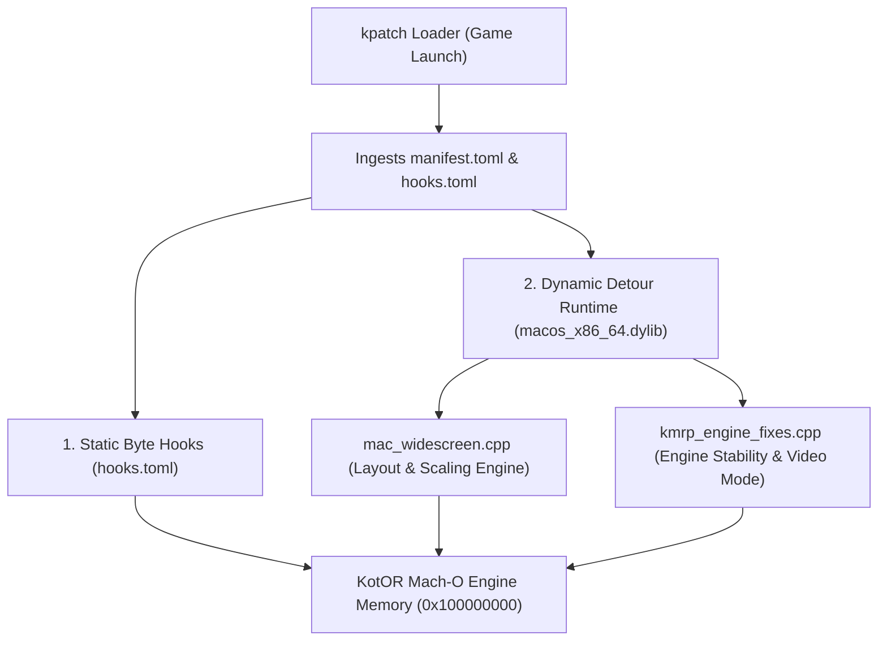
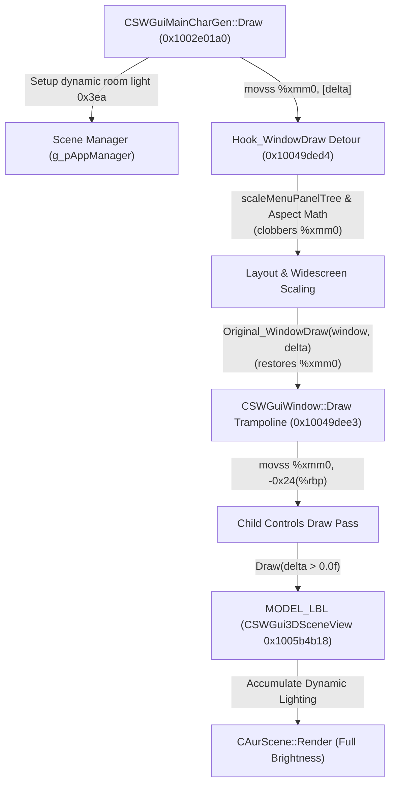

# KotOR 1 macOS Widescreen & High-Resolution UI Architecture Guide
*A Comprehensive Engineering Reference for the Aspyr 64-bit AMD64 Port (with KMRP Engine Enhancements)*

Note: You do not need to read this readme! This is a technical explanation for accountability and for interest. This patch offers two modes: (1) a scaled-up vanilla mode (with no additional files required) and (2) an external gui mode, with specific variables (or the variables for the conventional scaling formula, see section 9.2) defined in swkotor.ini. For mode 2, add `UseGuiFileLayouts=1` under `[Graphics Options]` to your .ini file.——FTD

---

## Table of Contents
1. [Architecture & System Overview](#1-architecture--system-overview)
   - 1.1 [The Multi-File Patching Pipeline](#11-the-multi-file-patching-pipeline)
   - 1.2 [Virtual Memory Safety on macOS](#12-virtual-memory-safety-on-macos)
   - 1.3 [Detour Execution Model: Single-Draw Preservation & Float delta Restoration](#13-detour-execution-model-single-draw-preservation--float-delta-restoration)
   - 1.4 [Sequential Hook Validation & Detour Ordering in hooks.toml](#14-sequential-hook-validation--detour-ordering-in-hookstoml)
2. [Display Resolution & Aspect Ratio Edits](#2-display-resolution--aspect-ratio-edits)
   - 2.1 [Resolution Discovery, Hardware Overrides & Retina (HiDPI) Mode Detection](#21-resolution-discovery-hardware-overrides--retina-hidpi-mode-detection)
   - 2.2 [Fullscreen Video Mode Alignment (KMRP_UseTargetVideoMode)](#22-fullscreen-video-mode-alignment-kmrp_usetargetvideomode)
   - 2.3 [Retina Display Mode List Scaling (KMRP_DisplayModeScale)](#23-retina-display-mode-list-scaling-kmrp_displaymodescale)
   - 2.4 [External .gui Layout Support (UseGuiFileLayouts)](#24-external-gui-layout-support-useguifilelayouts)
   - 2.5 [3D Viewport & Hor+ FOV Scaling](#25-3d-viewport--hor-fov-scaling)
   - 2.6 [Fullscreen Fade Curtain (CSWGuiFade)](#26-fullscreen-fade-curtain-cswguifade)
3. [In-Game Gameplay HUD & Minimap Edits](#3-in-game-gameplay-hud--minimap-edits)
   - 3.1 [Multi-Template Architecture & Resolution Standardization](#31-multi-template-architecture--resolution-standardization)
   - 3.2 [Master HUD Detour: CSWGuiMainInterface::Draw (0x100235e44)](#32-master-hud-detour-cswguimaininterfacedraw-0x100235e44)
   - 3.3 [Top-Right Button Cluster & Background Moulding](#33-top-right-button-cluster--background-moulding)
   - 3.4 [Bottom-Right Combat Action Bar & Queue](#34-bottom-right-combat-action-bar--queue)
   - 3.5 [Bottom-Left Portrait & Vitality Cluster](#35-bottom-left-portrait--vitality-cluster)
   - 3.6 [Floating Target Reticle & Health Bar](#36-floating-target-reticle--health-bar)
   - 3.7 [Fullscreen Tooltip & Scissor Clipping Elimination](#37-fullscreen-tooltip--scissor-clipping-elimination)
   - 3.8 [HUD Action Button Title Hover Centering & Height Alignment](#38-hud-action-button-title-hover-centering--height-alignment)
   - 3.9 [Minimap Radar Architecture & 1:1 Zoom Normalization (KMRP_MinimapMapRect/Zoom)](#39-minimap-radar-architecture--11-zoom-normalization-kmrp_minimapmaprectzoom)
   - 3.10 [Dynamic Positioning for Ambient NPC Bark Dialogue Banners (CSWGuiBarkBubble)](#310-dynamic-positioning-for-ambient-npc-bark-dialogue-banners-cswguibarkbubble)
   - 3.11 [Native Positioning for In-Game Pause Notification (CSWGuiInGamePause)](#311-native-positioning-for-in-game-pause-notification-cswguiingamepause)
4. [Main Area Map Screen Edits](#4-main-area-map-screen-edits)
   - 4.1 [Architecture of CSWGuiInGameMap (0x1005ab010)](#41-architecture-of-cswguiingamemap-0x1005ab010)
   - 4.2 [Responsive Viewport Scaling](#42-responsive-viewport-scaling)
   - 4.3 [Dynamic Fog Tile Step Scaling (CSWGuiMapHider::Draw)](#43-dynamic-fog-tile-step-scaling-cswguimaphiderdraw)
   - 4.4 [Area Map Centering Displacements](#44-area-map-centering-displacements)
   - 4.5 [Dynamic Map Marker Coordinate Scaling & High-Resolution Alignment](#45-dynamic-map-marker-coordinate-scaling--high-resolution-alignment)
5. [Inventory, Equipment, Character Sheet, & In-Game Skill Lists](#5-inventory-equipment-character-sheet--in-game-skill-lists)
   - 5.1 [Listbox Architecture & The 5-Slot Visible Budget](#51-listbox-architecture--the-5-slot-visible-budget)
   - 5.2 [Listbox Row Height & Stride Management (CSWGuiListBox)](#52-listbox-row-height--stride-management-cswguilistbox)
   - 5.3 [Independent Icon Geometry Hook (0x1002be42b)](#53-independent-icon-geometry-hook-0x1002be42b)
   - 5.4 [Text Box Alignment & Width Deduction](#54-text-box-alignment--width-deduction)
   - 5.5 [Item Quantity Badge Positioning & Missing Count Resolution (StackBadgeHeight & K5 Hook)](#55-item-quantity-badge-positioning--missing-count-resolution-stackbadgeheight--k5-hook)
   - 5.6 [In-Game Skill & Feat List Layout (CSWGuiInGameSkillEntry / 0x10022f60f)](#56-in-game-skill--feat-list-layout-cswguiingameskillentry--0x10022f60f)
   - 5.7 [Continuous Resolution Scaling Formula](#57-continuous-resolution-scaling-formula)
   - 5.8 [Item Icon Border Arch Scaling & The 4-Mini-Box Bug (CSWGuiBorder::Draw at 0x1004a1e40)](#58-item-icon-border-arch-scaling--the-4-mini-box-bug-cswguiborderdraw-at-0x1004a1e40)
   - 5.9 [Leading Newline Trim in GUI Text (KMRP_TrimLeadingNewlines at 0x1004a3726)](#59-leading-newline-trim-in-gui-text-kmrp_trimleadingnewlines-at-0x1004a3726)
   - 5.10 [AI Script Selection Screen Centering & Layout (CSWGuiScriptSelect / 0x1005acc70)](#510-ai-script-selection-screen-centering--layout-cswguiscriptselect--0x1005acc70)
6. [Popup Dialogs, Containers, Terminals, & Text Logs](#6-popup-dialogs-containers-terminals--text-logs)
   - 6.1 [Dispatching via isPopupPanel()](#61-dispatching-via-ispopuppanel)
   - 6.2 [Proportional Geometry Scaling & Automatic Centering](#62-proportional-geometry-scaling--automatic-centering)
   - 6.3 [Scroll Position Preservation (s_popupSnapshots)](#63-scroll-position-preservation-s_popupsnapshots)
   - 6.4 [Message Box Text Ceilings & Layout Fixes](#64-message-box-text-ceilings--layout-fixes)
   - 6.5 [Merchant Store Screens (CSWGuiStore / 0x1005ad040)](#65-merchant-store-screens-cswguistore--0x1005ad040)
   - 6.6 [Workbench Upgrade Screens (CSWGuiUpgradeItemSelect & CSWGuiUpgrade)](#66-workbench-upgrade-screens-cswguiupgradeitemselect--cswguiupgrade)
   - 6.7 [In-Game Area Transition Prompt & Vertical Text Centering (CSWGuiInGameAreaTransition / 0x1005a67c0)](#67-in-game-area-transition-prompt--vertical-text-centering-cswguiingameareatransition--0x1005a67c0)
   - 6.8 [Dialogue Letterbox Scaling, Expanded Reply Extent & Ultrawide Fix (SizeDialogueLetterbox)](#68-dialogue-letterbox-scaling-expanded-reply-extent--ultrawide-fix-sizedialogueletterbox)
   - 6.9 [Computer Terminals & Dialog Reply Listboxes (CSWGuiDialogComputer / 0x1005a6db0)](#69-computer-terminals--dialog-reply-listboxes-cswguidialogcomputer--0x1005a6db0)
   - 6.10 [Buffer Overrun Guard on 0x1005a6b98 in Hook_WindowDraw](#610-buffer-overrun-guard-on-0x1005a6b98-in-hook_windowdraw)
   - 6.11 [Messages Menu Formatting & Variable-Height Listbox Enforcement (CSWGuiInGameMessages / 0x1005ae790)](#611-messages-menu-formatting--variable-height-listbox-enforcement-cswguiingamemessages--0x1005ae790)
   - 6.12 [Security Camera Live 3D Viewport (CSWGuiDialogComputerCamera / 0x1005a6ed8)](#612-security-camera-live-3d-viewport-cswguidialogcomputercamera--0x1005a6ed8)
7. [Character Generation & Level-Up Edits](#7-character-generation--level-up-edits)
   - 7.1 [Class Selection Screen (CSWGuiClassSelection / classsel.gui)](#71-class-selection-screen-cswguiclassselection--classselgui)
   - 7.2 [Separation of Root Level-Up Console vs. Small Choice Panels](#72-separation-of-root-level-up-console-vs-small-choice-panels)
   - 7.3 [Character Generation Lighting Architecture & Subpanel State Transition (0x1002e01a0)](#73-character-generation-lighting-architecture--subpanel-state-transition-0x1002e01a0)
8. [Universal Menu Centering & Engine Layout Edits](#8-universal-menu-centering--engine-layout-edits)
   - 8.1 [The Universal Menu Centering Flag 0x60](#81-the-universal-menu-centering-flag-0x60)
   - 8.2 [The Definitive Centering Fix](#82-the-definitive-centering-fix)
   - 8.3 [Dynamic Centering Displacements (patchMenuCenteringConstants)](#83-dynamic-centering-displacements-patchmenucenteringconstants)
   - 8.4 [Save & Load Game Screen (CSWGuiSaveLoad at 0x1005ae300)](#84-save--load-game-screen-cswguisaveload-at-0x1005ae300)
   - 8.5 [Movies Menu List Layout & Stability (CSWGuiTitleMovies at 0x1005abc50)](#85-movies-menu-list-layout--stability-cswguititlemovies-at-0x1005abc50)
   - 8.6 [HUD Isolation from Menu Scaling](#86-hud-isolation-from-menu-scaling)
   - 8.7 [Elimination of 8-Bit Sign-Extension Bugs](#87-elimination-of-8-bit-sign-extension-bugs)
   - 8.8 [Pazaak Minigame Screens & Card 2 Scaling Fix](#88-pazaak-minigame-screens--card-2-scaling-fix)
   - 8.9 [Quests & Journal Screen Quest Border Calibration (CSWGuiInGameJournal at 0x1005aed10)](#89-quests--journal-screen-quest-border-calibration-cswguiingamejournal-at-0x1005aed10)
   - 8.10 [KMRP Word-Wrap Infinite Loop Hang ("Inventory Crash") Fix (0x1001bc644)](#810-kmrp-word-wrap-infinite-loop-hang-inventory-crash-fix-0x1001bc644)
   - 8.11 [KMRP Listbox Row Inflation on Repopulate Fix (0x1004a8927)](#811-kmrp-listbox-row-inflation-on-repopulate-fix-0x1004a8927)
   - 8.12 [KMRP Wrapped Text Measurement Under-Estimation Fix (0x1001bca20)](#812-kmrp-wrapped-text-measurement-under-estimation-fix-0x1001bca20)
   - 8.13 [Font Cache Invalidation by Height & Address (MarkFontScaled)](#813-font-cache-invalidation-by-height--address-markfontscaled)
9. [UI Customization & Dual-Mode Engine Architecture](#9-ui-customization--dual-mode-engine-architecture)
   - 9.1 [Dual-Mode Operation: Procedural Stretch vs. External GUI Files](#91-dual-mode-operation-procedural-stretch-vs-external-gui-files)
   - 9.2 [Multi-Skin Scaling Engine (UI Scaling Bases)](#92-multi-skin-scaling-engine-ui-scaling-bases)
   - 9.3 [Complete Configuration Reference (swkotor.ini)](#93-complete-configuration-reference-swkotorini)
10. [Master Reference Tables](#10-master-reference-tables)
   - 10.1 [Active Binary Detour Hooks (mac_widescreen.cpp & kmrp_engine_fixes.cpp)](#101-active-binary-detour-hooks-mac_widescreencpp--kmrp_engine_fixescpp)
   - 10.2 [Dynamic & Static Byte-Level Engine Patches](#102-dynamic--static-byte-level-engine-patches)
   - 10.3 [Engine Global Variables & Pointers](#103-engine-global-variables--pointers)
   - 10.4 [Master Vtable Inventory](#104-master-vtable-inventory)
   - 10.5 [Internal Structure Memory Offsets](#105-internal-structure-memory-offsets)

---

## 1. Architecture & System Overview

### 1.1 The Multi-File Patching Pipeline
The Knights of the Old Republic (KotOR 1) macOS widescreen and engine enhancement patch operates on Aspyr’s 64-bit AMD64 binary (`k1_mac_aspyr_swkotor.app_x64`). Rather than modifying the executable file on disk, the patch utilizes a clean, non-destructive runtime injection architecture consisting of interconnected layers across multiple source modules:



1. **`kpatch` Loader Archive (`FTD Vriff.kpatch`)**: A zip container containing `manifest.toml`, `kotor1-steam-aspyr-macos.hooks.toml`, and the compiled dynamic library `binaries/macos_x86_64.dylib`.
2. **Static Machine-Code Hooks (`kotor1-steam-aspyr-macos.hooks.toml`)**: Byte-level patches that modify assembly instructions at specific virtual addresses upon injection. Used for static instruction replacements such as register operand swaps, opcode modifications, NOP padding, and KMRP stability fixes.
3. **C++ Detour Runtime (`macos_x86_64.dylib`)**: Compiled with Apple Clang (`clang++ -dynamiclib -std=c++17 -arch x86_64`) from two primary source files:
   - `mac_widescreen.cpp`: Installs function detours, intercepts engine rendering and layout passes, manages dynamic UI coordinate hierarchies, and updates internal engine structures.
   - `kmrp_engine_fixes.cpp`: Implements low-level macOS video mode synchronization, Retina display mode expansion, letterbox aspect calibration, minimap zoom preservation, and string sanitization ported from the KotOR Modding Restoration Project (KMRP).

### 1.2 Virtual Memory Safety on macOS
Writing to code and read-only data segments in macOS Mach-O processes requires interacting directly with Darwin kernel Mach Virtual Memory APIs. The helper routines execute safe page-protection toggles:

```cpp
bool writeMemBytes(uintptr_t destAddress, const void* srcData, size_t length) {
    mach_port_t selfTask = mach_task_self();
    mach_vm_address_t pageAddress = destAddress & ~0xFFFULL;
    mach_vm_size_t pageSize = ((destAddress + length + 0xFFFULL) & ~0xFFFULL) - pageAddress;
    
    // 1. Elevate page permissions to Read/Write/Copy (COW)
    kern_return_t kr = mach_vm_protect(selfTask, pageAddress, pageSize, FALSE, 
                                       VM_PROT_READ | VM_PROT_WRITE | VM_PROT_COPY);
    if (kr != KERN_SUCCESS) return false;
    
    // 2. Perform raw memory copy
    memcpy((void*)destAddress, srcData, length);
    
    // 3. Restore executable protection
    mach_vm_protect(selfTask, pageAddress, pageSize, FALSE, 
                    VM_PROT_READ | VM_PROT_EXECUTE);
    return true;
}
```

In `kmrp_engine_fixes.cpp`, `ReplaceImageBytes` extends this concept by validating that memory still matches expected vanilla bytes before patching (`memcmp`), ensuring that external mods or conflicting hooks are never clobbered.

> [!NOTE]
> `VM_PROT_COPY` enforces copy-on-write semantics, guaranteeing that patched pages remain isolated to the running process without corrupting disk binaries or violating system integrity.

### 1.3 Detour Execution Model: Single-Draw Preservation & Float delta Restoration

#### KPM Detour Architecture: Prefix Interception & Prologue Continuation
Detour hooks in KotorPatcher (KPM) operate as **prefix detours**. When a function prologue is hooked:
1. The game executes a near jump to KPM's dynamically generated detour stub.
2. KPM's stub pushes general-purpose registers (`rax`, `rcx`, `rdx`, `rsi`, `rdi`, `r8`–`r15`) and calls the C++ detour function in `macos_x86_64.dylib`.
3. When the C++ detour returns (`ret`), KPM's stub restores the saved general-purpose registers.
4. KPM's stub **automatically executes the stolen prologue bytes and jumps back into the original function** (`target + stolen_bytes_length`).

Because KPM handles the stolen prologue bytes and execution continuation automatically, C++ detour handlers do not—and must not—call explicit trampolines (`Original_Func`). Omitting trampolines guarantees **single-draw execution**, preventing doubled animation speeds and preserving full framerate performance.

#### Floating-Point ABI Preservation (`%xmm0`) & Dynamic Lighting
Under the System V AMD64 ABI on macOS:
1. Scalar floating-point parameters (such as `delta` in `CSWGuiWindow::Draw(void* this, float delta)`) are passed in register `%xmm0`.
2. KPM's stub saves and restores general-purpose integer registers around the detour call, but **does not preserve SSE vector registers (`%xmm0`–`%xmm15`)**.
3. Any floating-point math performed inside the C++ detour (e.g. aspect ratio scaling or viewport calculation) clobbers `%xmm0`. If the hook returned `void`, `%xmm0` would exit containing arbitrary math remainders (often `0.0f`).
4. When KPM's stub jumps back to the original function at `0x10049dee3`, the engine executes:
   ```asm
   0x10049dee3: movss %xmm0, -0x24(%rbp)    # Saves delta to local stack frame
   ```
   If `%xmm0` were `0.0f`, child controls such as `CSWGui3DSceneView` would receive zero delta, halting dynamic room lighting accumulation in `CAurScene::Render` and collapsing 3D character models into pitch-black silhouettes.

#### The Architectural Solution: Returning `float delta`
By declaring detour handlers to return `float` and ending with `return delta;`:
```cpp
extern "C" float Hook_WindowDraw(char* window, float delta) {
    if (window && is_readable(window)) {
        // Apply coordinate hierarchy, centering, and scaling
    }
    return delta;
}

extern "C" float Hook_MainInterfaceDraw(char* hud, float delta) {
    if (hud && is_readable(hud)) {
        // Enforce widescreen anchors and viewport bounds
    }
    return delta;
}
```
Under System V ABI conventions, a function's scalar `float` return value is placed directly into `%xmm0`. When control returns through KPM's stub to the original function prologue, `%xmm0` holds the legitimate frame `delta`. Dynamic scene lighting accumulates normally, keeping 3D character models vividly illuminated across all menus.
### 1.4 Sequential Hook Validation & Detour Ordering in hooks.toml
KPM processes hooks in sequential file order and halts immediately if the `original_bytes` at any address do not match current memory.

The first declared detour hook loads `macos_x86_64.dylib`, whose constructor (`DylibInit`) dynamically writes resolution-dependent values into engine memory. If a static byte hook were declared *after* a detour and targeted memory modified by `DylibInit`, KPM's verification would fail against the newly modified bytes and abort all subsequent patches.

To ensure 100% deterministic installation, `kotor1-steam-aspyr-macos.hooks.toml` enforces strict structural ordering:
1. **All Static Byte Hooks (Sections 1, 2, 4, 6, 7, and KMRP Byte Fixes)** are declared first, allowing KPM to verify and patch clean binary bytes.
2. **All C++ Detour Hooks** are placed at the very end of the file.

---

## 2. Display Resolution & Aspect Ratio Edits

### 2.1 Resolution Discovery, Hardware Overrides & Retina (HiDPI) Mode Detection
Vanilla KotOR hardcoded display resolutions to legacy 4:3 aspect ratios (800×600, 1024×768, 1280×1024, 1600×1200). The engine clamped any arbitrary resolution request to the nearest 4:3 fallback.

The widescreen patch establishes target rendering bounds through a hierarchical discovery pipeline:
1. **Dynamic Point & Pixel Detection via CoreGraphics**: On launch, the runtime queries the active monitor using macOS CoreGraphics (`CGMainDisplayID`, `CGDisplayBounds`, and `CGDisplayCopyDisplayMode`). This retrieves both logical point dimensions (e.g. 1512×982 on 14" MacBook Pro) and native hardware pixel dimensions (e.g. 3024×1964). Using point dimensions by default guarantees 100% pixel-perfect mouse hitboxes without cursor drift.
2. **Configuration File Discovery (`swkotor.ini`)**: The patch reads `Width` and `Height` under `[Graphics Options]` in `~/Library/Application Support/Knights of the Old Republic/swkotor.ini` as a secondary fallback.
3. **Explicit Hardware Overrides (`ForceWidth` / `ForceHeight`)**: Users can explicitly dictate target resolution by adding `ForceWidth` and `ForceHeight` under `[Graphics Options]`:
   ```ini
   [Graphics Options]
   ForceWidth=1920
   ForceHeight=1200
   ```
4. **Runtime Engine Canvas Updates**: The target dimensions are propagated directly to the engine's internal global structures:
   - `0x1005d3b8c`: Global UI Canvas Width (`g_uiWidth`)
   - `0x1005d3b90`: Global UI Canvas Height (`g_uiHeight`)
   - `0x1005f4b44`: OpenGL Root Viewport Width (16-bit short)
   - `0x1005f4b46`: OpenGL Root Viewport Height (16-bit short)
   - `mgr + 0xa4`, `mgr + 0xa6`: `CSWGuiManager` canvas width and height

### 2.2 Fullscreen Video Mode Alignment (`KMRP_UseTargetVideoMode`)
The widescreen layout operates at `g_targetWidth` and `g_targetHeight`, but the engine's video mode routine (`0x10026e864`, Aspyr's `ReadAndSetVideoMode`) reads `[Graphics Options]` `Width` and `Height`. In fullscreen mode, macOS CGL allocates a fixed-size surface (`kCGLCPSurfaceBackingSize`). With the default 1024×768 in the INI, high-resolution frames (e.g. 1512×982) were rendered into a 1024×768 surface and cropped into the bottom-left corner of the physical display.

The detour `KMRP_UseTargetVideoMode` intercepts the convergence of all display mode paths at `0x10026ed44`:
```cpp
extern "C" void KMRP_UseTargetVideoMode(int* width, int* height) {
    if (!width || !height || g_targetWidth <= 0 || g_targetHeight <= 0) return;
    *width = g_targetWidth;
    *height = g_targetHeight;
    SizeDialogueLetterbox(g_targetWidth, g_targetHeight);
}
```
This forces `r12` (width) and `r15` (height) to match the target resolution, ensuring that the CGL fullscreen surface, OpenGL viewport, and widescreen layout agree.

### 2.3 Retina Display Mode List Scaling (`KMRP_DisplayModeScale`)
In Aspyr's port, a display mode is only accepted if it exists in the engine's internal mode list (`0x100204d5a`); missing modes fall back to 1024×768. The list-builder at `0x10001ddee` was designed to generate HiDPI twin modes scaled by the monitor's backing scale factor, but Aspyr hardcoded the factor to constant `1.0` (`0x10001de62`). Consequently, requesting full Retina pixel targets (such as `ForceWidth=3024` and `ForceHeight=1964`) failed validation and fell back to 1024×768.

The detour `KMRP_DisplayModeScale` intercepts the storage of that constant at `0x10001de6c`:
```cpp
extern "C" uint64_t KMRP_DisplayModeScale() {
    InitTargetResolution();
    double scale = 1.0;
    if (g_displayPointWidth > 0 && g_displayPointHeight > 0 &&
        (g_targetWidth > g_displayPointWidth || g_targetHeight > g_displayPointHeight)) {
        const double ratio = static_cast<double>(g_displayPixelWidth) / g_displayPointWidth;
        if (ratio > 1.0) scale = ratio;
    }
    uint64_t bits;
    memcpy(&bits, &scale, sizeof bits);
    return bits;
}
```
When a high-DPI target is requested, it provides the true pixel-to-point ratio (e.g. 2.0) in `rax`. The engine populates the HiDPI modes and handles SDL mouse scaling via its native render/window ratio (`0x100025802`), allowing native Retina rendering without cursor drift.

### 2.4 External `.gui` Layout Support (`UseGuiFileLayouts`)
For users who prefer pre-authored high-resolution GUI files in `Override/` (such as KOTOR High Resolution Menus or KMRP GUI sets), the patch provides `UseGuiFileLayouts=1` under `[Graphics Options]` in `swkotor.ini`:
```ini
[Graphics Options]
UseGuiFileLayouts=1
```
When enabled:
- The patch unlocks resolution, engine canvas dimensions, video modes, and stability bugfixes.
- Procedural C++ layout overrides in `Hook_MainInterfaceDraw`, `Hook_WindowDraw`, `Hook_ClassSelectionUpdate`, and font metadata scaling return immediately, allowing the authored `.gui` files to control menu placement.
- `DylibInit` loads `mipc28x6` (or `mipc210x7` at 3440×1440), restores the vanilla class selection update loop (`0x100337897`), and restores the vanilla store badge coordinates.

### 2.5 3D Viewport & Hor+ FOV Scaling
KotOR's 3D rendering pipeline uses a horizontal-plus (Hor+) field-of-view calculation. For any widescreen aspect ratio $A = W / H > 4/3$, the horizontal field of view $\text{FOV}_h$ expands proportionally based on vertical field of view $\text{FOV}_v$:

$$\text{FOV}_h = 2 \cdot \arctan\left(\tan\left(\frac{\text{FOV}_v}{2}\right) \cdot \frac{W}{H}\right)$$

This prevents vertical cropping (Vert- syndrome) and ensures that character models, geometry, and environments render with proper spatial perspective across 16:9, 16:10, and ultrawide displays.

### 2.6 Fullscreen Fade Curtain (`CSWGuiFade`)
During area transitions, cutscenes, and dialogue skips, the engine renders a fullscreen black quad via `CSWGuiFade` (`0x1005a90e0`). In vanilla, this quad was clamped to 640×480 or 1024×768, leaving unrendered pillars on widescreen displays.

In `scaleMenuPanelTree()`, when `vtable == (void*)0x1005a90e0`:
```cpp
Rect fullscreen = { 0, 0, g_targetWidth, g_targetHeight };
SetControlRect(panel, fullscreen);
```
The fade quad is explicitly expanded to span the full physical window extent `[0, 0, W, H]`.

---

## 3. In-Game Gameplay HUD & Minimap Edits

### 3.1 Multi-Template Architecture & Resolution Standardization
In the Aspyr 64-bit Mac binary, `CSWGuiMainInterface::Create` (`0x10023341b`) evaluates screen height to select an authored GUI template:
```x86asm
0x10023341b: movswl 0xa6(%rbx), %eax      ## Read manager height
0x100233422: cmpl   $0x4b0, %eax          ## 0x4B0 == 1200
0x100233427: jl     0x100233453
0x100233429: leaq   "mipc216x12", %rsi    ## Height >= 1200 -> loads "mipc216x12" (1600x1200)
0x100233454: cmpl   $0x400, %eax          ## 0x400 == 1024
0x100233459: movq   %r15, %rbx            ## Critical: control pointer restoration
0x10023345c: jl     0x100233482
0x10023345e: leaq   "mipc212x10", %rsi    ## Height >= 1024 -> loads "mipc212x10" (1280x1024)
0x100233482: cmpl   $0x3c0, %eax          ## 0x3C0 == 960
0x100233487: jl     0x1002334ad
0x100233489: leaq   "mipc212x9", %rsi     ## Height >= 960  -> loads "mipc212x9"  (1280x960)
0x1002334ad: cmpl   $0x300, %eax          ## 0x300 == 768
0x1002334b2: jl     0x1002334d8
0x1002334b4: leaq   "mipc210x7", %rsi     ## Height >= 768  -> loads "mipc210x7"  (1024x768)
0x1002334d8: leaq   "mipc28x6", %rsi      ## Else           -> loads "mipc28x6"   (800x600)
```

The patch preserves 100% of the original machine instructions, registers, and branch paths by safely repointing all four `leaq` template string literal target addresses (`0x100233429`, `0x10023345e`, `0x1002334b4`, and `0x1002334d8`) directly to `"mipc212x9"` (see [Table 9.2](#92-dynamic--static-byte-level-engine-patches)).

This guarantees that KotOR loads `mipc212x9` on every resolution with deterministic control indices and complete save-load stability. HUD elements (`HudScale`, `CombatScale`, and top-right buttons) automatically scale down proportionally using `targetHeight / 982.0f`.

### 3.2 Master HUD Detour: `CSWGuiMainInterface::Draw` (`0x100235e44`)
The master HUD render pass is intercepted on every frame via a detour on `CSWGuiMainInterface::Draw`. The patch implements **edge-anchored responsive positioning**:

```
+-----------------------------------------------------------------------+
| [Minimap (10, 10)]                                 [Top-Right Buttons]|
|  Moulding Bar (0, 5) bridges seamlessly            Menu, Map, Journal |
|                                                    x = screenW - offs |
|                                                                       |
|                                                                       |
| [Bottom-Left Cluster]                           [Bottom-Right Action] |
| Portraits, Health, Force                           Attack, Feats, Use |
| y = screenH - offs                              x = screenW - offs    |
+-----------------------------------------------------------------------+
```

### 3.3 Top-Right Button Cluster & Background Moulding
Because `mipc212x9` is universally loaded, the 8 category buttons follow strict deterministic indices:
- `BTN_EQU` (30), `BTN_INV` (29), `BTN_CHAR` (27), `BTN_ABI` (28), `BTN_MSG` (23), `BTN_JOU` (24), `BTN_MAP` (25), `BTN_OPT` (26).
- Anchoring calculation:
  $$X_{\text{last}} = W_{\text{target}} - 4, \quad X_{\text{first}} = X_{\text{last}} - 42 - (7 \cdot 43)$$
  $$X_{\text{btn}}[i] = X_{\text{first}} + (i \cdot 43)$$

**Background Banner Quad (`LBL_MENUBG` / Control 19)**:
Resized to span `left = firstBtnLeft + 1`, `width = (lastBtnRight - 1) - banner.left`, seating the dark backing quad flush behind all 8 buttons.

**Top Moulding Horizontal Bars (Controls 0 & 5)**:
In the vanilla 4:3 template, `LBL_CMBTMSGBG` (Control 0) and `LBL_CMBTMODEMSG` (Control 5) stopped at X = 1023. When the buttons move to the widescreen right edge, this created a black gap across the ceiling. The runtime dynamically stretches both controls from the minimap border (`X = 143`) to the start of the buttons (`X = firstBtnLeft + 2`), seamlessly bridging the gap.

### 3.4 Bottom-Right Combat Action Bar & Queue
The combat action bar and queue elements are scaled and anchored to the bottom-right corner:
- Scaled as a unified group from origin `(1095, 872)` using `HudScale`.
- Anchored to `targetWidth - 6 - scaledWidth` horizontally and `targetHeight - 8 - scaledHeight` vertically.
- Hit testing: Hitboxes for all action buttons, cycling arrows, and queue slots update dynamically, preserving 1:1 mouse selection accuracy.

### 3.5 Bottom-Left Portrait & Vitality Cluster
The party portrait tray, vitality bars, and Force meters:
- Positioned flush against the bottom-left corner at `left = 10`, `top = screenHeight - 145`.
- Secondary party member portraits stack horizontally with proportional offsets, preventing overlap with dialogues or subtitles.

### 3.6 Floating Target Reticle & Health Bar
Targeting NPCs or objects in 3D world space renders a floating reticle consisting of the target nameplate, health bar, and 3 combat action slots.
- The engine hardcoded these bounds for 800×600.
- The runtime applies uniform scaling based on vertical screen height:
  $$\text{scale} = \frac{\text{targetHeight}}{600}$$
- Preserves 1:1 square action icons (32×32 base) and readable health bars.

### 3.7 Fullscreen Tooltip & Scissor Clipping Elimination
In vanilla KotOR, tooltips and action descriptions clipped abruptly when hovering over elements placed beyond 1280px.
- **Root Cause**: `CSWGuiWindow::Draw` initialized the root scissor rectangle to the hardcoded engine dimensions `0x1005d3b8c` (1280px).
- **The Solution**: Overriding `0x1005d3b8c` with `g_targetWidth` and configuring `CSWGuiToolTipPanel` (`0x1005d3210`) to span full screen bounds permits descriptions to render across any display width.

### 3.8 HUD Action Button Title Hover Centering & Height Alignment
When the player mouses over any of the 6 combat action buttons in the bottom-right HUD, KotOR displays the active action's name in a rounded background pill.
1. **Baseline Initialization**: During `scaleMainInterface()`, the baseline coordinate is synchronized:
   ```cpp
   *(int*)(hud + 0xd170) = targetActionTop;
   ```
2. **Per-Frame Dynamic Button Tracking in `Hook_MainInterfaceDraw`**:
   The engine stores the active combat button index at `*(int*)(hud + 0x2358)`. The 6 buttons reside at `hud + 0x97e0` with a stride of `0x910` bytes:
   $$\text{btnAddress} = \text{hud} + \text{0x97e0} + (\text{hoveredIndex} \cdot \text{0x910})$$
   Every frame, the action nameplate centers horizontally over the hovered button and rests exactly 2px above its top border across all screen resolutions and UI scale factors.

### 3.9 Minimap Radar Architecture & 1:1 Zoom Normalization (`KMRP_MinimapMapRect/Zoom`)
The minimap HUD element (`CSWGuiInGameMinimap` at `0x1005abae0`) consists of a circular radar scanner encased in a metallic frame.

#### The Zoom Distortion Defect
In vanilla KotOR, the radar scanner (`LBL_MAPVIEW`) is authored at 120×120 and the map texture (`LBL_MAP`) is 512×512. When the widescreen patch enlarges the radar circle to `130 * HudScale` (e.g. 195px at 1512×982), the map texture stayed at 512px. As a result, the player saw 1.6× more area with surrounding geometry and doorways shrunken down.

#### 1:1 Radar Scale Normalization
The engine draws the minimap (`0x100237848`) by opening an OpenGL viewport, centering `LBL_MAP` on the player, drawing it, executing the fog pass (`0x100238684`), and drawing the player arrow.

The patch deploys three cooperative hooks:
1. `KMRP_MinimapMapRect` (`0x100237974`): Re-centers `LBL_MAP` relative to an authentic 120px radar.
2. `KMRP_MinimapZoomBegin` (`0x100237a2f`): Once the viewport is opened, temporarily sets the active OpenGL viewport stack entry (`0x1005f4b40`) and the radar size in `hud + 0x7b10/0x7b14` to 120px. The map and fog normalizations divide against 120px, enlarging the map geometry to maintain an authentic 1:1 scale within the larger radar circle.
3. `KMRP_MinimapZoomEnd` (`0x100237a4f`): Restores the original enlarged viewport dimensions immediately prior to drawing the player orientation arrow, ensuring that player blips and compass rotations remain mathematically exact.

### 3.10 Dynamic Positioning for Ambient NPC Bark Dialogue Banners (`CSWGuiBarkBubble`)
In KotOR, one-line dialogue quips from ambient non-conversational NPCs render inside a floating 2D speech banner (`barkbubble.gui`, managed by `CSWGuiBarkBubble` at `0x1005ad420`).
- **Dynamic Top Calculation**: `positionBarkBubble` calculates `desiredTop = minimapBottom + margin`.
- **Native Offset Injection at `+0x21c`**: On every frame, `CSWGuiBarkBubble::Draw` (`0x1002ddfa2`) loads its top offset directly from `*(int*)(this + 0x21c)`. Writing `desiredTop` directly to `+0x21c` guarantees that the banner and its child label (`LBL_BARKTEXT`) shift cleanly below the minimap without overlapping.

### 3.11 Native Positioning for In-Game Pause Notification (`CSWGuiInGamePause`)
In vanilla KotOR, pressing Spacebar toggles an in-game pause notification (`pause.gui`, base 251×70) positioned underneath the top-right category buttons.
- The engine computes placement inside `CSWGuiMainInterface::PositionPause` (`0x100239496`).
- By excluding `CSWGuiInGamePause` from modal popup scaling (`isPopupPanel()`), the native routine positions the banner flush under the top-right category bar at $(W_{\text{target}} - 254, 46)$ with zero distortion.

---

## 4. Main Area Map Screen Edits

### 4.1 Architecture of `CSWGuiInGameMap` (`0x1005ab010`)
The full-screen Area Map menu allows panning and zooming the discovered level geometry:
- `panel + 0x80`: `mapView` (Active clipping viewport within the blue frame)
- `panel + 0x1220`: `mapHider` (Fog-of-war grid tile engine, `CSWGuiMapHider`)
- `panel + 0x1528`: `mapTexture` (Static background map texture quad)

### 4.2 Responsive Viewport Scaling
In `scaleMenuPanelTree()`, the map subcontrols are scaled relative to the scaled menu canvas (`targetW × targetH`):
```cpp
int mapLeft = (int)(((long long)95  * targetW + baseW / 2) / baseW);
int mapTop  = (int)(((long long)118 * targetH + baseH / 2) / baseH);
int mapW    = (int)(((long long)440 * targetW + baseW / 2) / baseW);
int mapH    = (int)(((long long)256 * targetH + baseH / 2) / baseH);

Rect viewRect = { mapLeft, mapTop, mapW, mapH };
SetControlRect(panel + 0x80, viewRect);

Rect hiderRect = { 0, 0, mapW, mapH };
SetControlRect(panel + 0x1220, hiderRect);

int texW = (int)(((long long)512 * targetW + baseW / 2) / baseW);
int texH = (int)(((long long)256 * targetH + baseH / 2) / baseH);
Rect texRect = { 0, 0, texW, texH };
SetControlRect(panel + 0x1528, texRect);
```

### 4.3 Dynamic Fog Tile Step Scaling (`CSWGuiMapHider::Draw`)
In vanilla KotOR, `CSWGuiMapHider::Draw` (`0x1002b4ce0`) divided hardcoded constants `440.0f` and `256.0f` by the tile counts `numTilesX` and `numTilesY` to establish the step size for drawing revealed fog quads.

The patch replaces both instructions with dynamic register reads:
- At `0x1002b4ce9`: `cvtsi2ssl 0x10(%r12), %xmm1; nop` (`f3 41 0f 2a 4c 24 10 90`)
- At `0x1002b4cfc`: `cvtsi2ssl 0x14(%r12), %xmm2; nop` (`f3 41 0f 2a 54 24 14 90`)

Because `%r12` holds `this`, `0x10(%r12)` is `mapW` and `0x14(%r12)` is `mapH`. The fog tile step scales dynamically:

$$\text{step}_x = \frac{W_{\text{map}}}{N_x} \qquad \text{step}_y = \frac{H_{\text{map}}}{N_y}$$

The revealed map readout and fog-of-war now cover 100% of the widescreen map screen.

### 4.4 Area Map Centering Displacements
The engine's map renderer (`CSWGuiInGameMap::Draw`) and mouse handler (`CSWGuiInGameMap::HandleMouseInput`) compute coordinate offsets relative to screen dimensions. The patch dynamically updates their four hardcoded displacements (`0x1002b4b3b`, `0x1002b4b46`, `0x1002b5615`, `0x1002b561f`) from `-640` and `-480` to `-targetWidth` and `-targetHeight`, ensuring synchronized map zooming, panning, and mouse clicks.

### 4.5 Dynamic Map Marker Coordinate Scaling & High-Resolution Alignment
1. **`MapHider_WorldToMapCoords` (`0x1004400d2` wrapper)**: Intercepts coordinate calculation for unselected and selected map notes (bullseye quest targets) from `CSWGuiMapHider::Draw` at callsite `0x1002b4fca`. Routes through bridge `0x1000f4f68`, multiplying output coordinates by:
   $$\text{scale} = \frac{\text{targetHeight}}{480}$$
2. **`MapHider_GetPlayerMapCoords` (`0x100440300` wrapper)**: Intercepts coordinate calculation for party member markers (`0x1002b541b`) and the player direction arrow (`0x1002b54c2`). Routes through bridge `0x1000f4f78` to scale coordinates by `g_targetHeight / 480.0f`.
3. **Native Icon Centering Preservation**: Because marker coordinates scale dynamically at the conversion layer, `CSWGuiMapHider::Draw`'s native half-width subtractions (`X - 7` for 14px notes, `X - 8` for 16px party circles, and `X - 16` for the player arrow) remain unmodified, centering markers accurately over world rooms.

---

## 5. Inventory, Equipment, Character Sheet, & In-Game Skill Lists

### 5.1 Listbox Architecture & The 5-Slot Visible Budget
The Inventory (`CSWGuiInGameInventory` at `0x1005a75c0`) and Equipment (`CSWGuiInGameEquip` at `0x1005ab508`) screens display player items using a `CSWGuiListBox` container holding `CSWGuiInGameItemEntry` subcontrols. The interface features exactly **5 pre-rendered purple slot frames**:

$$\text{Total Item Span} = 5 \cdot H_{\text{item}} + 4 \cdot P_{\text{padding}} = 5 \cdot 108 + 4 \cdot 6 = 564\text{ px}$$

### 5.2 Listbox Row Height & Stride Management (`CSWGuiListBox`)
1. **Recalculation Bypass (0x1004a9554 & 0x1004a959c)**: Six NOPs (`90 90 90 90 90 90`) are written to both instructions in `CSWGuiListBox::RecalculateItemHeight`, preventing the engine from overwriting `<code>m_itemHeight</code>` (`+0x368`) with the prototype 70px limit.
2. **Fixed Item Height Flag**: In `scaleMenuPanelTree()`, bit `0x8` is set on the listbox flags (`*(uint8_t*)(ctrl + 0x370) |= 0x8`), instructing KotOR to enforce custom row heights without recalculating.
3. **Dynamic Row Height & Inter-Item Padding**:
   - `*(int*)(ctrl + 0x368) = geom.itemHeight;` (108px at 982p)
   - `*(uint8_t*)(ctrl + 0x373) = (uint8_t)geom.itemPadding;` (6px at 982p)
4. **Scroll Offset Invariance**: With a unified stride $(H_{\text{item}} + P_{\text{padding}} = 114\text{px})$, mouse wheel scrolling advances in clean 1-item increments without vertical drift.

### 5.3 Independent Icon Geometry Hook (`0x1002be42b`)
The patch installs an independent geometry hook in `CSWGuiInGameItemEntry::Layout`:
```cpp
// Subcontrol 1 (0x250): Icon Image Texture
*(int*)(item + 0x250) = rowX;
*(int*)(item + 0x254) = iconY;
*(int*)(item + 0x258) = geom.iconWidth;   // 117px baseline
*(int*)(item + 0x25c) = geom.iconHeight;  // 117px baseline

// Subcontrol 2 (0x2d8): Neon Arch Border
*(int*)(item + 0x2d8) = rowX;
*(int*)(item + 0x2dc) = iconY;
*(int*)(item + 0x2e0) = geom.iconWidth;
*(int*)(item + 0x2e4) = geom.iconHeight;

// Subcontrol 3 (0x360): Selection Highlight Arch
*(int*)(item + 0x360) = rowX;
*(int*)(item + 0x364) = iconY;
*(int*)(item + 0x368) = geom.iconWidth;
*(int*)(item + 0x36c) = geom.iconHeight;
```
This guarantees crisp, undistorted 1:1 square icon brackets.

### 5.4 Text Box Alignment & Width Deduction
Item names and descriptions are rendered in subcontrol `0x1c8`:
- `left = rowX + TextOffset` (`TextOffset = 118`)
- `width = rowWidth - TextDeduct` (`TextDeduct = 118`)
This decouples text wrapping from icon width, eliminating overlaps while maximizing readable description space.

### 5.5 Item Quantity Badge Positioning & Missing Count Resolution (`StackBadgeHeight` & K5 Hook)
The quantity indicator (e.g. `×10` next to medpacs or grenades) resides in subcontrol `0x3e0`:
- **Horizontal Position**: `rowX + BadgeOffset` (`BadgeOffset = 113`)
- **Vertical Position**: `rowY + ItemHeight - StackBadgeHeight(scale) + badgeTopOffset`

#### The Missing Quantity Number Defect
In KotOR, `CAurGUIStringInternal::Draw` (`0x1001bcb04`) contains a culling pass that drops lines from the top whenever text height exceeds the bounding box. When fonts scale up (either automatically at &ge; 1080p or via `FontScale`), the font digits outgrew the 18px badge box. Because the stack count is a single line, dropping it caused stack numbers to completely vanish!

#### The Two-Part Resolution
1. **Dynamic Font-Proportional Badge Height (`StackBadgeHeight`)**:
   ```cpp
   static int StackBadgeHeight(float layoutScale) {
       float growth = ScaledFont::GetEffectiveFontScale();
       if (growth < 1.0f) growth = 1.0f;
       return (int)(18 * layoutScale * growth + 0.5f);
   }
   ```
   The badge bounding box expands with both the layout scale and the effective font scale, accommodating larger font textures without clipping.
2. **K5 Line Drop Guard in `CAurGUIStringInternal::Draw`**:
   Replace hooks at `0x1001bcbef`, `0x1001bcc22`, `0x1001bcc72`, and `0x1001bcca9` ensure that the engine never drops the final remaining line of text. If text slightly overflows a narrow container, it draws overflowing rather than disappearing.

### 5.6 In-Game Skill & Feat List Layout (`CSWGuiInGameSkillEntry` / `0x10022f60f`)
The Abilities tab displays skills and feats through `CSWGuiInGameSkillEntry` items placed inside an `LB_ABILITY` listbox.
- Because the skills list does not have etched background slots, keeping `skillHeight = 42` (matching the button and icon height) allows all 8 skills to stack contiguously with zero gap and fit cleanly within the listbox without scrolling.
- A tuning knob `skillHeight = 42` in `UiTuningKnobs` allows live tuning via `[UI Tuning]` in `swkotor.ini`.

### 5.7 Continuous Resolution Scaling Formula
To provide clean list layouts out-of-the-box across arbitrary screen heights without requiring manual configuration, the runtime implements `GetScaledItemGeometry(int targetHeight)`. In Procedural Mode (`UseGuiFileLayouts=0`), listbox row strides, item dimensions, and offsets are computed dynamically:
```cpp
ItemGeometry GetScaledItemGeometry(int targetHeight) {
    float scale = (targetHeight > 0) ? ((float)targetHeight / 982.0f) : 1.0f;
    ItemGeometry g;
    g.itemHeight      = (int)(108.0f * scale + 0.5f);
    g.itemPadding     = (int)(6.0f   * scale + 0.5f);
    g.iconWidth       = (int)(117.0f * scale + 0.5f);
    g.iconHeight      = (int)(117.0f * scale + 0.5f);
    g.iconTopOffset   = (int)(-5.0f  * scale - 0.5f);
    g.textOffset      = (int)(118.0f * scale + 0.5f);
    g.textDeduct      = (int)(118.0f * scale + 0.5f);
    g.listLeftOffset  = (int)(-4.0f  * scale - 0.5f);
    g.listTopOffset   = (int)(4.0f   * scale + 0.5f);
    g.listWidthOffset = (int)(6.0f   * scale + 0.5f);
    g.badgeOffset     = (int)(113.0f * scale + 0.5f);
    g.badgeTopOffset  = (int)(-8.0f  * scale - 0.5f);
    return g;
}
```

> [!TIP]
> Every variable in this formula can be explicitly overridden in `swkotor.ini` under the `[UI Tuning]` section (e.g. `ItemHeight`, `ItemPadding`, `IconWidth`, `IconHeight`, `IconTopOffset`, `TextOffset`, `TextDeduct`, `ListLeftOffset`, `ListTopOffset`, `ListWidthOffset`, `BadgeOffset`, `BadgeTopOffset`). If a variable is specified in `swkotor.ini`, the engine honors the INI value; otherwise, it computes the scaled value automatically via the formula above.


### 5.8 Item Icon Border Arch Scaling & The 4-Mini-Box Bug (`CSWGuiBorder::Draw` at `0x1004a1e40`)
KotOR's item arch borders (`lbl_hex_3`) use fill-only textures without corner pieces (`border->cornerTexture == NULL`). In vanilla KotOR, borders default to tile mode (`fillStyle = 0`). Expanding item icon dimensions beyond 1024×768 caused the engine's 2D renderer to divide width and height by 56px and tile `lbl_hex_3` across a 2×2 grid, producing four miniature hexagon boxes per icon.

The patch enforces `DrawStretched` (`0x1004a2376`) through a triple-lock architecture:
1. **Universal Engine Dispatch Intercept (`0x1004a2350`)**: Replaces 5 bytes at `0x1004a2350` with `jmp 0x1000f4f90`. The `stretchFillStub` (37 bytes) checks if `0x70(%r15) == NULL` (border has NO corners) and width/height &le; 400. If so, it branches directly to `DrawStretched`, while window frames with corners continue to standard tiling.
2. **Object Constructor Byte Patches**: Enforces `fillStyle = 2` at `0x1002be754`/`0x1002be80c` (in-game items) and `0x1002bfe55`/`0x1002bff0e` (store items).
3. **Dynamic Frame Enforcement (`enforceItemGeometry`)**: Sets `fillStyle = 2` on offsets `0x27c`, `0x304`, and `0x38c` every frame.

### 5.9 Leading Newline Trim in GUI Text (`KMRP_TrimLeadingNewlines` at `0x1004a3726`)
In vanilla KotOR, item and quest descriptions are constructed by prefixing each property line with `\n`. Descriptions starting with properties open with a newline, rendering an unsightly empty top line (~16px in vanilla, magnified when fonts are scaled).

The detour `KMRP_TrimLeadingNewlines` intercepts `CSWGuiTextParams::SetText` at `0x1004a3726`:
```cpp
extern "C" void KMRP_TrimLeadingNewlines(char** exoString) {
    if (!exoString) return;
    char* s = *exoString;
    if (!s || *s != '\n') return;
    size_t skip = 0;
    while (s[skip] == '\n') ++skip;
    memmove(s, s + skip, strlen(s + skip) + 1);
}
```
Trimming leading newlines in-place right after `CExoString` assignment guarantees that the line-breaker and text renderer agree on layout bounds.

### 5.10 AI Script Selection Screen Centering & Layout (`CSWGuiScriptSelect` / `0x1005acc70`)
The AI Script Selection screen (`scriptselect.gui`, managed by `CSWGuiScriptSelect` at `0x1005acc70`) allows players to choose combat AI behavior scripts from the Character Sheet.
1. **Modal Popup Classification via `isPopupPanel()`**: Routed directly through `scalePopupPanel()`.
2. **Eliminating 9-Slice Tiling via `FILLSTYLE = 2` (`DrawStretched`)**: Enforces `FILLSTYLE = 2` and `DIMENSION = 0` on `border + 0x34` and `border + 0x18`, drawing `lbl_char_scr` as a single continuous stretched quad.
3. **Proportional Menu Scaling**:
   $$\text{scale} = \frac{H_{\text{target}}}{480.0}, \quad W_{\text{target}} = \text{round}(640 \cdot \text{scale}), \quad H_{\text{target}} = \text{round}(480 \cdot \text{scale})$$
4. **Calibrated Container Alignment**:
   - Left Container (`LST_AIState`): `{ round(70*s), round(84*s), round(238*s), round(323*s) }`
   - Right Container (`LB_DESC`): `{ round(322*s), round(84*s), round(258*s), round(323*s) }`
   - Header & Buttons: `LBL_TITLE` centered in green arch; `BTN_Accept` and `BTN_Back` seated in lower trays.

---

## 6. Popup Dialogs, Containers, Terminals, & Text Logs

### 6.1 Dispatching via `isPopupPanel()`
Dialog boxes, loot containers, message prompts, and tutorial windows are handled by `scalePopupPanel()`. The predicate `isPopupPanel(vtable)` matches:
- `0x1005ab758`: `CSWGuiContainer` (Placeable loot containers, corpses, footlockers)
- `0x1005a5cb8`, `0x1005ae880`: `CSWGuiMessageBox` (OK / Cancel confirmation dialogs)
- `0x1005ae9a0`: `CSWGuiStatusSummary` (Notification toast popups)
- `0x1005a5d30`: `CSWGuiInGameAutoPause` (Combat auto-pause dialog)
- `0x1005a67c0`: `CSWGuiInGameAreaTransition` (Area transition query)
- `0x1005abea0`: `CSWGuiInGameSoloModeQuery` (Party solo mode prompt)
- `0x1005a8c60`: `CSWGuiTutorialBox` (Tutorial popup boxes)
- `0x1005a9e18`: `CSWGuiSkillInfoBox` (Granted feats / skills popup)
- `0x1005ae3f0`: `CSWGuiSaveNamePanel` (Savegame name entry dialog)
- `0x1005aeaa8`: `CSWGuiControllerLossBox` (Gamepad disconnect alert)
- `0x1005aee60`: `CSWGuiExamine` (Item examination popup)
- `0x1005acc70`: `CSWGuiScriptSelect` (Combat AI script selection modal console)

### 6.2 Proportional Geometry Scaling & Automatic Centering
1. **Dimension Calculation**:
   $$W_{\text{target}} = W_{\text{vanilla}} \cdot \text{scale}, \quad H_{\text{target}} = H_{\text{vanilla}} \cdot \text{scale}$$
2. **Screen Centering**:
   $$\text{targetLeft} = \frac{W_{\text{screen}} - W_{\text{target}}}{2}, \quad \text{targetTop} = \frac{H_{\text{screen}} - H_{\text{target}}}{2}$$
3. **Border Resizing**: Sized to match `{ 0, 0, targetW, targetH }`.
4. **Flag Bit 0x1**: Popups receive `panel[0x5c] = (panel[0x5c] & ~0x60) | 0x1;`, enabling client-relative coordinate space.

### 6.3 Scroll Position Preservation (`s_popupSnapshots`)
When looting high-capacity containers, scaling on every frame resets the `CSWGuiListBox` scroll position to index 0. The patch maintains `s_popupSnapshots`. If the popup is already scaled for the current resolution, subsequent frame scaling calls return immediately, preserving active scroll offsets.

### 6.4 Message Box Text Ceilings & Layout Fixes
In `CSWGuiMessageBox`, static patches at `0x1003065a2`, `0x100306879`, `0x100306881`, `0x10030688d`, and `0x1003068ff` expand text wrap ceilings and icon insets. Including `0x1005abea0` (`CSWGuiInGameSoloModeQuery`) and `0x1005aeaa8` (`CSWGuiControllerLossBox`) in `isMsgBox` prevents button ballooning by allowing the native layout to place OK/Cancel buttons.

### 6.5 Merchant Store Screens (`CSWGuiStore` / `0x1005ad040`)
Merchant store interfaces manage dual inventory lists: `LB_INVITEMS` (`panel + 0x1da0`) and `LB_SHOPITEMS` (`panel + 0x2140`), flanking `LB_DESCRIPTION`.
- **Prototype Synchronization**: In `scaleMenuPanelTree()`, buy and sell prototype heights (`+0x1d60`, `+0x2100`) synchronize to `geom.containerItemHeight`, with padding set to `0`.
- **Opcode Hooks in `CSWGuiStoreItemEntry::SetExtent`**: Opcode hooks at `0x1002bfb49`, `0x1002bfbe2`, `0x1002bfbe9`, and `0x1002bfbbf` dynamically derive icon dimensions and button bounds from incoming row height (`rect->height`).

### 6.6 Workbench Upgrade Screens (`CSWGuiUpgradeItemSelect` & `CSWGuiUpgrade`)
1. **Item Selection Screen (`CSWGuiUpgradeItemSelect` at `0x1005a5090`)**:
   Enforces `workbenchItemHeight = 56` and 1px padding on `LB_ITEMS` (width 270) via tuning knob and `scaleMenuPanelTree()`.
2. **Opcode Hooks (`CSWUpgradeItemEntry::SetExtent` at `0x10021c020`)**:
   Opcode hooks at `0x10021c063`, `0x10021c0e2`, `0x10021c0ff`, and `0x10021c106` load icon and button dimensions dynamically from row height (56px).

### 6.7 In-Game Area Transition Prompt & Vertical Text Centering (`CSWGuiInGameAreaTransition` / `0x1005a67c0`)
In `scalePopupPanel()`, the destination area name (`LBL_DESCRIPTION`) is vertically centered inside the expanded background pill:

$$Y_{\text{text}} = \frac{H_{\text{bg}} - 16}{2} + \text{AreaTransitionTextOffset}$$

At 982p ($H_{\text{bg}} = 65\text{px}$), $Y_{\text{text}}$ is set to $(65 - 16) / 2 = 24\text{px}$, maintaining balanced top and bottom margins across all resolutions.

### 6.8 Dialogue Letterbox Scaling, Expanded Reply Extent & Ultrawide Fix (`SizeDialogueLetterbox`)

#### Ultrawide Aspect Ratio Fix
Vanilla KotOR sizes conversation letterbox bars based on screen width:
$$\text{bar} = \frac{H - W / (7/3)}{2}$$
The constant `7/3` (2.333333f) resides at `0x100570a14`. Derived from width, letterbox bars shrink as screens widen, becoming **negative** on ultrawide displays wider than 21:9 (e.g. -17px on 3440×1440), pulling dialogue text and replies off-screen.

In `kmrp_engine_fixes.cpp`, `SizeDialogueLetterbox` replaces the `7/3` float with:
$$\text{aspect} = 1.5 \cdot \frac{W}{H}$$
Substituting this back into the engine's formula:
$$\text{bar} = \frac{H - \frac{W}{1.5 \cdot W / H}}{2} = \frac{H - \frac{2}{3}H}{2} = \frac{H}{6}$$
Width cancels out completely. Letterbox bars are now strictly height-proportional ($H/6$) and remain positive and consistent across all display aspect ratios.

#### Expanded Reply Panel & List Extent
In vanilla, the dialogue reply panel under the bottom bar is hardcoded to 100px (constructor `0x100244aa6` and Reset `0x10024505b`), with `LB_REPLIES` fixed at 98px. With enlarged fonts, only two replies fit, forcing premature scrolling while leaving most of the black bar empty.

`SizeDialogueLetterbox` calculates:
$$\text{panel} = \text{max}(100, \text{bar} - 36)$$
and updates the immediate values in the constructor (`0x100244aa9`) and Reset (`0x10024505d`) routines.

Additionally, a replace hook in `CSWGuiDialogCinematic::SetExtent` at `0x100244d7d`:
- Original: Sets list width = panel width.
- Replacement: Also sets `list height = panel height - list top`, never shrinking it below authored minimums.
Replies expand to utilize the full height of the bottom letterbox bar.

### 6.9 Computer Terminals & Dialog Reply Listboxes (`CSWGuiDialogComputer` / `0x1005a6db0`)
1. **Clear Fixed-Item Flag in `scaleMenuPanelTree`**: Bit `0x8` is cleared and `0x368` reset to 0 across dialog and terminal classes.
2. **Per-Frame Active Maintenance in `Hook_WindowDraw`**: Updates `LB_REPLIES` text wrapping width to `listRect.width - scrollbarWidth - 8`.
3. **Register `CSWGuiDialogComputer` in `isMenuPanel`**: Enforces flag `0xe0` (`0x80` visibility + `0x60` centering).

### 6.10 Buffer Overrun Guard on `0x1005a6b98` in `Hook_WindowDraw`
In the baseline patch, `Hook_WindowDraw` checked:
```cpp
if (vtable == (void*)0x1005a6db0 || vtable == (void*)0x1005a6a70 ||
    vtable == (void*)0x1005a6c88 || vtable == (void*)0x1005a6b98) {
    char* lbReplies = window + 0x20c0;
```
`0x1005a6b98` is `CSWGuiDialogLetterbox` (the letterbox bar object, constructor `0x100243fc0`), which is only ~`0xc8` (200) bytes in size. Accessing `window + 0x20c0` (8,384 bytes) was writing flags ~9 KB past the end of the object on every dialogue frame!

The patch removes `0x1005a6b98` from this check. Only `CSWGuiDialog` (`0x1005a6a70`) and its subclasses (`0x1005a6c88`, `0x1005a6db0`) access `LB_REPLIES` at `+0x20c0`, completely eliminating heap corruption.

### 6.11 Messages Menu Formatting & Variable-Height Listbox Enforcement (`CSWGuiInGameMessages` / `0x1005ae790`)
In `scaleMenuPanelTree`, bit `0x8` is cleared and `<code>m_itemHeight</code>` (`0x368`) is reset to `0` both before and after `SetControlRect`. Directly invoking native `CSWGuiInGameMessages::Show` (`0x100305ae2`) immediately post-scale re-wraps dialogue entries to widescreen width, giving single-line combat logs compact ~18px heights.

### 6.12 Security Camera Live 3D Viewport (`CSWGuiDialogComputerCamera` / `0x1005a6ed8`)
1. **Isolate `0x1005a6ed8` from Menu Scaling**: Excluded from `isMenuPanel()`.
2. **Dynamic Fullscreen Extent**: Enforced at `{ 0, 0, g_targetWidth, g_targetHeight }`.
3. **Native Engine Detection (`CGuiInGame::IsCameraDialog`)**: Inspects pointers from `g_pAppManager` (`0x100677cf0`). While camera mode is active, `CSWGuiDialogComputer` (`0x1005a6db0`) suppresses background drawing, exposing the 3D room feed. Cancelling the feed returns directly to the terminal interface.

---

## 7. Character Generation & Level-Up Edits

### 7.1 Class Selection Screen (`CSWGuiClassSelection` / `classsel.gui`)
The Class Selection screen (`0x1005af890`) presents 6 class choices in a 2-column by 3-row matrix:
- `getScaledClassSlotRect(slot, targetW, targetH)` calculates responsive bounding boxes.
- Calls `0x1004a5adc` on `panel + 0x90 + (slot * 0x320)` to synchronize button hitboxes.
- Calls `0x1004aaca6` on `panel + 0x2d0 + (slot * 0x320)` to synchronize 3D preview character models.
- Epilogue bypass at `0x100337897` (`jmp 0x100337b38`) skips the vanilla unscaled delta loop, preventing slot box flickering.

### 7.2 Separation of Root Level-Up Console vs. Small Choice Panels
1. **`CSWGuiLevelUpCharGen` (`0x1005a9b40`)**: Loads `MAINCG` (full 640×480 root console). Classified in `isMenuPanel()` to receive full 4:3 menu scaling and `0x60` centering.
2. **`CSWGuiLevelUpPanel` (`0x1005a4c00`)**: Loads `LEVELUPPNL` (compact choice panel). Classified in `isSmallChargenPanel()` to receive relative sub-panel scaling alongside the character console.

### 7.3 Character Generation Lighting Architecture & Subpanel State Transition (`0x1002e01a0`)

#### GUI Hierarchy & Dynamic 3D Scene Viewport
The Character Generation interface is governed by a hierarchical panel structure:
- **Root Screen (`CSWGuiMainCharGen` / `0x1005ad530`)**: Loads `maincg.gui`. Hosts the 3D player character viewport (`MODEL_LBL` / `CSWGui3DSceneView` at `0x1005b4b18`), camera perspective controls, navigation buttons, and the dynamic subpanel container (`panel + 0x228`).
- **Initial Decision Subpanel (`CSWGuiQuickOrCustomPanel` / `0x1005a9a30`)**: Screen 1 (`qorcpnl.gui`), offering the choice between "Quick Character" and "Custom Character".
- **Step 1 Subpanels**: Screen 2 loads either `CSWGuiQuickPanel` (`0x1005adb30` / `quickpnl.gui`) or `CSWGuiCustomPanel` (`0x1005a6960` / `custpnl.gui`), which sequentially hosts `CSWGuiPortraitCharGen` (`0x1005afea0`), `CSWGuiNameChargen` (`0x1005aac10`), `CSWGuiAbilitiesCharGen` (`0x1005b0950`), `CSWGuiSkillsCharGen` (`0x1005a7820`), and `CSWGuiFeatsCharGen` (`0x1005adc40`).

#### Engine Lighting Pass (`CSWGuiMainCharGen::Draw`)
Unlike 2D menus, `CSWGuiMainCharGen::Draw` (`0x1002e01a0`) executes a dedicated scene lighting setup before invoking the base GUI window draw pass:
1. Obtains the global scene manager via `g_pAppManager` (`0x100677cf0`).
2. Configures dynamic room light `0x3ea` (`SetupRoomLighting`) to cast warm ambient, diffuse, and directional fill onto the 3D character preview model.
3. Loads the frame delta time into `%xmm0` (`0x1002e0271: movss -0x14(%rbp), %xmm0`).
4. Tail-calls `CSWGuiWindow::Draw` (`0x10049ded4`).



#### The Subpanel Classification Architecture
To prevent layout conflicts between master fullscreen consoles and child choice boxes:
1. **Master Chargen Subpanels in `isMenuPanel()`**:
   The 5 primary chargen screens (`CSWGuiPortraitCharGen` `0x1005afea0`, `CSWGuiNameChargen` `0x1005aac10`, `CSWGuiAbilitiesCharGen` `0x1005b0950`, `CSWGuiSkillsCharGen` `0x1005a7820`, `CSWGuiFeatsCharGen` `0x1005adc40`) are registered in `isMenuPanel()`.
   - Ensures they receive full standard menu scaling without distorting the underlying 3D room canvas.
   - Cleanses conflicting flags on `panel + 0x5c` to `0x60` (centering) and `0x01` (fallback), preventing misaligned hitboxes.
2. **Subpanel Transition Preservation**:
   During subpanel switching (`CSWGuiMainCharGen::ResetSubPanels` at `0x1002df6bd`), the engine sets internal state bits `0x0100`–`0x0700` in the 16-bit word at `panel + 0x5c`. Preserving standard bit masking `(panel[0x5c] & ~0x09) | 0x60` ensures these transition state bits remain uncorrupted across screen transitions.
3. **Choice Panels in `isSmallChargenPanel()`**:
   Compact choice panels such as `LEVELUPPNL` (`CSWGuiLevelUpPanel` at `0x1005a4c00`) are handled by `scaleSmallChargenPanel()`, anchoring them responsively on the right side of the screen while keeping the left-side 3D model unobstructed.

---

## 8. Universal Menu Centering & Engine Layout Edits

### 8.1 The Universal Menu Centering Flag `0x60`
`CSWGuiWindow::CalculateDrawRect` (`0x10049dd86`) inspects 16-bit flags at `panel + 0x5c`:
- **Bit `0x20` (Horizontal Centering)**: Adds `(canvasWidth - targetWidth) / 2` to `outRect.left`.
- **Bit `0x40` (Vertical Centering)**: Adds `(canvasHeight - targetHeight) / 2` to `outRect.top`.
- **Input Parity**: `CSWGuiPanel::HandleMouseInput` (`0x10049dcfd`) subtracts `outRect.left` from mouse coordinates, guaranteeing that click hitboxes match visual rendering when `0x60` (`0x20 | 0x40`) is set.

### 8.2 The Definitive Centering Fix
Setting `0x60` across menu classes:
```cpp
if (isMenuPanel(vtable)) {
    panel[0x5c] = (panel[0x5c] & ~0x09) | 0x60;
} else {
    panel[0x5c] = (panel[0x5c] & ~0x68) | 0x01;
}
```
All top-level menus, load screens, and category tab buttons share the exact same horizontal center.

### 8.3 Dynamic Centering Displacements (`patchMenuCenteringConstants`)
The patch dynamically updates 12 hardcoded displacements to `-targetWidth` and `-targetHeight`:
- `0x10049dcca`, `0x10049dcd4`: `HandleMouseInput` width displacements
- `0x10049ddb2`, `0x10049ddbc`: `ScreenToClient` width displacements
- `0x10049e855`, `0x10049e85f`: `GetLocalMousePos` width displacements
- `0x1002b4b3b`, `0x1002b4b46`: `CSWGuiInGameMap::Draw` viewport X displacements
- `0x1002b5615`, `0x1002b561f`: `CSWGuiInGameMap::HandleMouseInput` mouse X displacements
- `0x10049dce9`, `0x10049dcf3`: `HandleMouseInput` height displacements

### 8.4 Save & Load Game Screen (`CSWGuiSaveLoad` at `0x1005ae300`)
- `LB_GAMES` (`r.width == 272 && r.height == 323`) calibrated with a zero-gap stride and top offset (`-2.8f * scale`), seating save entries flush inside the 6 background slots.
- Header labels `LBL_PLANETNAME` (Y=64) and `LBL_AREANAME` (Y=87) scale cleanly above the screenshot preview.

### 8.5 Movies Menu List Layout & Stability (`CSWGuiTitleMovies` at `0x1005abc50`)
Dynamic write at `0x1002c4758` sets movie row height to `containerItemHeight` without overwriting the REX.W prefix at `0x1002c475c`, avoiding crash upon opening Movies.

### 8.6 HUD Isolation from Menu Scaling
An explicit guard in `scaleMenuPanelTree()` isolates the HUD from menu processing:
```cpp
if (vtable == (void*)0x1005a6220) {
    return; // CSWGuiMainInterface is anchored via Hook_MainInterfaceDraw
}
```

### 8.7 Elimination of 8-Bit Sign-Extension Bugs
All static hooks in `hooks.toml` and dynamic runtime writes deploy full 32-bit immediate instructions (`addl $imm32`, `subl $imm32`), preventing sign-extension errors when pixel offsets exceed 127px.

### 8.8 Pazaak Minigame Screens & Card 2 Scaling Fix
- Screen Centering: `CSWGuiPazaakStart`, `CSWGuiPazaakGame`, and `CSWGuiWagerPopup` classified in `isMenuPanel()` with flag `0x60`.
- Second Card Typo Fix: In `pazaakgame.gui`, Control 27 (`{129, 340, 64, 64}`) had `FILLSTYLE = 1` (`DrawCentered`). In `scaleMenuPanelTree()`, offsets `+0xa8 + 0x34` and `+0x130 + 0x34` are updated to `FILLSTYLE = 2` (`DrawStretched`), allowing Card 2 to scale identically to Cards 1, 3, and 4.

### 8.9 Quests & Journal Screen Quest Border Calibration (`CSWGuiInGameJournal` at `0x1005aed10`)
In `scaleMenuPanelTree()`, when the control matches `LB_ITEMS` (`width 269, height 261`), listbox width is brought inward by `2.5 * scale` pixels. Quest name buttons automatically inherit this reduced client width from `ctrl + 0x340`, seating buttons cleanly inside the blue background container without spilling into the divider gutter.

### 8.10 KMRP Word-Wrap Infinite Loop Hang ("Inventory Crash") Fix (`0x1001bc644`)
In `CAurGUIStringInternal::WrapStrings` (`0x1001bc644`), when a text line with no breakable spaces cannot fit even two characters, the engine backs up one character and restarts. The vanilla progress guard compared `r8` (cursor) against `[rsp+0x18]` (start of the entire string) instead of `r15` (start of the current line). Because cursor > string start, the engine believed progress was occurring, looping indefinitely and allocating line objects until the process ran out of memory (the classic KotOR inventory crash).

The replacement hook at `0x1001bc644`:
1. Compares progress against line start `r15`.
2. When no progress occurs, takes the remainder of the line whole and routes to the engine's line-end path at `0x1001bca69`, degrading unfittable text to a single overflowing line rather than hanging.
3. Byte patches at `0x1001bc71e` and `0x1001bc738` bypass legacy checks that blanked 1- or 2-character strings in narrow labels.

### 8.11 KMRP Listbox Row Inflation on Repopulate Fix (`0x1004a8927`)
In `CSWGuiListBox::OrganizeControls` (`0x1004a82b4`), the visible-row loop distributes leftover listbox height across rows by increasing row heights and writing the enlarged height back to `[rbp-0x34]`. When the list re-opened or refilled, the engine recomputed item height from this inflated value and inflated it again, causing list rows to expand continuously.

The patch NOPs the two instructions at `0x1004a8927` (`89 5d cc -> 90 90 90`) and `0x1004a8939` (`89 45 cc -> 90 90 90`), stopping row height inflation while preserving row spacing advancement.

### 8.12 KMRP Wrapped Text Measurement Under-Estimation Fix (`0x1001bca20`)
In `CAurGUIStringInternal::WrapStrings`, the line-breaker truncated glyph advances after adding `0.25f` (`0x10056eca0`), under-measuring line widths by ~0.25px per character relative to `Draw` (which uses exact floating-point widths). Long wrapped lines often exceeded their container box and collided with scrollbars.

The hook at `0x1001bca20` points the displacement to the engine's existing `0.5f` constant (`0x100537dc4`), restoring unbiased half-up rounding.

### 8.13 Font Cache Invalidation by Height & Address (`MarkFontScaled`)
In earlier versions, `s_scaledFonts` tracked scaled fonts solely by `CAurFontInfo` pointer address. When the engine freed and re-allocated font textures on module transitions, newly loaded fonts re-using a previous heap address were erroneously treated as "already scaled" and remained at 1× size.

The updated cache tracks both pointer address and font height:
```cpp
static bool IsFontAlreadyScaled(void* fontInfo) {
    const float fh = CurrentFontHeight(fontInfo);
    for (uint32_t i = 0; i < s_scaledFontCount; ++i) {
        if (s_scaledFonts[i] == fontInfo && s_scaledHeights[i] == fh) return true;
    }
    return false;
}
```
A fresh font carries unscaled TXI metrics, triggering scaling even at a recycled heap address. Oldest entries are recycled via circular FIFO indexing when the table reaches capacity.

---

## 9. UI Customization & Dual-Mode Engine Architecture

### 9.1 Dual-Mode Operation: Procedural Stretch vs. External GUI Files
A core feature of this patch is its **Dual-Mode UI Architecture**, governed by the setting `UseGuiFileLayouts` under `[Graphics Options]` in `swkotor.ini`. In short, this patch actually contains two modes:

1. **Procedural Mode (`UseGuiFileLayouts=0`, Default)**:
   - **Zero Dependencies**: Operates 100% out-of-the-box without requiring any custom `.gui` files, texture overrides, or external assets.
   - **Dynamic Hierarchy Scaling**: Analyzes the engine's vanilla 4:3 GUI hierarchy at runtime, stretching backdrops, centering root consoles, repositioning HUD clusters, and scaling floating target reticles across arbitrary widescreen resolutions (16:10, 16:9, 21:9, and beyond).
   - **Continuous Resolution Layout**: Derives listbox row strides, item heights, and text gutters proportionally using continuous scaling formulas.

2. **External GUI Mode (`UseGuiFileLayouts=1`)**:
   - **Full Mod Compatibility**: Designed for use with comprehensive widescreen GUI redesigns, such as the KotOR Modding Restoration Project (KMRP) or custom high-resolution UI layouts placed in the `Override/` directory.
   - **Suppression of Procedural Stretching**: Bypasses procedural scaling (`scaleMenuPanelTree`) globally across all menus and popups (including HUD, In-Game Menu, Area Map, Options, and `skillinfo.gui` granted popups), preserving the exact dimensions and positions authored in modded `.gui` files.
   - **Windows Gold Listbox Padding Rules**: Fixes the Mac port's vertical padding anomaly. Under vanilla Mac logic, listbox `padding` was incorrectly added to the vertical row pitch, causing severe spacing blowouts. Under `UseGuiFileLayouts=1`, the patch enforces Windows Gold v11/v12 behavior: vertical row padding is zeroed, the first row starts at $Y=0$, and `padding` serves purely as a horizontal scrollbar gutter.
   - **High-Resolution Area Map Scaling**: Synchronizes the engine's internal map canvas ($880\times 491$) and overlay ($756\times 491$), while dynamically scaling world-to-map coordinate conversions (`MapHider_WorldToMapCoords` and `MapHider_GetPlayerMapCoords`) so player, party, and quest markers align perfectly with high-resolution map textures.
   - **Content-Fitted Message & Tutorial Popups**: When custom high-resolution GUI files (e.g. `confirm.gui`) are active, the patch dynamically installs `GuiMode_FitMessageBox` and scales tutorial icon geometry (`tut_attack.tga`). This binary-searches the minimum width required for the text, strips vertical slack, centers buttons and icons, and eliminates oversized boxes, overlapping text, and unnecessary scrollbars.
   - **Dialogue Reply List Height Stretch (K7 Hook)**: Intercepts `CSWGuiDialogCinematic::SetExtent` (`0x100244d7d`). Rather than capping the dialogue choice listbox `LB_REPLIES` at vanilla's hardcoded 98px, it expands the list height dynamically to fill the bottom letterbox panel ($\text{panel height} - \text{list top}$), preventing early scrollbars on widescreen displays.
   - **Level-Up Granted Popup Row Formatting**: Formats the "You have been granted..." feat and Force power popup rows (`skillinfo.gui`, `0x1005a9e18`) to match inventory row standards: expands the hex frames to fit the full text frame height, centers the icon, insets the text by an eighth of the row, and trims vertical row gaps (`GuiMode_GrantedFill` at `0x10028ea4f` and `GuiMode_GrantedRowText` at `0x10022f321`).
   - **Dynamic Options Checkbox Scaling**: Dynamically scales the Options screens' toggle circles and state quads (`CSWGuiOptionsCheckbox::SetExtent` at `0x1002cecee`), growing the box from vanilla's 25px and text label from 30px proportionally with the display height factor $s = H / \text{BaseRefH}$.

---

### 9.2 Multi-Skin Scaling Engine (`[UI Scaling Bases]`)
To eliminate manual row-by-row pixel math in `swkotor.ini` when running external UI skins at different resolutions, the patch implements a universal skin-scaling engine under `[UI Scaling Bases]`:
- **The Scaling Formula**: External UI skins declare their native authoring reference resolution height (`BaseReferenceHeight`, e.g. `720` for KMRP or `1080` for 1080p skins). The engine derives a dynamic scale factor $s$:
  $$s = \frac{H_{\text{screen}}}{\text{BaseReferenceHeight}}$$
- **Proportional Element Scaling**: Row heights and checkbox dimensions are scaled dynamically via:
  $$\text{ItemHeight} = \text{round}(\text{BaseItemHeight} \cdot s)$$
  $$\text{SkillHeight} = \text{round}(\text{BaseSkillHeight} \cdot s)$$
  $$\text{ChainHeight} = \text{round}(\text{BaseChainHeight} \cdot s)$$
  $$\text{CheckboxSize} = \text{round}(\text{BaseCheckboxSize} \cdot s)$$
- **Configurable INI Variables**: All five parameters can be configured directly in `swkotor.ini` under `[UI Scaling Bases]` (`BaseReferenceHeight`, `BaseItemHeight`, `BaseSkillHeight`, `BaseChainHeight`, `BaseCheckboxSize`).
- **Explicit Override Precedence**: If a user specifies an explicit row height under `[UI Tuning]` (e.g. `ItemHeight=76`), the explicit value takes priority over the scaling formula.

---

### 9.3 Complete Configuration Reference (`swkotor.ini`)

All aspects of the engine layout, listbox geometry, font sizes, and map dimensions can be tuned via `swkotor.ini` (located in `~/Library/Application Support/Knights of the Old Republic/swkotor.ini` or the Steam application directory).

#### `[Graphics Options]` Core Engine Settings
| Setting Key | Type | Default | Description |
| :--- | :--- | :--- | :--- |
| `UseGuiFileLayouts` | `int` | `0` | Set to `1` to enable external `.gui` layout mode (KMRP compatibility, Windows Gold padding, high-res map scaling). Set to `0` for procedural stretch mode. |
| `ForceWidth` | `int` | Auto | Overrides monitor detection to force a specific horizontal rendering resolution (e.g. `1920`, `2560`, `3024`). |
| `ForceHeight` | `int` | Auto | Overrides monitor detection to force a specific vertical rendering resolution (e.g. `1080`, `1440`, `1964`). |

#### `[UI Scaling Bases]` UI Skin Customization (Multi-Skin Architecture)
| Setting Key | Type | Default | Description |
| :--- | :--- | :--- | :--- |
| `BaseReferenceHeight` | `int` | `720` | Baseline reference resolution height for custom `.gui` skin sets (e.g. `720` for KMRP/HD, `1080` for 1080p-authored sets). Scales dynamically via $s = H / \text{BaseReferenceHeight}$. |
| `BaseItemHeight` | `int` | `56` | Baseline unscaled row height for inventory and store list items at reference height. |
| `BaseSkillHeight` | `int` | `50` | Baseline unscaled row height for character sheet skills and abilities list items. |
| `BaseChainHeight` | `int` | `50` | Baseline unscaled row height for progression chain rows (Feats & Powers tabs). |
| `BaseCheckboxSize` | `int` | `25` | Baseline unscaled square dimension for Options menu toggle checkboxes. |

#### `[UI Tuning]` Global & Menu Scaling
| Setting Key | Type | Default | Description |
| :--- | :--- | :--- | :--- |
| `MenuScale` | `float` | `1.0` | Global scaling factor applied to centered in-game menus and dialog panels. |
| `CombatScale` | `float` | `1.0` | Scaling multiplier for the bottom-right combat action bar and action queue. |
| `HudScale` | `float` | `1.0` | Scaling multiplier for HUD widgets, portrait clusters, and top-right menu buttons. |
| `FontScale` | `float` | `1.0` | Scaling multiplier for bitmap font glyph metrics (`CAurFontInfo`). |

#### `[UI Tuning]` Listbox & Item Geometry
| Setting Key | Type | Default | Description |
| :--- | :--- | :--- | :--- |
| `ItemHeight` | `int` | `64` / `70` | Height in pixels for standard listbox rows (Inventory, Equipment). |
| `ItemPadding` | `int` | `0` | Vertical padding between consecutive item rows. |
| `ListHeight` | `int` | `370` | Viewport height for the inventory item listbox. |
| `IconWidth` | `int` | `56` | Width in pixels for item icon, border, and selection highlight quads. |
| `IconHeight` | `int` | `56` | Height in pixels for item icon, border, and selection highlight quads. |
| `IconTopOffset` | `int` | `4` | Vertical offset of item icons relative to the row top. |
| `TextOffset` | `int` | `60` | Horizontal starting coordinate for item name and description labels. |
| `TextDeduct` | `int` | `66` | Width deducted from the item text box to provide gutter space for the scrollbar. |
| `ListLeftOffset` | `int` | `0` | Horizontal displacement added to listbox containers. |
| `ListTopOffset` | `int` | `0` | Vertical displacement added to listbox containers. |
| `ListWidthOffset` | `int` | `0` | Width adjustment added to listbox containers. |
| `BadgeOffset` | `int` | `32` | Horizontal position of item stack quantity badges relative to the row origin. |
| `BadgeTopOffset` | `int` | `38` | Vertical position of item stack quantity badges relative to the row origin. |

#### `[UI Tuning]` Containers, Stores, & Other Menus
| Setting Key | Type | Default | Description |
| :--- | :--- | :--- | :--- |
| `ContainerItemHeight` | `int` | `58` | Row height in loot containers (chests, corpses) and merchant store lists. |
| `ContainerPadding` | `int` | `0` | Vertical padding between container / store rows. |
| `WorkbenchItemHeight` | `int` | `58` | Row height in workbench item selection and upgrade lists. |
| `SkillHeight` | `int` | `58` | Row height in Character Sheet skills and feats listboxes. |
| `SaveHeight` | `int` | `80` | Row height in the Save & Load Game listbox. |
| `AreaTransitionTextOffset`| `int` | `4` | Vertical offset for text centering inside the in-game area transition prompt. |

#### `[UI Tuning]` Area Map Scaling & Markers
| Setting Key | Type | Default | Description |
| :--- | :--- | :--- | :--- |
| `MapCanvasWidth` | `int` | `880` | Horizontal resolution of the area map canvas texture (`0x100571398`). |
| `MapCanvasHeight` | `int` | `491` | Vertical resolution of the area map canvas texture (`0x100571398`). |
| `MapOverlayWidth` | `int` | `756` | Horizontal width of the map overlay viewport (`0x1005713a8`). |
| `MapOverlayHeight` | `int` | `491` | Vertical height of the map overlay viewport (`0x1005713a8`). |
| `MapMarkerScale` | `float` | `1.0` | Scaling factor applied to map marker coordinate transformations. |
| `MapArrowSize` | `float` | `24.0` | Display size of the player orientation direction arrow on the area map. |
| `MapPartySize` | `float` | `18.0` | Display size of party member marker dots on the area map. |
| `MapNoteSize` | `float` | `20.0` | Display size of unselected map note / bullseye pins on the area map. |
| `MapNoteSelSize` | `float` | `24.0` | Display size of selected map note / bullseye pins on the area map. |

---

## 10. Master Reference Tables

### 10.1 Active Binary Detour Hooks (`mac_widescreen.cpp` & `kmrp_engine_fixes.cpp`)

| Function Name | Virtual Address | Detour Type | Source File | Purpose |
| :--- | :--- | :--- | :--- | :--- |
| `Hook_MainInterfaceDraw` | `0x100235e44` | Detour | `mac_widescreen.cpp` | Master HUD render pass: anchors buttons, combat bar, portraits, radar, expands viewport/scissor bounds |
| `Hook_WindowDraw` | `0x10049ded4` | Detour | `mac_widescreen.cpp` | Master menu render pass: scales 4:3 menu hierarchy, applies 0x60 centering flag, scales popups, stores, inventory |
| `Hook_ClassSelectionUpdate` | `0x100337886` | Detour | `mac_widescreen.cpp` | Responsive 6-slot class selection matrix and 3D preview model synchronization in Character Generation |
| `scaleLoadedTextureMetadata` | `0x1001f8883` | Detour | `mac_widescreen.cpp` | Intercepts texture TXI parser to dynamically scale font glyph metrics (`CAurFontInfo`) |
| `KMRP_TrimLeadingNewlines` | `0x1004a3726` | Detour | `kmrp_engine_fixes.cpp` | Trims leading `\n` in GUI text params in-place to prevent empty top lines in item/quest descriptions |
| `KMRP_UseTargetVideoMode` | `0x10026ed44` | Detour | `kmrp_engine_fixes.cpp` | Forces fullscreen video mode to widescreen target, eliminating CGL surface cropping |
| `KMRP_DisplayModeScale` | `0x10001de6c` | Detour | `kmrp_engine_fixes.cpp` | Supplies true pixel/point backing ratio to unlock native Retina (HiDPI) display modes |
| `KMRP_MinimapMapRect` | `0x100237974` | Detour | `kmrp_engine_fixes.cpp` | Re-centers `LBL_MAP` for 120px vanilla radar normalization |
| `KMRP_MinimapZoomBegin` | `0x100237a2f` | Detour | `kmrp_engine_fixes.cpp` | Normalizes active viewport stack and radar dimensions to 120px for 1:1 map scale |
| `KMRP_MinimapZoomEnd` | `0x100237a4f` | Detour | `kmrp_engine_fixes.cpp` | Restores enlarged viewport bounds for player orientation arrow rendering |
| `MapHider_WorldToMapCoords` | `0x1000f4f68` | Bridge | `mac_widescreen.cpp` | Dynamically scales unselected and selected map note / quest bullseye coordinates from `CSWGuiMapHider::Draw` |
| `MapHider_GetPlayerMapCoords` | `0x1000f4f78` | Bridge | `mac_widescreen.cpp` | Dynamically scales party member markers and player direction arrow coordinates from `CSWGuiMapHider::Draw` |

---

### 10.2 Dynamic & Static Byte-Level Engine Patches

| Address | Original Bytes | Replacement Bytes | Target Function | Behavior & Rationale |
| :--- | :--- | :--- | :--- | :--- |
| `0x100204a24` | `55 48 89 e5 81 fe 20 03...` | `55 48 89 e5 b8 01 00 00...` | `CSWGuiManager::GetAspectRatio` | Returns `1` (true) in `%eax`, unlocking native widescreen aspect ratios (16:10, 16:9, 21:9). |
| `0x100233429` | `48 8d 35 02 78 2f 00` | `48 8d 35 18 78 2f 00` | `CSWGuiMainInterface::Create` | Standardizes &ge;1200px HUD template string from `mipc216x12` to `mipc212x9`. |
| `0x10023345e` | `48 8d 35 d8 77 2f 00` | `48 8d 35 e3 77 2f 00` | `CSWGuiMainInterface::Create` | Standardizes 1024-1199px HUD template from `mipc212x10` to `mipc212x9`. |
| `0x1002334b4` | `48 8d 35 97 77 2f 00` | `48 8d 35 8d 77 2f 00` | `CSWGuiMainInterface::Create` | Standardizes 768-959px HUD template from `mipc210x7` to `mipc212x9`. |
| `0x1002334d8` | `48 8d 35 7d 77 2f 00` | `48 8d 35 69 77 2f 00` | `CSWGuiMainInterface::Create` | Standardizes &lt;768px HUD template from `mipc28x6` to `mipc212x9`. |
| `0x100337897` | `f3 0f 11 45 d4` | `e9 9c 02 00 00` | `CSWGuiClassSelection::Update` | Jumps directly to epilogue (`0x100337b38`), preserving widescreen class card coordinates. |
| `0x1002b4b4e` | `8d 88 20 fe ff ff` | `8d 88 2a fc ff ff` | `CSWGuiInGameMap::Draw` | Subtracts scaled menu width displacement instead of fixed 640px to center map. |
| `0x1002b4b60` | `8d 9c 08 20 fe ff ff` | `8d 9c 08 2a fc ff ff` | `CSWGuiInGameMap::Draw` | Subtracts scaled menu height displacement instead of fixed 480px to center map. |
| `0x1002b562f` | `8d 88 20 fe ff ff` | `8d 88 2a fc ff ff` | `CSWGuiInGameMap::HandleMouseInput` | Restores pixel-perfect map mouse hit-testing using scaled menu width displacement. |
| `0x1002b5638` | `8d 84 08 20 fe ff ff` | `8d 84 08 2a fc ff ff` | `CSWGuiInGameMap::HandleMouseInput` | Restores pixel-perfect map mouse hit-testing using scaled menu height displacement. |
| `0x1002b4ce9` | `f3 0f 10 0d a7 bb 2b 00` | `f3 41 0f 2a 4c 24 10 90` | `CSWGuiMapHider::Draw` | Converts map width `0x10(%r12)` dynamically to float, synchronizing fog tile step size X. |
| `0x1002b4cfc` | `f3 0f 10 15 a8 8c 28 00` | `f3 41 0f 2a 54 24 14 90` | `CSWGuiMapHider::Draw` | Converts map height `0x14(%r12)` dynamically to float, synchronizing fog tile step size Y. |
| `0x1000f4f68` | Code cave padding | `48 b8 ... ff e0` | Jump Bridge | 64-bit absolute jump bridge dispatching to `MapHider_WorldToMapCoords`. |
| `0x1000f4f78` | Code cave padding | `48 b8 ... ff e0` | Jump Bridge | 64-bit absolute jump bridge dispatching to `MapHider_GetPlayerMapCoords`. |
| `0x1002b4fca` | `e8 03 b1 18 00` | `e8 99 ff e3 ff` | `CSWGuiMapHider::Draw` | Redirects map note coordinates to bridge `0x1000f4f68`, scaling by `scale`. |
| `0x1002b541b` | `e8 e0 ae 18 00` | `e8 58 fb e3 ff` | `CSWGuiMapHider::Draw` | Redirects party member markers to bridge `0x1000f4f78`, scaling coordinates. |
| `0x1002b54c2` | `e8 39 ae 18 00` | `e8 b1 fa e3 ff` | `CSWGuiMapHider::Draw` | Redirects player orientation arrow to bridge `0x1000f4f78`, aligning with map geometry. |
| `0x1004a9554` | `41 89 84 24 68 03 00 00` | `90 90 90 90 90 90` | `CSWGuiListBox::RecalculateItemHeight` | NOPs 70px prototype clamp 1, preserving dynamic scaled item row heights (108px). |
| `0x1004a959c` | `41 89 84 24 68 03 00 00` | `90 90 90 90 90 90` | `CSWGuiListBox::RecalculateItemHeight` | NOPs prototype clamp 2, preventing scroll height calculation from reverting. |
| `0x1002be42b` | 98 bytes | 98 bytes | `CSWGuiInGameItemEntry::SetExtent` | Loads dynamic `iconWidth`, `iconHeight`, and `iconTopOffset` into subquads. |
| `0x1002be4da` | 64 bytes | 64 bytes | `CSWGuiInGameItemEntry::Layout` | Applies dynamic `textOffset` and `textDeduct` to item text labels. |
| `0x1002bfbe2` | `41 83 c7 38` | `45 01 ef 90` | `CSWGuiStoreItemEntry::SetExtent` | Dynamically adds scaled icon width (`addl %r13d, %r15d`) to store button offset. |
| `0x1002bfbe9` | `83 c0 c8` | `44 29 e8` | `CSWGuiStoreItemEntry::SetExtent` | Deducts dynamic icon width (`subl %r13d, %eax`) from store button width. |
| `0x1002bfbbf` | `b8 38 00 00 00` | `41 8d 45 f2 90` | `CSWGuiStoreItemEntry::SetExtent` | Anchors store quantity badge flush on bottom-right of scaled icon (`leal -14(%r13), %eax`). |
| `0x10021c063` | `41 bf 38 00 00 00` | `44 8b 7b 14 90 90` | `CSWUpgradeItemEntry::SetExtent` | Loads workbench icon dimensions dynamically from row height (`0x14(%rbx)`). |
| `0x10021c0e2` | `b8 38 00 00 00` | `41 8d 47 f2 90` | `CSWUpgradeItemEntry::SetExtent` | Anchors workbench quantity badge flush on bottom-right of icon (`leal -14(%r15), %eax`). |
| `0x10021c0ff` | `41 83 c5 38` | `45 01 fd 90` | `CSWUpgradeItemEntry::SetExtent` | Adds dynamic icon width (`addl %r15d, %r13d`) to workbench button offset. |
| `0x10021c106` | `83 c0 c8` | `44 29 f8` | `CSWUpgradeItemEntry::SetExtent` | Deducts dynamic icon width (`subl %r15d, %eax`) from workbench button width. |
| `0x1001bc644` | `49 ff c8 4c 8b 65 b0 4d...` | `49 ff c8 4c 8b 65 b0 4d...` | `CAurGUIStringInternal::WrapStrings` | K1 Word-wrap infinite loop hang fix; degrades unfittable text safely to overflowing line. |
| `0x1001bc71e` | `e9 c4 03 00 00` | `eb 1e 90 90 90` | `CAurGUIStringInternal::WrapStrings` | Bypasses single-character string blanking, allowing 1-digit stack counts to draw. |
| `0x1001bc738` | `0f 8c a9 03 00 00` | `90 90 90 90 90 90` | `CAurGUIStringInternal::WrapStrings` | Bypasses two-character string blanking, allowing 2-digit stack counts to draw. |
| `0x1004a8927` | `89 5d cc` | `90 90 90` | `CSWGuiListBox::OrganizeControls` | K2 Listbox row inflation fix; prevents compound height growth on refill. |
| `0x1004a8939` | `89 45 cc` | `90 90 90` | `CSWGuiListBox::OrganizeControls` | K2 Listbox row inflation fix; secondary write NOP. |
| `0x1001bcbef` | `0f 2e ca 76 36` | 28-byte replace hook | `CAurGUIStringInternal::Draw` | K5 Bottom-aligned text line drop prevention; retains single line if taller than box. |
| `0x1001bcc72` | `0f 2e d1 76 3a` | 28-byte replace hook | `CAurGUIStringInternal::Draw` | K5 Centered text line drop prevention; retains centered lines taller than box. |
| `0x1001bca20` | `f3 0f 58 05 78 22 3b 00` | `f3 0f 58 05 9c b3 37 00` | `CAurGUIStringInternal::WrapStrings` | K6 Wrapped text rounding fix; restores standard 0.5f half-up rounding. |
| `0x100244d7d` | `8b 43 10 41 89 46 08` | `e9 52 02 eb ff 90 90` | `CSWGuiDialogCinematic::SetExtent` | K7 Reply list height stretch; jumps to stub at `0x1000f4fd4`, expanding height to panel. |
| `0x1004a2350` | `80 f9 02 74 21` | `e9 3b 2c c5 ff` | `CSWGuiBorder::Draw` | Jumps to `stretchFillStub`, routing borders without corners to `DrawStretched`. |
| `0x1000f4f90` | Code cave padding | 37 bytes | `stretchFillStub` | Pure-fill border inspection logic (eliminates 4-mini-box bug). |
| `0x1002be754` | `31 c0 50` | `6a 02 90` | `CSWGuiInGameItemEntry::Init` | Enforces `fillStyle = 2` (stretched) on item icon neon arches. |
| `0x1002bfe55` | `31 c0 50` | `6a 02 90` | `CSWGuiStoreItemEntry::Init` | Enforces `fillStyle = 2` (stretched) on store icon neon arches. |
| `0x1002cecee` | 17-byte prologue | 14-byte `jmp *0(%rip)` | `CSWGuiOptionsCheckbox::SetExtent` | Scales Options menu check quads dynamically by $s = H / \text{BaseRefH}$. |
| `0x100306a88` | `e8 a9 71 19 00` | `e8 2b e5 de ff` | `CSWGuiMessageBox::FixMessageLabel` | Bridges to `GuiMode_FitMessageBox` at `0x1000f4fb8`, auto-fitting popups to text. |
| `0x10028ea4f` | `e8 92 b1 21 00` | `e8 [rel32]` | `CSWGuiSkillInfoBox::Fill` | Calls near-page thunk to `GuiMode_GrantedFill`, fitting granted rows to content. |
| `0x10022f321` | `e8 26 4a 27 00` | `e8 [rel32]` | `CSWGuiInGameSkillEntry::SetExtent` | Calls near-page thunk to `GuiMode_GrantedRowText`, formatting granted hex/icon/text bounds. |

---

### 10.3 Engine Global Variables & Pointers

| Virtual Address | Type | Identifier / Description |
| :--- | :--- | :--- |
| `0x1005d3b8c` | `int32_t` | `g_uiWidth`: Engine UI canvas width; controls tooltip and button hit-test clipping |
| `0x1005d3b90` | `int32_t` | `g_uiHeight`: Engine UI canvas height |
| `0x1005f4b44` | `int16_t` | OpenGL root viewport width |
| `0x1005f4b46` | `int16_t` | OpenGL root viewport height |
| `0x1005f4b34` | `int32_t` | `kViewportTop`: Active index into engine OpenGL viewport stack |
| `0x1005f4b40` | `int16_t[5]` | `kViewportStack`: 10-byte viewport stack entries `{ x, y, w, h, flags }` |
| `0x100570a14` | `float` | `kLetterboxAspect`: Dialogue letterbox aspect ratio constant (vanilla 7/3, patched to $1.5 \cdot W / H$) |
| `0x1005f5600` | `void*` | `g_pAppManager`: Pointer to master game application manager |
| `0x1005d3210` | `void*` | `CSWGuiTooltip` vtable: Tooltip coordinate plane (exempt from direct scaling) |

---

### 10.4 Master Vtable Inventory

| Virtual Address | Class Name | Menu / Panel Role |
| :--- | :--- | :--- |
| `0x1005ae6a0` | `CSWGuiInGameMenu` | Master In-Game Menu container frame & 8 category tab buttons |
| `0x1005ab508` | `CSWGuiInGameEquip` | Equipment screen child tab |
| `0x1005a75c0` | `CSWGuiInGameInventory` | Inventory screen child tab |
| `0x1005ad790` | `CSWGuiInGameCharacter` | Character sheet child tab |
| `0x1005a5f80` | `CSWGuiInGameAbilities` | Abilities & Skills child tab |
| `0x1005aed10` | `CSWGuiInGameJournal` | Quest Journal child tab |
| `0x1005ab010` | `CSWGuiInGameMap` | Area Map child tab |
| `0x1005ae790` | `CSWGuiInGameMessages` | Message Log child tab |
| `0x1005aba30` | `CSWGuiInGameOptions` | In-Game Options child tab |
| `0x1005abfe0` | `CSWGuiOptionsMain` | Main Menu Options screen (`optionsmain.gui`) |
| `0x1005ac490` | `CSWGuiOptionsSound` | Sound Options screen (`optsound.gui`) |
| `0x1005ac1c0` | `CSWGuiOptionsGraphics` | Graphics Options screen (`optgraphics.gui`) |
| `0x1005ac2b0` | `CSWGuiOptionsGraphicsAdvanced` | Advanced Graphics Options screen (`optgraphicsadv.gui`) |
| `0x1005ac3a0` | `CSWGuiOptionsResolution` | Resolution Options screen (`optresolution.gui`) |
| `0x1005ac580` | `CSWGuiOptionsMouse` | Mouse Settings screen (`optmouse.gui`) |
| `0x1005ac0d0` | `CSWGuiOptionsFeedback` | Feedback Settings screen (`optfeedback.gui`) |
| `0x1005a76d0` | `CSWGuiInGameGameplay` | Gameplay Settings screen (`optgameplay.gui`) |
| `0x1005a72d0` | `CSWGuiInGameOptKeyMappings` | Key Mapping screen (`optkeymap.gui`) |
| `0x1005a5d30` | `CSWGuiInGameAutoPause` | Auto-Pause Settings screen (`optautopause.gui`) |
| `0x1005aad20` | `CSWGuiInGameCredits` | Game Credits screen (`credits.gui`) |
| `0x1005a4fa0` | `CSWGuiUpgradeSelection` | Workbench Slot Selection screen (`upgradesel.gui`) |
| `0x1005a5090` | `CSWGuiUpgradeItemSelect` | Workbench Item Selection screen (`upgradeitems.gui`) |
| `0x1005abb40` | `CSWGuiPowersLevelUp` | Force Powers Level-Up screen (`pwrlvlup.gui`) |
| `0x1005acc70` | `CSWGuiScriptSelect` | Combat Script Selection dialog (`scriptselect.gui`) |
| `0x1005abd60` | `CSWGuiLoadScreen` | In-Game Loading screen |
| `0x1005aefa0` | `CSWGuiMainMenu` | Main Menu root screen |
| `0x1005ae300` | `CSWGuiSaveLoad` | Save & Load Game screen |
| `0x1005ada20` | `CSWGuiPartySelection` | Party Member selection screen |
| `0x1005ab248` | `CSWGuiInGameGalaxyMap` | Ebon Hawk Galaxy Map navigation screen |
| `0x1005a5180` | `CSWGuiUpgrade` | Workbench & Item Upgrade screen |
| `0x1005ad040` | `CSWGuiStore` | Merchant Store screen |
| `0x1005abc50` | `CSWGuiTitleMovies` | Cinematic movie player screen |
| `0x1005af890` | `CSWGuiClassSelection` | Character Generation - Class selection (6 slots) |
| `0x1005ad530` | `CSWGuiMainCharGen` | Character Generation - Main console (`maincg.gui`) |
| `0x1005afea0` | `CSWGuiPortraitCharGen` | Character Generation - Portrait selection |
| `0x1005aac10` | `CSWGuiNameChargen` | Character Generation - Name entry |
| `0x1005b0950` | `CSWGuiAbilitiesCharGen` | Character Generation - Attributes |
| `0x1005a7820` | `CSWGuiSkillsCharGen` | Character Generation - Skills |
| `0x1005adc40` | `CSWGuiFeatsCharGen` | Character Generation - Feats |
| `0x1005a9a30` | `CSWGuiQuickOrCustomPanel` | Chargen / Level-up sub-panel (`qorcpnl`) |
| `0x1005a6960` | `CSWGuiCustomPanel` | Chargen / Level-up sub-panel (`custpnl`) |
| `0x1005adb30` | `CSWGuiQuickPanel` | Chargen / Level-up sub-panel (`quickpnl`) |
| `0x1005a9b40` | `CSWGuiLevelUpCharGen` | Full-Screen Level-Up master console (`MAINCG` / `maincg.gui`) |
| `0x1005a4c00` | `CSWGuiLevelUpPanel` | Level-Up choice sub-panel (`LEVELUPPNL` / `leveluppnl.gui`) |
| `0x1005a6db0` | `CSWGuiDialogComputer` | Computer Terminal dialog interface (`computer.gui`) |
| `0x1005a6ed8` | `CSWGuiDialogComputerCamera` | Security Camera live feed viewport & cancel HUD (`computercam.gui`) |
| `0x1005a6a70` | `CSWGuiDialog` | In-Game NPC Conversation dialog (`dialog.gui`) |
| `0x1005a6c88` | `CSWGuiDialogCinematic` | Cinematic Conversation dialog |
| `0x1005a6b98` | `CSWGuiDialogLetterbox` | Letterbox Conversation bar dialog |
| `0x1005ab758` | `CSWGuiContainer` | Loot container popup (chests, corpses) |
| `0x1005a5cb8` | `CSWGuiMessageBox` | OK / Cancel confirmation dialog |
| `0x1005ae880` | `CSWGuiMessageBox` | Master message box vtable |
| `0x1005abea0` | `CSWGuiInGameSoloModeQuery` | Party Solo Mode confirmation prompt (`solomode.gui`) |
| `0x1005aeaa8` | `CSWGuiControllerLossBox` | Gamepad / Input loss alert dialog |
| `0x1005ae9a0` | `CSWGuiStatusSummary` | Notification summary toast popup |
| `0x1005a8c60` | `CSWGuiTutorialBox` | Tutorial popup box |
| `0x1005a9e18` | `CSWGuiSkillInfoBox` | Granted Feats / Skills popup |
| `0x1005ad640` | `CSWGuiInGamePause` | In-game pause notification banner (positioned via native `0x100239496`) |
| `0x1005a5a90` | `CSWGuiPazaakStart` | Pazaak SideDeck selection screen (`pazaaksetup.gui`) |
| `0x1005a5b80` | `CSWGuiPazaakGame` | Pazaak main game board (`pazaakgame.gui`) |
| `0x1005a59a0` | `CSWGuiWagerPopup` | Pazaak wager selection dialog (`pazaakwager.gui`) |
| `0x1005a90e0` | `CSWGuiFade` | Fullscreen transition fade quad |
| `0x1005a6220` | `CSWGuiMainInterface` | Gameplay HUD root interface |
| `0x1005abae0` | `CSWGuiInGameMinimap` | Gameplay HUD Minimap radar |
| `0x1005ad420` | `CSWGuiBarkBubble` | Ambient NPC dialogue speech banner (dynamically positioned below minimap) |
| `0x1005b4318` | `CSWGuiListBox` | Generic GUI scrollable listbox container |
| `0x1005b4370` | `CSWGuiLabel` | Generic GUI text and image label control |

---

### 10.5 Internal Structure Memory Offsets

#### `CSWGuiWindow` / `CSWGuiPanel` (Base UI Control)
| Offset | Type | Field Description |
| :--- | :--- | :--- |
| `+0x00` | `void*` | Virtual Method Table (vtable) pointer |
| `+0x08` | `int32_t` | `rect.left`: Horizontal position relative to parent |
| `+0x0c` | `int32_t` | `rect.top`: Vertical position relative to parent |
| `+0x10` | `int32_t` | `rect.width`: Control width |
| `+0x14` | `int32_t` | `rect.height`: Control height |
| `+0x20` | `char*` | Pointer to parent `CSWGuiManager` |
| `+0x30` | `char**` | Pointer to child controls array |
| `+0x38` | `int32_t` | Child controls count |
| `+0x5c` | `uint16_t` | Window flags (`0x20` = Horiz Centering, `0x40` = Vert Centering, `0x01` = Client-relative mouse) |
| `+0x70` | `char*` | Pointer to border frame subcontrol quad |

#### `CSWGuiListBox` (Container List)
| Offset | Type | Field Description |
| :--- | :--- | :--- |
| `+0x14` | `int32_t` | Visible list width |
| `+0x18` | `int32_t` | Visible list height (controls visible item clipping budget) |
| `+0x168` | `int32_t` | Scrollbar thumb width / button width |
| `+0x340` | `int32_t` | Inner client width (`width - scrollbar_width`), read by `PopulateItemListBox` |
| `+0x348` | `char**` | Array of child item entry pointers |
| `+0x350` | `int32_t` | Child item count |
| `+0x368` | `int32_t` | Listbox row item height (`0` = variable text height mode) |
| `+0x370` | `uint32_t` | Listbox configuration flags (bit `0x8` enforces fixed row height) |
| `+0x373` | `uint8_t` | Item cell spacing / vertical padding between elements |

#### `CSWGuiMainInterface` (Gameplay HUD at `0x1005a6220`)
| Offset | Type | Field Description |
| :--- | :--- | :--- |
| `+0x180` | `int32_t` | Control count |
| `+0x188` | `char**` | Array of HUD subcontrol pointers |
| `+0x2358` | `int32_t` | Index of active/hovered combat action button (`0..5`) |
| `+0x7b10` | `int32_t` | Minimap radar width in HUD structure |
| `+0x7b14` | `int32_t` | Minimap radar height in HUD structure |
| `+0x97e0` | `CSWGuiButton` | Array of 6 combat action buttons (stride `0x910` bytes) |
| `+0xce40` | `CSWGuiLabel` | Action title label control (`LBL_ACTIONDESC`) |
| `+0xcfd8` | `CSWGuiLabel` | Action title background pill control (`LBL_ACTIONDESCBG`) |
| `+0xd170` | `int32_t` | Vertical baseline top coordinate used by native `0x1002355e6` |

#### `CSWGuiDialogComputer` (Computer Terminal Dialog at `0x1005a6db0`)
| Offset | Type | Field Description |
| :--- | :--- | :--- |
| `+0x20c0` | `CSWGuiListBox` | Player response choices listbox (`LB_REPLIES`) |
| `+0x3940` | `CSWGuiListBox` | Terminal diagnostics & text prompt listbox (`LB_MESSAGE`) |

#### `CSWGuiInGameItemEntry` (List Row Subcontrol)
| Offset | Type | Subcontrol Role |
| :--- | :--- | :--- |
| `+0x1c8` | `CSWGuiLabel` | Item name, classification, and description text box |
| `+0x250` | `CSWGuiPanel` | Item icon texture quad (`[rowX, iconY, iconW, iconH]`) |
| `+0x2d8` | `CSWGuiPanel` | Neon arch border quad (`[rowX, iconY, iconW, iconH]`) |
| `+0x360` | `CSWGuiPanel` | Selection highlight arch quad (`[rowX, iconY, iconW, iconH]`) |
| `+0x3e0` | `CSWGuiLabel` | Item quantity badge label (`[rowX + BadgeOffset, rowY + qTop]`) |

#### `CSWGuiStore` (Merchant Store Screen at `0x1005ad040`)
| Offset | Type | Field Description |
| :--- | :--- | :--- |
| `+0x1d60` | `int32_t` | Buy item prototype height (synchronized to `geom.containerItemHeight`) |
| `+0x1d93` | `uint8_t` | Buy item prototype padding (synchronized to `0`) |
| `+0x1da0` | `CSWGuiListBox*` | Buy item listbox pointer (`LB_INVITEMS`, base 263×307) |
| `+0x2100` | `int32_t` | Sell item prototype height (synchronized to `geom.containerItemHeight`) |
| `+0x2133` | `uint8_t` | Sell item prototype padding (synchronized to `0`) |
| `+0x2140` | `CSWGuiListBox*` | Sell item listbox pointer (`LB_SHOPITEMS`, base 263×307) |

#### `CSWGuiStoreItemEntry` (Store & Loot Container Row Subcontrol)
| Offset | Type | Subcontrol Role |
| :--- | :--- | :--- |
| `+0x14` | `int32_t` | Row height (read dynamically by opcode hooks) |
| `+0x1c8` | `CSWGuiButton` | Item name, cost, and selection button |
| `+0x250` | `CSWGuiPanel` | Square item icon texture quad (`[0, 0, iconH, iconH]`) |
| `+0x2d8` | `CSWGuiPanel` | Border frame quad |
| `+0x3e0` | `CSWGuiLabel` | Item quantity count badge (anchored to bottom-right of icon) |
